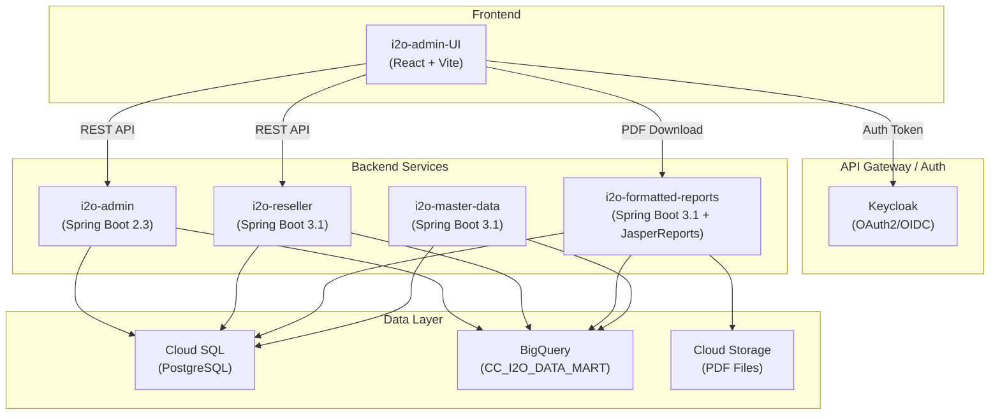
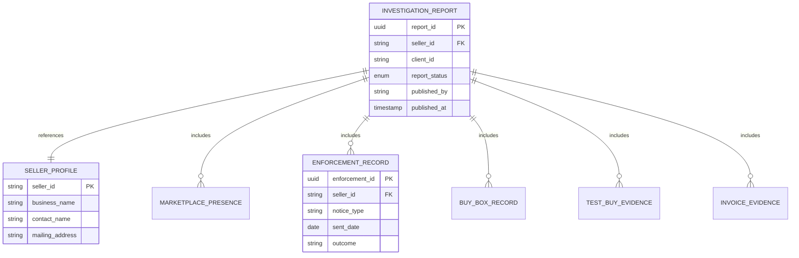
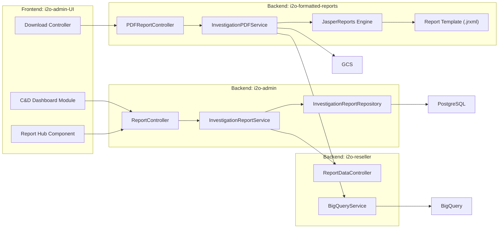
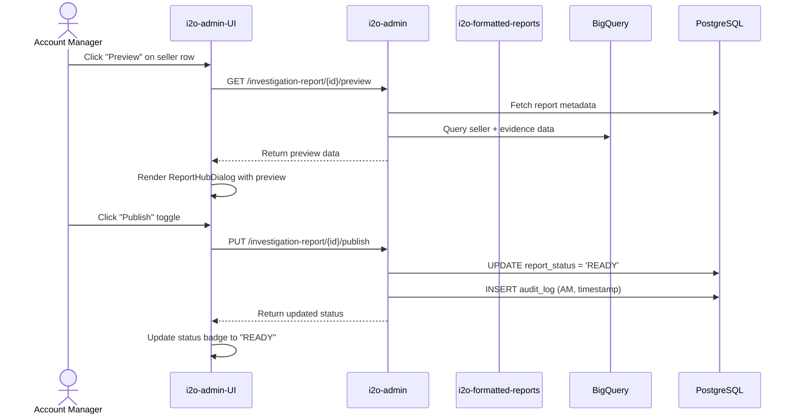
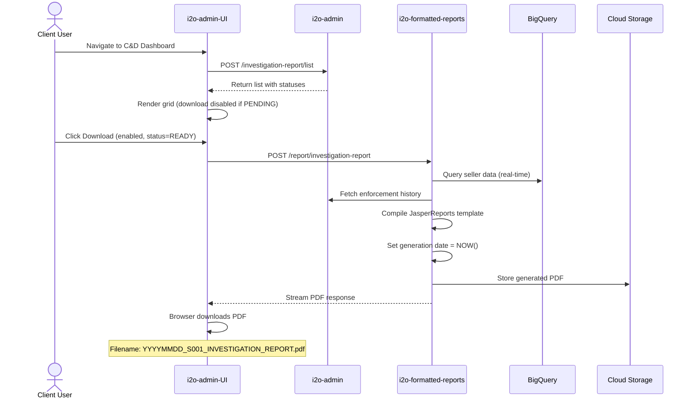
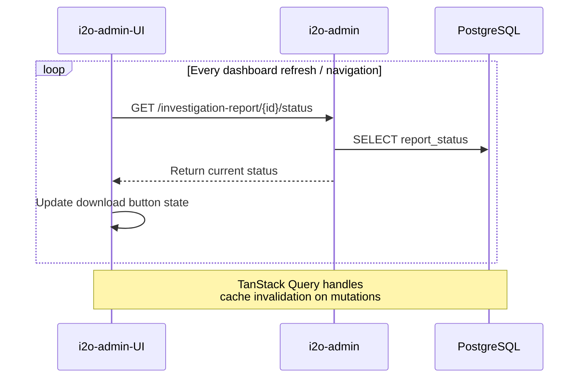

# Seller Investigation Report — Fullstack Architecture Document

## 1. Introduction

This document defines the complete fullstack architecture for the **Seller Investigation Report** feature within the i2o Cease & Desist (C&D) Management ecosystem. It provides a formalized, business-ready evidentiary PDF that aggregates seller entity data, marketplace presence, enforcement history, and physical evidence (test buys, invoices) for legal and audit purposes.

### 1.1 Starter Template / Existing Projects

This feature integrates into the **existing i2o microservices ecosystem**. No greenfield project is required.

| Project | Role | GitHub |
|---------|------|--------|
| **i2o-admin-UI** | React frontend (Account Manager & Client dashboard) | `git@github.com:i2o-retail/i2o-admin-UI.git` |
| **i2o-admin** | Spring Boot backend (enforcement APIs, RBAC, status) | `https://github.com/i2o-retail/i2o-admin.git` |
| **i2o-formatted-reports** | JasperReports PDF generation engine | `git@github.com:i2o-retail/i2o-formatted-reports.git` |
| **i2o-reseller** | BigQuery analytics & report data APIs | `https://github.com/i2o-retail/i2o-reseller.git` |
| **i2o-framework** | Shared library (auth, BigQuery, GCS utilities) | `git@github.com:i2o-retail/i2o-framework.git` |
| **i2o-master-data** | Reseller metadata & product master | `git@github.com:i2o-retail/i2o-master-data.git` |

### 1.2 Change Log

| Date | Version | Description | Author |
|------|---------|-------------|--------|
| 2026-02-20 | v1.0 | Initial architecture document | Antigravity AI |

---

## 2. High-Level Architecture

### 2.1 Technical Summary

The Seller Investigation Report follows a **microservices architecture deployed on Google Cloud Platform (GCP)**. The React-based `i2o-admin-UI` frontend provides the C&D Management Dashboard with swimlane workflows and gating controls. Backend APIs are split across `i2o-admin` (enforcement state, RBAC, publish workflow) and `i2o-reseller` (BigQuery-driven analytics data). PDF generation is handled **on-the-fly** by `i2o-formatted-reports` using JasperReports with dynamic data binding, ensuring data freshness at download time. Authentication is managed via Keycloak with role-based access control separating Account Manager and Client user capabilities. All data flows through existing GCP infrastructure (Cloud SQL PostgreSQL, BigQuery, Cloud Storage).

### 2.2 Platform & Infrastructure

**Platform:** Google Cloud Platform (GCP) — aligns with existing i2o infrastructure.

| Service | Purpose |
|---------|---------|
| **Cloud Run / App Engine** | Hosts backend microservices |
| **Cloud SQL (PostgreSQL)** | Report status, enforcement metadata |
| **BigQuery** | Seller analytics, Buy Box data (`CC_I2O_DATA_MART`) |
| **Cloud Storage (GCS)** | Generated PDF storage & signed URL downloads |
| **Secret Manager** | API keys, DB credentials |
| **Keycloak** | OAuth2/OIDC authentication & RBAC |

### 2.3 High-Level Architecture Diagram



### 2.4 Architectural Patterns

| Pattern | Description | Rationale |
|---------|-------------|-----------|
| **Microservices** | Each service owns a bounded context | Aligns with existing i2o architecture; independent deployment |
| **On-the-Fly PDF Generation** | Reports generated at download time, not pre-cached | Ensures data freshness per NFR2 (date = download time) |
| **RBAC with Keycloak** | Role-based gating (AM vs Client) | Enforces FR7/NFR3 download restrictions |
| **Repository Pattern** | Spring Data JPA for data access | Standard across all i2o backend services |
| **BFF (Backend-for-Frontend)** | `i2o-admin` aggregates data from multiple sources | Single API surface for the frontend |
| **Feature-Based UI Architecture** | React modules organized by feature domain | Matches existing `i2o-admin-UI` patterns |

---

## 3. Technology Stack

| Category | Technology | Version | Purpose | Rationale |
|----------|-----------|---------|---------|-----------|
| **Frontend Framework** | React | 18.3.1 | UI Library | Existing i2o-admin-UI stack |
| **Frontend Build** | Vite | 5.4.1 | Dev server & bundler | Existing i2o-admin-UI stack |
| **Frontend Language** | TypeScript | 5.5.3 | Type safety | Existing i2o-admin-UI stack |
| **CSS Framework** | Tailwind CSS | 3.4.11 | Styling | Existing i2o-admin-UI stack |
| **UI Components** | Shadcn UI | latest | Reusable primitives | Existing i2o-admin-UI stack |
| **State Management** | TanStack Query | 5.56.2 | Server state & caching | Existing i2o-admin-UI stack |
| **Data Grid** | AG Grid | latest | Seller matrix / tables | Per PRD technical assumptions |
| **Forms** | React Hook Form + Zod | 7.60.0 / 3.23.8 | Form handling & validation | Existing i2o-admin-UI stack |
| **Auth (Frontend)** | Keycloak-js | 26.2.0 | Identity management | Existing i2o-admin-UI stack |
| **Backend Language** | Java | 17 | Server logic | Existing i2o backend standard |
| **Backend Framework** | Spring Boot | 3.1.7 | REST APIs | Existing i2o backend standard |
| **ORM** | Spring Data JPA | — | Data access | Existing i2o pattern |
| **PDF Engine** | JasperReports | 6.17.0 | PDF generation | Existing i2o-formatted-reports |
| **Database** | PostgreSQL | 15+ | Metadata, report status | Existing Cloud SQL infra |
| **Data Warehouse** | Google BigQuery | — | Seller analytics, Buy Box | Existing i2o data pipeline |
| **File Storage** | Google Cloud Storage | — | PDF file storage | Existing GCS infra |
| **Authentication** | Keycloak | 22.0.5 | OAuth2/OIDC + RBAC | Existing i2o auth provider |
| **Backend Testing** | JUnit 5 + Mockito | — | Unit & integration tests | Existing i2o standards |
| **Frontend Testing** | Vitest + Playwright | 3.2.4 / 1.55.0 | Unit & E2E tests | Existing i2o-admin-UI stack |
| **API Documentation** | SpringDoc OpenAPI | 2.3.0 | Swagger API docs | Existing i2o pattern |

---

## 4. Data Models

### 4.1 Investigation Report Entity

```typescript
interface InvestigationReport {
  reportId: string;           // UUID
  sellerId: string;           // Reference to seller
  sellerName: string;
  clientId: string;           // Organization/client
  reportStatus: 'PENDING' | 'READY';
  publishedBy?: string;       // AM user ID who published
  publishedAt?: string;       // ISO timestamp
  createdAt: string;
  updatedAt: string;
}
```

### 4.2 Seller Profile (from BigQuery/PostgreSQL)

```typescript
interface SellerProfile {
  sellerId: string;
  businessName: string;
  contactName: string;
  email?: string;
  phone?: string;
  mailingAddress: string;
  city: string;
  state: string;
  country: string;
  zipCode: string;
}
```

### 4.3 Marketplace Presence (from BigQuery)

```typescript
interface MarketplacePresence {
  sellerId: string;
  marketplace: string;       // e.g., "Amazon US", "Walmart"
  sellerUrl?: string;
  violationCount: number;
  violationTypes: string[];
  isActive: boolean;
}
```

### 4.4 Enforcement History (from PostgreSQL)

```typescript
interface EnforcementRecord {
  enforcementId: string;
  sellerId: string;
  noticeType: string;        // "C&D", "Warning", "Final Notice"
  sentDate: string;
  deliveryStatus: string;    // "Delivered", "Bounced", "Pending"
  outcome: string;           // "Complied", "Ignored", "Partial"
  notes?: string;
}
```

### 4.5 Buy Box History (from BigQuery)

```typescript
interface BuyBoxRecord {
  sellerId: string;
  asin: string;
  marketplace: string;
  buyBoxWinPercentage: number;
  recordDate: string;
  productTitle: string;
}
```

### 4.6 Evidence (from PostgreSQL / GCS)

```typescript
interface TestBuyEvidence {
  orderId: string;
  sellerId: string;
  orderDate: string;
  amount: number;
  marketplace: string;
  items: string[];
}

interface InvoiceEvidence {
  invoiceId: string;
  sellerId: string;
  invoiceDate: string;
  amount: number;
  imageUrl: string;      // GCS signed URL
}
```

### 4.7 Entity Relationship Diagram



---

## 5. Database Schema

### 5.1 PostgreSQL Tables (Cloud SQL)

```sql
-- Report status & metadata (in i2o-admin database)
CREATE TABLE investigation_report (
    report_id        UUID PRIMARY KEY DEFAULT gen_random_uuid(),
    seller_id        VARCHAR(100) NOT NULL,
    seller_name      VARCHAR(255),
    client_id        VARCHAR(100) NOT NULL,
    report_status    VARCHAR(20) NOT NULL DEFAULT 'PENDING'
                     CHECK (report_status IN ('PENDING', 'READY')),
    published_by     VARCHAR(100),
    published_at     TIMESTAMP,
    created_at       TIMESTAMP NOT NULL DEFAULT CURRENT_TIMESTAMP,
    updated_at       TIMESTAMP NOT NULL DEFAULT CURRENT_TIMESTAMP,
    CONSTRAINT idx_seller_client UNIQUE (seller_id, client_id)
);

CREATE INDEX idx_report_status ON investigation_report(report_status);
CREATE INDEX idx_report_client ON investigation_report(client_id);

-- Audit log for publish actions
CREATE TABLE report_audit_log (
    audit_id         UUID PRIMARY KEY DEFAULT gen_random_uuid(),
    report_id        UUID NOT NULL REFERENCES investigation_report(report_id),
    action           VARCHAR(50) NOT NULL,
    performed_by     VARCHAR(100) NOT NULL,
    performed_at     TIMESTAMP NOT NULL DEFAULT CURRENT_TIMESTAMP,
    details          JSONB
);
```

### 5.2 BigQuery Data Sources

| Table / View | Dataset | Purpose |
|--------------|---------|---------|
| `viz_bbx_filtered_detail` | `CC_I2O_DATA_MART` | Buy Box ownership history |
| Seller marketplace presence | `CC_I2O_DATA_MART` | Marketplace presence data |
| Seller analytics views | `CC_I2O_DATA_MART` | Seller violation & analytics data |

---

## 6. API Specification

### 6.1 i2o-admin — Report Management APIs

#### `POST /enforcement/investigation-report/list`
Get investigation reports for a client with filtering.

```json
// Request
{
  "clientId": "org-123",
  "filters": {
    "status": "PENDING",
    "marketplace": "Amazon US",
    "searchTerm": "seller name"
  },
  "pagination": { "page": 0, "size": 20 },
  "sort": { "field": "updatedAt", "direction": "DESC" }
}

// Response
{
  "content": [
    {
      "reportId": "uuid",
      "sellerId": "S-001",
      "sellerName": "Example Seller LLC",
      "reportStatus": "PENDING",
      "marketplaces": ["Amazon US", "Walmart"],
      "lastNoticeDate": "2026-01-15",
      "updatedAt": "2026-02-19T10:30:00Z"
    }
  ],
  "totalElements": 42,
  "totalPages": 3
}
```

#### `PUT /enforcement/investigation-report/{reportId}/publish`
AM-only: Mark report as READY for client download.

```json
// Response
{
  "reportId": "uuid",
  "reportStatus": "READY",
  "publishedBy": "am-user-id",
  "publishedAt": "2026-02-20T09:30:00Z"
}
```

#### `GET /enforcement/investigation-report/{reportId}/preview`
AM-only: Preview report data before publishing.

#### `GET /enforcement/investigation-report/{reportId}/status`
Get report readiness status (for gating UI).

### 6.2 i2o-formatted-reports — PDF Generation API

#### `POST /report/investigation-report`
Generate and download seller investigation PDF.

```json
// Request
{
  "sellerId": "S-001",
  "clientId": "org-123",
  "reportId": "uuid",
  "sections": ["SELLER_PROFILE", "MARKETPLACE", "ENFORCEMENT_HISTORY",
               "BUY_BOX", "TEST_BUYS", "INVOICES"]
}

// Response: application/pdf stream
// Filename: YYYYMMDD_sellerID_INVESTIGATION_REPORT.pdf
```

### 6.3 i2o-reseller — Analytics Data APIs

#### `POST /report/getReportData` (existing endpoint extension)
Fetch seller analytics data from BigQuery for report rendering.

```json
// Request
{
  "reportName": "SELLER_INVESTIGATION",
  "sellerId": "S-001",
  "clientId": "org-123",
  "dataType": "BUY_BOX_HISTORY"
}
```

---

## 7. Component Architecture

### 7.1 System Components



### 7.2 Frontend Components (i2o-admin-UI)

| Component | Location | Description |
|-----------|----------|-------------|
| `InvestigationModule/` | `src/features/InvestigationModule/` | Feature module root |
| `InvestigationDashboard` | `components/InvestigationDashboard.tsx` | Main C&D swimlane dashboard |
| `SellerReportList` | `components/SellerReportList.tsx` | AG Grid seller list with filters |
| `ReportStatusBadge` | `components/ReportStatusBadge.tsx` | PENDING/READY status indicator |
| `DownloadButton` | `components/DownloadButton.tsx` | Gated download with tooltip |
| `ReportHubDialog` | `components/ReportHubDialog.tsx` | AM preview & publish overlay |
| `PublishToggle` | `components/PublishToggle.tsx` | AM-only publish switch |
| `SellerProfileCard` | `components/SellerProfileCard.tsx` | Seller details panel |

### 7.3 Backend Components

#### i2o-admin (Report Management)
| Component | Package | Description |
|-----------|---------|-------------|
| `InvestigationReportController` | `controller` | REST endpoints for report CRUD |
| `InvestigationReportService` | `service` | Business logic, status management |
| `InvestigationReportRepository` | `repository` | JPA repository for report entity |
| `InvestigationReport` | `model` | JPA entity |
| `ReportAuditLog` | `model` | Audit trail entity |

#### i2o-formatted-reports (PDF Generation)
| Component | Package | Description |
|-----------|---------|-------------|
| `InvestigationReportController` | `reporting.controller` | PDF generation endpoint |
| `InvestigationReportService` | `reporting.service` | Data assembly + Jasper rendering |
| `investigation_report.jrxml` | `resources/` | JasperReports template |
| `InvestigationReportDTO` | `reporting.dto` | Data transfer object for report |

---

## 8. Core Workflows

### 8.1 AM Preview & Publish Flow



### 8.2 Client Download Flow (Gated)



### 8.3 Status Synchronization Flow



---

## 9. UI/UX Architecture

### 9.1 Navigation & Routing

```typescript
// Route additions in App.tsx
<ProtectedRoute>
  <Route path="/enforcement/investigation" element={<InvestigationDashboard />} />
  <Route path="/enforcement/investigation/:sellerId" element={<SellerReportDetail />} />
</ProtectedRoute>
```

### 9.2 Swimlane Workflow States

| Swimlane | Status | Actions Available |
|----------|--------|-------------------|
| **Active Recommendations** | New sellers flagged | Review, Approve for C&D |
| **Approved** | C&D approved | Send Notice |
| **In Progress** | Notice sent, awaiting response | Track, Update Status |
| **Closed** | Resolved | View Report, Download PDF |

### 9.3 Download Button Gating Logic

```typescript
// DownloadButton.tsx - key logic
const DownloadButton = ({ report }: { report: InvestigationReport }) => {
  const { user } = useKeycloak();
  const isAM = user.roles.includes('ACCOUNT_MANAGER');
  const isReady = report.reportStatus === 'READY';

  // AMs can always download (for preview)
  // Clients can only download when READY
  const canDownload = isAM || isReady;

  return (
    <TooltipProvider>
      <Tooltip>
        <TooltipTrigger asChild>
          <Button disabled={!canDownload} onClick={handleDownload}>
            <Download className="h-4 w-4" />
          </Button>
        </TooltipTrigger>
        {!canDownload && (
          <TooltipContent>
            Report pending verification by Account Manager
          </TooltipContent>
        )}
      </Tooltip>
    </TooltipProvider>
  );
};
```

---

## 10. PDF Report Template Design

### 10.1 Page Layout

| Element | Position | Content |
|---------|----------|---------|
| **Header - Left** | Top-left, every page | i2o Logo (`i2o_logo.png`) |
| **Header - Right** | Top-right, every page | Generation Date (`MMM DD, YYYY`) |
| **Footer** | Bottom-center, every page | `CONFIDENTIAL - FOR AUTHORIZED USE ONLY` |

### 10.2 Report Sections (Page Order)

1. **Cover Page** — Title, Seller ID, Generated Date
2. **Seller Profile** — Business name, contact, address
3. **Marketplace Presence** — Matrix of active marketplaces + violation counts
4. **Buy Box History** — Historical Buy Box win % chart/table
5. **Enforcement History** — Timeline of C&D notices + outcomes
6. **Test Buy Evidence** — Order IDs, dates, amounts
7. **Invoice Evidence** — Invoice fragments/images
8. **Summary** — Key findings overview

### 10.3 JasperReports Template Structure

```
resources/
├── investigation_report.jrxml          # Master report
├── seller_profile_subreport.jrxml      # Seller details
├── marketplace_subreport.jrxml         # Marketplace matrix
├── buybox_subreport.jrxml              # Buy Box history
├── enforcement_subreport.jrxml         # Enforcement timeline
├── evidence_subreport.jrxml            # Test buys + invoices
└── assets/
    └── i2o_logo.png                    # Branding asset
```

### 10.4 PDF Naming Convention

```
Format: YYYYMMDD_<sellerID>_INVESTIGATION_REPORT.pdf
Example: 20260220_S001_INVESTIGATION_REPORT.pdf
```

---

## 11. Frontend Architecture

### 11.1 Module Structure

```
src/features/InvestigationModule/
├── components/
│   ├── InvestigationDashboard.tsx    # Main dashboard with swimlanes
│   ├── SellerReportList.tsx          # AG Grid data table
│   ├── ReportStatusBadge.tsx         # Status indicator
│   ├── DownloadButton.tsx            # Gated download button
│   ├── ReportHubDialog.tsx           # AM preview/publish overlay
│   ├── PublishToggle.tsx             # AM publish switch
│   ├── SellerProfileCard.tsx         # Seller details panel
│   ├── SearchFilterBar.tsx           # Search & filter controls
│   └── SwimlaneView.tsx             # Kanban-style swimlane
├── hooks/
│   ├── useInvestigationReports.ts   # TanStack Query hooks
│   ├── useReportPublish.ts          # Publish mutation hook
│   └── useReportDownload.ts         # Download handler hook
├── types/
│   └── investigation.types.ts       # TypeScript interfaces
└── services/
    └── investigationApi.ts          # Axios API calls
```

### 11.2 State Management (TanStack Query)

```typescript
// hooks/useInvestigationReports.ts
export const useInvestigationReports = (filters: ReportFilters) => {
  return useQuery({
    queryKey: ['investigation-reports', filters],
    queryFn: () => investigationApi.getReports(filters),
    staleTime: 30_000, // 30s cache
  });
};

export const usePublishReport = () => {
  const queryClient = useQueryClient();
  return useMutation({
    mutationFn: (reportId: string) => investigationApi.publishReport(reportId),
    onSuccess: () => {
      queryClient.invalidateQueries({ queryKey: ['investigation-reports'] });
    },
  });
};
```

### 11.3 API Client Service

```typescript
// services/investigationApi.ts
import apiClient from '@/api';

export const investigationApi = {
  getReports: (filters: ReportFilters) =>
    apiClient.post('/enforcement/investigation-report/list', filters),

  getReportStatus: (reportId: string) =>
    apiClient.get(`/enforcement/investigation-report/${reportId}/status`),

  publishReport: (reportId: string) =>
    apiClient.put(`/enforcement/investigation-report/${reportId}/publish`),

  downloadReport: (reportId: string, sellerId: string) =>
    apiClient.post('/report/investigation-report',
      { reportId, sellerId },
      { responseType: 'blob' }
    ),
};
```

---

## 12. Backend Architecture

### 12.1 i2o-admin — Controller & Service

```java
/**
 * REST controller for investigation report management.
 * Handles CRUD, status, and publish operations.
 */
@RestController
@RequestMapping("/enforcement/investigation-report")
public class InvestigationReportController {

    @Autowired
    private InvestigationReportService reportService;

    /** List reports with filtering and pagination. */
    @PostMapping("/list")
    public ResponseEntity<Page<InvestigationReportDTO>> listReports(
            @RequestBody ReportListRequest request) {
        return ResponseEntity.ok(reportService.listReports(request));
    }

    /** AM-only: Publish report (set status to READY). */
    @PutMapping("/{reportId}/publish")
    @PreAuthorize("hasRole('ACCOUNT_MANAGER')")
    public ResponseEntity<InvestigationReportDTO> publishReport(
            @PathVariable UUID reportId,
            @AuthenticationPrincipal KeycloakPrincipal principal) {
        return ResponseEntity.ok(
            reportService.publishReport(reportId, principal.getName()));
    }

    /** Get report readiness status. */
    @GetMapping("/{reportId}/status")
    public ResponseEntity<ReportStatusDTO> getStatus(
            @PathVariable UUID reportId) {
        return ResponseEntity.ok(reportService.getStatus(reportId));
    }
}
```

### 12.2 i2o-formatted-reports — PDF Service

```java
/**
 * Service for generating investigation report PDFs using JasperReports.
 * Fetches data on-the-fly from BigQuery and PostgreSQL.
 */
@Service
public class InvestigationPDFService {

    @Autowired private BigQueryService bigQueryService;
    @Autowired private GcsService gcsService;

    /**
     * Generate investigation report PDF on-the-fly.
     * @param request Contains sellerId, clientId, sections to include
     * @return byte[] of generated PDF
     */
    public byte[] generateReport(InvestigationReportRequest request) {
        // 1. Fetch seller profile from DB
        SellerProfile profile = fetchSellerProfile(request.getSellerId());

        // 2. Fetch marketplace presence from BigQuery
        List<MarketplacePresence> marketplaces =
            bigQueryService.queryMarketplacePresence(request.getSellerId());

        // 3. Fetch Buy Box history from BigQuery (CC_I2O_DATA_MART)
        List<BuyBoxRecord> buyBox =
            bigQueryService.queryBuyBoxHistory(request.getSellerId());

        // 4. Fetch enforcement history from PostgreSQL
        List<EnforcementRecord> history = fetchEnforcementHistory(request.getSellerId());

        // 5. Compile template and fill data
        Map<String, Object> params = buildParameters(profile, marketplaces, buyBox, history);
        params.put("GENERATION_DATE", new java.util.Date()); // NFR2: current timestamp

        JasperPrint jasperPrint = JasperFillManager.fillReport(
            compiledReport, params, new JREmptyDataSource());

        return JasperExportManager.exportReportToPdf(jasperPrint);
    }
}
```

---

## 13. Security & Performance

### 13.1 Security Architecture

| Layer | Control | Implementation |
|-------|---------|----------------|
| **Authentication** | Keycloak OAuth2/OIDC | JWT token validation on all APIs |
| **Authorization (RBAC)** | Role-based access | `ACCOUNT_MANAGER` vs `CLIENT` roles |
| **Publish Gating** | AM-only publish | `@PreAuthorize("hasRole('ACCOUNT_MANAGER')")` |
| **Download Gating** | Status-based | Backend validates `report_status = READY` before PDF generation for client roles |
| **CORS** | Whitelist origins | Configured per environment |
| **Input Validation** | Spring Validation | All request DTOs validated |
| **PDF Security** | Confidentiality footer | Every page includes `CONFIDENTIAL` notice |
| **Audit Trail** | `report_audit_log` table | All publish/unpublish actions logged with user + timestamp |

### 13.2 Performance Targets

| Metric | Target | Strategy |
|--------|--------|----------|
| **PDF Generation** | < 5 seconds (NFR1) | On-the-fly with compiled JasperReports templates |
| **Dashboard Load** | < 2 seconds | Paginated queries, TanStack Query caching |
| **BigQuery Latency** | < 3 seconds | Optimized queries on partitioned `CC_I2O_DATA_MART` views |
| **API Response** | < 500ms (non-PDF) | Redis/in-memory caching for status lookups |

---

## 14. Testing Strategy

### 14.1 Testing Pyramid

| Layer | Tools | Coverage Target |
|-------|-------|-----------------|
| **Frontend Unit** | Vitest | 80% component coverage |
| **Backend Unit** | JUnit 5 + Mockito | 85% service layer coverage |
| **Integration** | Spring Boot Test + Testcontainers | All API endpoints |
| **E2E** | Playwright | Critical paths (publish, download) |

### 14.2 Key Test Scenarios

| Scenario | Type | Description |
|----------|------|-------------|
| Download button disabled for PENDING | E2E | Verify client cannot download unpublished reports |
| AM can publish and toggle status | Integration | Verify publish endpoint + audit log |
| PDF contains all sections | Integration | Validate generated PDF structure |
| BigQuery data in report | Integration | Verify Buy Box data appears in PDF |
| RBAC enforcement | Unit | Verify role-based access controls |
| Status sync on refresh | E2E | Verify dashboard reflects latest status |

---

## 15. Deployment Architecture

### 15.1 Service Deployment

| Service | Platform | Build | Notes |
|---------|----------|-------|-------|
| `i2o-admin-UI` | Cloud Run / Nginx | `npm run build` → `dist/` | Static SPA served via CDN |
| `i2o-admin` | Cloud Run / App Engine | `mvn clean package` → WAR | Existing deployment pipeline |
| `i2o-formatted-reports` | Cloud Run / App Engine | `mvn clean package` → WAR | Needs JasperReports templates |
| `i2o-reseller` | Cloud Run / App Engine | `mvn clean package` → WAR | Existing deployment pipeline |

### 15.2 Environment Configuration

| Environment | Purpose |
|-------------|---------|
| `local` / `dev` | Development & testing |
| `qa` / `qa1` | QA testing |
| `uat` / `preuat` | User acceptance testing |
| `preprod` | Pre-production validation |
| `prod` | Production |

---

## 16. Coding Standards

### 16.1 Critical Rules

- **Java**: Add Javadocs to ALL methods; add comments to complex functions
- **TypeScript**: Use strict mode; define shared types in `types/` directory
- **API Calls**: Always use the service layer (`investigationApi.ts`), never direct Axios calls
- **Error Handling**: All API routes must use the standard error handler middleware
- **Report Status**: NEVER modify `report_status` directly in DB — always go through the service layer
- **PDF Templates**: All `.jrxml` changes must maintain header/footer consistency

### 16.2 Naming Conventions

| Element | Convention | Example |
|---------|-----------|---------|
| React Components | PascalCase | `ReportHubDialog.tsx` |
| React Hooks | `use` prefix, camelCase | `useReportPublish.ts` |
| API Endpoints | kebab-case | `/investigation-report/publish` |
| DB Tables | snake_case | `investigation_report` |
| Java Classes | PascalCase | `InvestigationReportService.java` |
| Constants | UPPER_SNAKE_CASE | `REPORT_STATUS_READY` |

---

## 17. Monitoring & Observability

| Aspect | Tool | Details |
|--------|------|---------|
| **Backend Tracing** | Micrometer + Brave | Distributed tracing across services |
| **Metrics** | Prometheus / Micrometer | Request rates, error rates, latency |
| **Logs** | Cloud Logging (GCP) | Structured JSON logging |
| **Error Tracking** | Cloud Error Reporting | Exception monitoring |
| **Frontend Monitoring** | Firebase Analytics | User interactions, page loads |

### Key Metrics to Track

- `investigation_report_generate_duration_ms` — PDF generation time
- `investigation_report_publish_count` — Publish actions per day
- `investigation_report_download_count` — Downloads per day
- `investigation_report_status_check_count` — Status API calls

---

## 18. Architect Checklist Validation

| # | Criterion | Status | Evidence |
|---|-----------|--------|----------|
| 1 | All PRD FRs addressed | ✅ PASS | FR1-FR11 mapped to components/APIs |
| 2 | Non-functional requirements met | ✅ PASS | NFR1-NFR5 addressed in §13 |
| 3 | Technology stack is definitive | ✅ PASS | Full stack table in §3 |
| 4 | Data models cover all entities | ✅ PASS | 6 models defined in §4 |
| 5 | API spec is complete | ✅ PASS | REST endpoints defined in §6 |
| 6 | Security (RBAC) is defined | ✅ PASS | Keycloak + role-based gating §13.1 |
| 7 | PDF template design specified | ✅ PASS | JasperReports structure §10 |
| 8 | Frontend architecture aligned | ✅ PASS | Feature module pattern §11 |
| 9 | Backend architecture aligned | ✅ PASS | Existing microservices §12 |
| 10 | Deployment strategy defined | ✅ PASS | GCP deployment §15 |
| 11 | Testing strategy defined | ✅ PASS | Testing pyramid §14 |
| 12 | Monitoring defined | ✅ PASS | Observability stack §17 |
| 13 | Integrates with existing infra | ✅ PASS | Uses existing i2o services |
| 14 | On-the-fly PDF generation | ✅ PASS | No pre-caching, date = download time |
| 15 | Audit trail implemented | ✅ PASS | `report_audit_log` table §5.1 |

**Overall Score: 15/15 PASS** — Architecture is implementation-ready.
