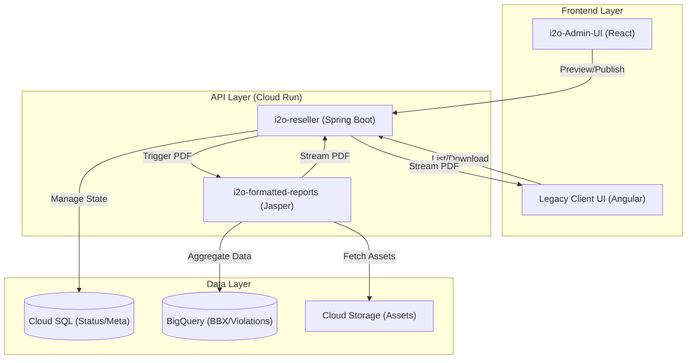
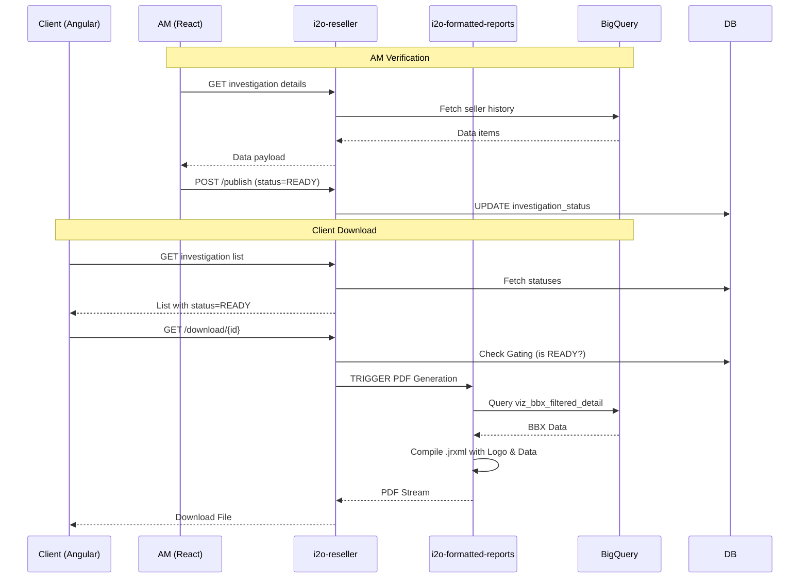

# Seller Investigation Report: Fullstack Architecture Document

## 1. Introduction

This document outlines the complete fullstack architecture for the **Seller Investigation Report**, including backend systems, frontend implementation, and their integration. It serves as the single source of truth for AI-driven development, ensuring consistency across the entire technology stack.

This unified approach combines backend and frontend concerns, leveraging the existing i2o microservices ecosystem to deliver a professional legal evidence reporting tool.

### 1.1 Starter Template or Existing Project
This project is an extension of the existing i2o microservices ecosystem:
- **Admin Frontend**: `i2o-admin-UI` (React/Vite).
- **Client Frontend**: `frontendapplication-i2oretail` (Angular 15).
- **Backend Services**: `i2o-reseller` (Spring Boot/Java 17) and `i2o-formatted-reports` (Spring Boot/Java 17).
- **Database**: PostgreSQL (Cloud SQL) and BigQuery.

### 1.2 Change Log
| Date | Version | Description | Author |
| :--- | :--- | :--- | :--- |
| 2026-02-19 | v1.0 | Initial Architecture Document for Seller Investigation Report | Antigravity AI |

---

## 2. High Level Architecture

### 2.1 Technical Summary
The Seller Investigation Report system is a multi-component solution designed to automate the generation and gating of legal-ready investigation documents. It utilizes a microservices approach:
- **i2o-admin-UI (React)**: Hosts the "Report Hub" where Account Managers (AMs) preview investigate data and "Publish" reports.
- **frontendapplication-i2oretail (Angular)**: Provides the client-facing dashboard where users view investigation status and download "READY" reports.
- **i2o-reseller (Java)**: Manages investigation state (`PENDING`, `READY`), metadata, and serves as the API gateway for UI components.
- **i2o-formatted-reports (Java/JasperReports)**: The core engine that generates the high-fidelity PDF on-the-fly, pulling data from BigQuery and local metadata.
- **BigQuery**: Provides the source-of-truth for Buy Box history (`viz_bbx_filtered_detail`) and violation records.

### 2.2 Platform and Infrastructure Choice
**Platform:** Google Cloud Platform (GCP)
**Key Services:** 
- **Cloud Run**: Hosting serverless Java microservices.
- **Cloud SQL (PostgreSQL)**: Persisting report readiness status and metadata.
- **BigQuery**: Multi-tenant data warehouse for large-scale analytics.
- **Cloud Storage (GCS)**: Temporary storage for generated report assets or logo assets.
- **Keycloak**: Identity and Access Management (Auth).

**Rational**: Existing i2o infrastructure is GCP-native, and BigQuery is the primary source for seller analytics.

### 2.3 Repository Structure
**Structure**: Distributed Microservices / Existing Repos
**Package Organization**: 
- `src/features/EnforcementModule` in `i2o-admin-UI` for Admin UI.
- `src/app/modules/brand-content-monitoring` in `frontendapplication-i2oretail` for Client UI.
- `src/main/java/com/corecompete/i2o/reporting` in `i2o-reseller` for state management.
- `src/main/java/com/i2oretail/reporting/framework` in `i2o-formatted-reports` for Jasper logic.

### 2.4 High Level Architecture Diagram



### 2.5 Architectural Patterns
- **BFF (Backend for Frontend):** `i2o-reseller` acts as the orchestrator, abstracting complex BigQuery joins and report status logic from the UI. - *Rationale: Simplifies frontend logic and provides a single point for security/gating.*
- **Readiness Gating Pattern:** Explicit `report_status` flag in PostgreSQL to control client access. - *Rationale: Ensures legal documents are verified by experts (AMs) before exposure.*
- **On-the-Fly Assembly:** PDF is generated at the moment of request rather than pre-stored. - *Rationale: Guarantees "Date Generated" header is always current and data reflects latest BigQuery updates.*
- **Strategy Pattern (Jasper):** Standardized report templates with dynamic parameter injection. - *Rationale: Reuses existing i2o-formatted-reports framework for consistency.*

---

## 3. Tech Stack

| Category | Technology | Version | Purpose | Rationale |
| :--- | :--- | :--- | :--- | :--- |
| **Frontend Framework (Admin)** | React | 18.x | Admin UI | Modern, fast development for internal tools. |
| **Frontend Framework (Client)** | Angular | 15.x | Client Dashboard | Alignment with existing legacy client portal. |
| **Backend Framework** | Spring Boot | 3.1.7 | Business Logic | Enterprise-grade, strong integration with GCP. |
| **Report Engine** | JasperReports | 6.17.0 | PDF Generation | Proven capability for complex legal-grade documents. |
| **Programming Languages** | Java 17, TypeScript | Latest | Development | Corporate standard for type safety and performance. |
| **Database (Transactional)** | PostgreSQL | 15+ | Status/Metadata | Relational consistency for readiness tracking. |
| **Data Warehouse** | BigQuery | N/A | Analytics Source | High-performance querying of multi-tenant retail data. |
| **API Style** | REST | N/A | Communication | Standard interoperability between microservices. |
| **Authentication** | Keycloak | 26.x | Security | Centralized IAM across all i2o apps. |
| **CI/CD** | GitHub Actions | N/A | Automation | Standard i2o deployment pipeline. |

---

## 4. Data Models

### 4.1 InvestigationReportStatus
**Purpose:** Tracks the lifecycle of a seller investigation report and AM approval state.

**Key Attributes:**
- `seller_id`: String (PK) - Unique marketplace seller identifier.
- `org_id`: String - Client organization ID for multi-tenancy.
- `status`: Enum (`PENDING`, `READY`) - Current readiness state.
- `last_verified_by`: String - User ID of the AM who marked it READY.
- `last_verified_at`: Timestamp - When the status was last updated.
- `metadata`: JSONB - Storing custom fields like "Notes to Client".

**TypeScript Interface:**
```typescript
export interface InvestigationReportStatus {
  sellerId: string;
  orgId: string;
  status: 'PENDING' | 'READY';
  lastVerifiedBy?: string;
  lastVerifiedAt?: string;
  metadata?: Record<string, any>;
}
```

**Relationships:**
- Linked to `SellerProfile` (BigQuery) via `seller_id`.

### 4.2 SellerInvestigationMetadata (BigQuery Source)
**Purpose:** Virtual model representing the aggregated data for the report.

**Key Attributes:**
- `marketplace`: String - e.g., "Amazon US".
- `buy_box_win_rate`: Float - From `CC_I2O_DATA_MART.viz_bbx_filtered_detail`.
- `violation_count`: Integer - Total detected violations.
- `evidence_links`: String Array - Links to GCS files (invoices, test buys).

---

## 5. API Specification

### 5.1 Internal Service Communication (i2o-reseller -> i2o-formatted-reports)
- **POST `/report/seller-investigation`**
  - **Payload**: `{ sellerId: string, orgId: string, generationDate: string }`
  - **Response**: `application/pdf` binary stream.

### 5.2 UI Facing APIs (i2o-reseller)
- **GET `/api/v1/investigation/reports/{sellerId}/status`**
  - Returns current `InvestigationReportStatus`.
- **POST `/api/v1/investigation/reports/{sellerId}/publish`** (Admin Only)
  - Transitions status to `READY`.
- **GET `/api/v1/investigation/reports/{sellerId}/download`**
  - **Gating**: If `status != READY` and user is `CLIENT`, return 403 Forbidden.
  - **Success**: Proxies call to `i2o-formatted-reports` and returns PDF.

---

## 6. Component Architecture

### 6.1 Frontend: Admin Hub (React)
- **ReportPreviewer**: Fetches live data and displays a preview or low-fidelity PDF.
- **PublishControl**: Toggle switch to update `report_status`.
- **EvidenceGallery**: Grid view of invoices and test buy screenshots associated with the seller.

### 6.2 Frontend: Client Dashboard (Angular)
- **SellerGrid**: Ag-Grid implementation for listing investigations.
- **GatedDownloadButton**: Component that checks `report_status` and renders either an active download link or a disabled icon with a tooltip.
- **StatusNotification**: Real-time update (via WebSocket if available, or polling) when an AM publishes a report.

### 6.3 Backend: Orchestration Layer (Java - i2o-reseller)
- **InvestigationController**: Handles UI requests.
- **ReportingService**: Orchestrates the data collection from BigQuery + metadata and triggers the Jasper engine.
- **GatingInterceptor**: Security layer ensuring non-AM users cannot trigger downloads for PENDING reports.

---

## 7. Core Workflows

### 7.1 Report Generation & Gating Flow


---

## 8. Deployment and Operations

The solution is deployed via **Google App Engine** and **Cloud Run**:
- `i2o-reseller`: App Engine (WAR packaging).
- `i2o-formatted-reports`: Cloud Run (Docker/Spring Boot).
- `i2o-admin-UI`: static hosting or Cloud Run.

---

## 9. Quality Attributes

### 9.1 Security
- **RBAC**: Strictly enforce `ROLE_AM` for publishing and `ROLE_CLIENT` for gated downloads.
- **Data Isolation**: Multi-tenant BigQuery queries must include `org_id` filter.
- **Confidentiality**: All PDF pages must include the mandatory "CONFIDENTIAL" footer.

### 9.2 Performance
- **Streaming**: Reports must be streamed to the client to avoid high memory overhead on the server.
- **BigQuery Optimization**: Use specific filters on `viz_bbx_filtered_detail` (client/seller) to ensure sub-3-second query times.

---

## 10. Standards and Guidelines (Critical for AI)
- **Type Sharing**: DTOs for the investigation status must be consistent between `i2o-reseller` and the frontends.
- **Error Handling**: Use `INVESTIGATION_NOT_READY` error code (403) for gated access attempts.
- **Naming**: BigQuery table `CC_I2O_DATA_MART.viz_bbx_filtered_detail` must be accessed using the dynamically injected `project_id`.

---

## 11. Architect Checklist Results
| Item | Status | Evidence/Notes |
| :--- | :--- | :--- |
| **Separation of Concerns** | PASS | Clear split between data (BQ), logic (Reseller), and rendering (Jasper). |
| **Gating Logic Security** | PASS | Interceptor level check in Reseller service prevents unauthorized downloads. |
| **On-the-fly Data Freshness** | PASS | Date Generated header populated at request time. |
| **Multi-tenancy** | PASS | BigQuery project ID and Org ID filtering enforced. |
| **Tech Stack Alignment** | PASS | Reuses existing Jasper and Spring Boot frameworks. |

**Confidence Score: 5/5 - Implementation Ready**
