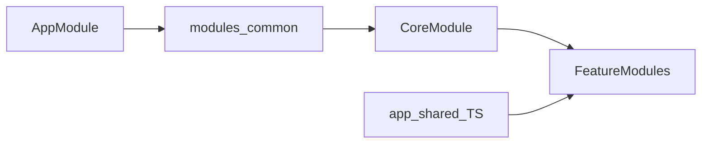

# I2O Retail - Frontend Application

A comprehensive Angular-based retail analytics and monitoring platform for e-commerce business intelligence.

---

## 📋 Table of Contents

- [Technology Stack](#technology-stack)
- [Project Structure](#project-structure)
- [Key Modules](#key-modules)
- [Common Components](#common-components)
- [Shared Types & Files](#shared-types--files)
- [Constants](#constants)
- [Core Services](#core-services)
- [Authentication System](#authentication-system)
- [Environment Configuration](#environment-configuration)
- [Development Setup](#development-setup)
- [Build & Deployment](#build--deployment)
- [Key Files Reference](#key-files-reference)
- [Coding Guidelines](#coding-guidelines)

---

## 🛠 Technology Stack

| Category | Technology | Version |
|----------|------------|---------|
| **Framework** | Angular | 15.2.10 |
| **Language** | TypeScript | 4.9.5 |
| **UI Libraries** | Angular Material | 15.2.9 |
|                  | PrimeNG | 15.0.0 |
|                  | Bootstrap (via `bootstrap` + `@ng-bootstrap/ng-bootstrap`) | 5.2.0 / ^14.2.0 |
| **Data Grid** | AG Grid Enterprise | 21.1.1 |
| **Charts** | ECharts | 6.0.0 |
|            | FusionCharts | 3.23.0 |
| **Authentication** | Keycloak Angular | 13.1.0 |
| **State Management** | RxJS | 7.5.7 |
| **Real-time** | Socket.io Client | 2.3.1 |
| **Date Handling** | Moment.js / Luxon | 2.27.0 / 3.7.1 |
| **Testing** | Jasmine/Karma | ~3.6.0 / ~6.4.4 |
| **E2E Testing** | Protractor | ~7.0.0 |
|                 | Playwright (`@playwright/test`, devDependency) | ^1.58.x |

---

## 📁 Project Structure

```
frontendapplication-i2oretail/
├── src/
│   ├── app/
│   │   ├── auth/                    # Authentication guards & interceptors
│   │   ├── directives/              # Custom Angular directives
│   │   ├── main/                    # Main layout components
│   │   │   ├── new-reseller-management/
│   │   │   ├── reseller-library/
│   │   │   └── shared/
│   │   ├── modules/                 # Feature modules (41 top-level folders; see modules/ for full list)
│   │   │   ├── alerts/
│   │   │   ├── brand-content-monitoring/
│   │   │   ├── common/              # Reusable UI, pipes, helpers (wired via CoreModule; see below)
│   │   │   ├── core/                # Core functionality (aggregates much of common/)
│   │   │   ├── dashboard/
│   │   │   ├── detailTables/
│   │   │   ├── home/
│   │   │   ├── marketplace/
│   │   │   ├── marketplace-overview/
│   │   │   ├── portfolioSummary/
│   │   │   ├── price-monitor/
│   │   │   ├── price-monitor-alerts/
│   │   │   ├── promotions/
│   │   │   ├── sales-analysis/
│   │   │   ├── summary/
│   │   │   ├── schedule-report/, sales-insights/, new-reseller-management/, ...
│   │   │   └── ... (utility modules: generic-*, *-popup, etc.)
│   │   ├── pipes/                   # Custom pipes
│   │   ├── services/                # Application services (45 services)
│   │   ├── shared/                  # Shared TS models/types (not UI components; see section below)
│   │   ├── styles/                  # SCSS/CSS styles
│   │   ├── app.component.ts         # Root component
│   │   ├── app.module.ts            # Root module
│   │   └── app-routing.module.ts    # Application routing
│   ├── assets/                      # Static assets
│   │   ├── fonts/
│   │   ├── icons/
│   │   ├── img/
│   │   ├── json/
│   │   ├── themes/
│   │   └── videos/
│   ├── environments/                # Environment configurations
│   ├── index.html                   # Main HTML entry
│   ├── main.ts                      # Application bootstrap
│   ├── styles.scss                  # Global styles
│   └── styles.css                   # Compiled CSS
├── e2e/                             # End-to-end tests
├── angular.json                     # Angular CLI configuration
├── package.json                     # Dependencies & scripts
├── tsconfig.json                    # TypeScript configuration
└── tslint.json                      # TSLint rules (see Linting under Development Setup)
```

---

## 🧩 Key Modules

### Business Feature Modules

| Module | Path | Description |
|--------|------|-------------|
| **Dashboard** | `modules/dashboard/` | Main analytics dashboard |
| **Home** | `modules/home/` | Home/landing views |
| **Portfolio Summary** | `modules/portfolioSummary/` | Portfolio analytics & summaries |
| **Marketplace** | `modules/marketplace/` | Marketplace management |
| **Marketplace Overview** | `modules/marketplace-overview/` | Marketplace overview & activation flows |
| **Price Monitor** | `modules/price-monitor/` | Price tracking & monitoring |
| **Price Monitor Alerts** | `modules/price-monitor-alerts/` | Price change alert system |
| **Promotions** | `modules/promotions/` | Promotional campaign management |
| **Sales Analysis** | `modules/sales-analysis/` | Sales analytics & reports |
| **Summary** | `modules/summary/` | Summary reports & views |
| **Brand Content Monitoring** | `modules/brand-content-monitoring/` | Brand content tracking |
| **Alerts** | `modules/alerts/` | Alert management system |
| **Exception Management** | `modules/exceptionmanagement/` | Exception handling & workflows |

### Infrastructure Modules

| Module | Path | Description |
|--------|------|-------------|
| **Common** | `modules/common/` | Reusable UI & helpers (~750+ files; no `common.module.ts`; see [Common Components](#common-components)) |
| **Core** | `modules/core/` | Core application services |
| **Generic Module** | `modules/generic-module/` | Generic reusable components |
| **Generic Layout** | `modules/generic-layout-component/` | Layout templates |

---

## 🧱 Common Components

**Location:** `src/app/modules/common/`

Cross-feature **UI** (grids, charts, cards, filters, dialogs), **AG Grid** cell renderers, preloaders, pipes, and some **module-adjacent services** (e.g. `data-storage.service.ts`). There is **no** `common.module.ts` in this folder; reusable pieces are wired into the app mainly through **`CoreModule`** (`src/app/modules/core/core.module.ts`), which imports and declares many `../common/...` components. **`AppModule`** and **`app-routing.module.ts`** also reference selected common components (e.g. generic dashboard, report view, dialog body) and shared literals from `global-constants.ts`.

### How common code is wired



### Representative inventory (by category)

| Category | Examples (folders under `common/`) |
|----------|-------------------------------------|
| **Grids & reports** | `data-grid`, `report-component`, `report-grid-cell-renderer`, `full-edit-grid`, `summary`, `grid-header`, `grid-card` |
| **Charts** | `chart`, `custom-bar-chart`, `custom-drill-down-chart`, `chart-renderer`, `side-collapse-card-chart` |
| **Filters & selects** | `app-filters`, `generic-filter`, `multi-select-autocomplete`, `multi-select-autocomplete-standalone`, `multi-select-autocomplete-savefilter`, `new-multi-select-autocomplete`, `mat-select-search`, `all-filter-selection-dialog` |
| **Layout & navigation** | `tabs`, `tabs-with-url`, `breadcrumb-new`, `generic-dashboard`, `generic-child` |
| **Documents** | `pdf-viewer`, `doc-viewer` |
| **Dialogs & popups** | `dialog-body`, `export-utility-popup`, `schedule-report-modal`, `reseller-popup`, and other dialog-style folders |
| **AG Grid renderers** | `renderer/`, `generic-grid-cell-renderer`, `grid-cell-rendering`, `multi-format-cell-renderer`, `router-link-render` |
| **Other** | Preloaders under `preloaders/`, `i-frame-loader`, `theme-picker`, `export-utility-*`, and many more |

**Maintenance:** When you add a major reusable widget, extend this table or add a note (e.g. “+ *N* other folders”) so the overview stays accurate.

---

## 🔗 Shared Types & Files

**Location:** `src/app/shared/`

This folder holds **shared TypeScript models, enums, and helpers**—not Angular components. Reusable **UI** belongs under `src/app/modules/common/` (see above).

| File | Role |
|------|------|
| `navigation-items.ts` | Navigation/menu shape (`NavigationItems` class). |
| `user-authorization.ts` | User, org, and session-oriented model used across auth-related flows. |
| `sales-equation-interfaces.ts` | Enums and types for sales variance / equation features. |
| `*.spec.ts` | Unit tests colocated with the above. |

---

## 📌 Constants

### Global constants

**File:** `src/app/modules/common/global-constants.ts`

Large, app-wide export surface. Typical **categories** include:

- HTTP helpers (e.g. request type labels)
- Pagination defaults (e.g. BigQuery page size)
- Screen / UI identifiers (`SCREEN_CD`, `ROUTE_VS_UI_SCREEN_CD`, etc.)
- Route or navigation maps (`DetailReportMap` and similar)
- Domain literals (e.g. marketplace IDs, schedule period labels)

Prefer **not** to grow this file indefinitely without splitting or moving values closer to their feature.

### Feature- and component-scoped `*.constants.ts`

Use a colocated `*.constants.ts` (or a `shared/` folder inside the feature) for module-specific literals. Examples in the repo:

| File | Scope |
|------|--------|
| `modules/marketplace-overview/marketplace-overview.constants.ts` | Marketplace overview |
| `modules/home/shared/home.constants.ts` | Home |
| `modules/dashboard/shared/dashboard.constants.ts` | Dashboard |
| `modules/alerts/shared/alerts.constants.ts` | Alerts |
| `modules/brand-content-monitoring/bcm-details/shared/bcm-details.constants.ts` | BCM details |
| `modules/common/card/chart.constants.ts` | Card/chart (common) |
| `modules/common/sales-portfolio-card/sales-portfolio-card.constants.ts` | Sales portfolio card |

### Guidelines

1. Use **feature `*.constants.ts`** for values only that feature (or component) needs.
2. Use **`global-constants.ts`** only for **truly cross-cutting** literals shared by many modules.
3. Refactor or split `global-constants.ts` when it becomes hard to navigate or review.

---

## ⚙️ Core Services

Services are located in `src/app/services/` (45 `*.ts` files in that folder). Key services include:

### API & Communication
| Service | File | Purpose |
|---------|------|---------|
| **REST API Service** | `rest-api.service.ts` | Main HTTP client for backend APIs |
| **Socket Service** | `socket.service.ts` | Real-time WebSocket communication |
| **Share Link Service** | `share-link.service.ts` | Link sharing functionality |

### Data & State Management
| Service | File | Purpose |
|---------|------|---------|
| **Util Service** | `util.service.ts` | General utility functions |
| **Master Data Service** | `master-data.service.ts` | Master data handling |
| **Filter Data Service** | `filter-data.service.ts` | Data filtering logic |
| **User Persistence Service** | `user.persistence.service.ts` | User state persistence |
| **Current State Cache Service** | `current-state-cache.service.ts` | Application state caching |

### Business Logic
| Service | File | Purpose |
|---------|------|---------|
| **Generic Module Service** | `generic-module.service.ts` | Generic module operations |
| **Product Master Service** | `product-master.service.ts` | Product catalog management |
| **Portfolio Summary Service** | `portfolio-summary.service.ts` | Portfolio analytics |
| **Scheduler Service** | `scheduler-service.ts` | Task scheduling |

### UI & Experience
| Service | File | Purpose |
|---------|------|---------|
| **Event Emit Service** | `event-emit.service.ts` | Event-based communication |
| **Open Dialog Service** | `open-dialog.service.ts` | Dialog management |
| **App Theme Service** | `app-theme.service.ts` | Theme management |
| **Toggle Sidenav Service** | `toggle-sidenav.service.ts` | Navigation state |
| **Google Analytics Service** | `google-analytics.service.ts` | Analytics tracking |

### Grid & Export
| Service | File | Purpose |
|---------|------|---------|
| **Grid Event Service** | `grid-event.service.ts` | AG Grid event handling |
| **Grid Report Service** | `grid.report.service.ts` | Grid-based reporting |
| **Export Utility Service** | `export-utility.service.ts` | Data export functionality |
| **Data Grid Utility Service** | `data-grid-utility.service.ts` | Grid utilities |

---

## 🔐 Authentication System

The application uses **Keycloak** for authentication and authorization.

### Auth Components (`src/app/auth/`)

| File | Purpose |
|------|---------|
| `auth.interceptor.ts` | HTTP request interceptor for auth tokens |
| `keycloak-authentication.guard.ts` | Keycloak-based route protection |
| `logged-in-users.guard.ts` | Guard for authenticated users |
| `roles-based-auth.gaurd.ts` | Role-based access control |
| `business-view-filter.guard.ts` | Business view access control |
| `custom-redirect.guard.ts` | Custom redirect handling |
| `permission.guard.ts` | Permission checking |

### Authentication Flow

1. Application bootstraps with Keycloak initialization (`app.module.ts`)
2. `kcInitializer` function handles SSO and token management
3. Route guards (`LoggedInUsersGuard`, `RoleBasedAuthGuard`) protect routes
4. `KeycloakBearerInterceptor` attaches tokens to API requests

---

## 🌍 Environment Configuration

### Environment Files

| File | Purpose |
|------|---------|
| `src/environments/environment.ts` | Primary workspace config in this repo: feature flags, **Keycloak** options, **API base URLs** (e.g. `i2oApiEndPoint`, reseller/scheduler/admin endpoints), **Google Analytics** IDs, and related app settings. |
| `src/environments/environment.prod.ts` | Minimal stub (`production: true` only). |

### Typical keys in `environment.ts`

Illustrative groups (exact names live in source; do not commit secrets):

- **Flags:** `production`, `dev`, `qa`, etc.
- **Keycloak:** `keycloakOptions` (`config`, `initOptions`, `enableBearerInterceptor`).
- **APIs:** `i2oApiEndPoint`, `userLeftNavigation__apiURL`, BCM/promotion/reseller/scheduler/admin endpoints as applicable.
- **Analytics:** Universal Analytics and GA4 / Tag Manager IDs where configured.

> **Build note:** In `angular.json`, the production configuration’s `fileReplacements` currently maps `environment.ts` to itself (no swap to `environment.prod.ts`). Ensure **file replacement and deployment** match how your environments are actually built and released.

### Keycloak Configuration

Keycloak is configured in **`environment.ts`** (`keycloakOptions`) and initialized from the root module. Operational concerns also include:

- Cookie-based token storage
- Runtime configuration from backend API calls where used
- Realm/client alignment with each deployment target

---

## 💻 Development Setup

### Prerequisites

- **Node.js**: v14.x or higher recommended
- **npm**: v6.x or higher
- **Angular CLI**: v15.x

### Installation

```bash
# Clone the repository
git clone <repository-url>

# Navigate to project directory
cd frontendapplication-i2oretail

# Install dependencies
npm install
```

### Running Development Server

```bash
# Start development server
npm start

# Or using Angular CLI directly
ng serve
```

Navigate to `http://localhost:4200/`. The app auto-reloads on file changes.

### Running Tests

```bash
# Unit tests
npm test

# End-to-end tests (Protractor; see angular.json e2e target)
npm run e2e
```

### Linting

`package.json` defines `npm run lint` (`ng lint`), and `tslint.json` is present. The **`i2o-retail` project in `angular.json` does not currently define a `lint` architect target**, so `ng lint` may fail until a lint target (e.g. ESLint via `@angular-eslint`) is added and configured.

---

## 🚀 Build & Deployment

### Development Build

```bash
npm run build
```

### Production Build

```bash
npm run build_prod
```

Build artifacts are stored in `dist/i2o-retail/`.

### Build Configuration

Key build settings in `angular.json`:
- **Output Hashing**: Enabled for production
- **AOT Compilation**: Enabled by default
- **Source Maps**: Enabled for dev, disabled for prod
- **Budget**: 5MB warning, 20MB error limit

---

## 📄 Key Files Reference

| File | Description |
|------|-------------|
| `src/main.ts` | Application entry point, AG Grid license setup |
| `src/app/app.module.ts` | Root module with Keycloak initialization |
| `src/app/app-routing.module.ts` | Main routing configuration (~840+ lines) |
| `src/app/app.component.ts` | Root component |
| `angular.json` | Angular CLI workspace configuration |
| `package.json` | Dependencies and npm scripts |
| `tsconfig.json` | TypeScript compiler options |
| `karma.conf.js` | Unit test configuration |
| `src/styles.scss` | Global SCSS styles |
| `src/index.html` | Main HTML template |

---

## 📐 Coding Guidelines

### Component Structure

```
component-name/
├── component-name.component.ts      # Component class
├── component-name.component.html    # Template
├── component-name.component.scss    # Styles (or .css)
└── component-name.component.spec.ts # Unit tests
```

### Module Structure

```
module-name/
├── module-name.module.ts            # Module definition
├── module-name-routing.module.ts    # Routing (if lazy-loaded)
├── components/                      # Module components
├── services/                        # Module-specific services
└── models/                          # Interfaces & types
```

### Naming Conventions

- **Components**: `kebab-case` for folders and files
- **Services**: `*.service.ts`
- **Guards**: `*.guard.ts`
- **Pipes**: `*.pipe.ts`
- **Interfaces**: PascalCase, prefixed with `I` (optional)

### Best Practices

1. **Lazy Loading**: Use lazy loading for feature modules
2. **Reusable UI**: Add shared **components** under `src/app/modules/common/` and wire them through **`CoreModule`** (or the appropriate feature module), not via a standalone `common.module.ts` in that folder
3. **Shared models**: Put cross-cutting **types/classes/enums** in `src/app/shared/` when they are not UI
4. **Constants**: Prefer feature-level `*.constants.ts`; reserve `global-constants.ts` for truly app-wide literals (see [Constants](#constants))
5. **Services**: Injectable services should be provided in root or specific modules
6. **State Management**: Use RxJS BehaviorSubjects for state
7. **Type Safety**: Prefer interfaces and strong typing

---

## 📊 Third-Party Integrations

| Integration | Purpose | Documentation |
|-------------|---------|---------------|
| **Keycloak** | Identity & Access Management | [Keycloak Docs](https://www.keycloak.org/documentation) |
| **AG Grid Enterprise** | Data Grid | [AG Grid Docs](https://www.ag-grid.com/documentation/) |
| **ECharts** | Data Visualization | [ECharts Docs](https://echarts.apache.org/en/index.html) |
| **FusionCharts** | Business Charts | [FusionCharts Docs](https://www.fusioncharts.com/dev/) |
| **Playwright** | E2E automation (devDependency; alongside Protractor) | [Playwright Docs](https://playwright.dev/docs/intro) |

---

## 🆘 Troubleshooting

### Common Issues

**Memory Issues During Build**
```bash
# Scripts already use --max_old_space_size=8192
# If still failing, increase in package.json scripts
```

**Keycloak Connection Issues**
- Check network connectivity to Keycloak server
- Verify realm and client configuration
- Check browser console for CORS issues

**AG Grid License Warning**
- License key is set in `src/main.ts`
- Ensure license is valid and not expired

---

## 📞 Support

For questions or issues, contact the development team or refer to internal documentation.

---

*Last Updated: March 2026*