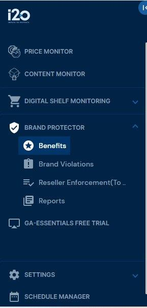
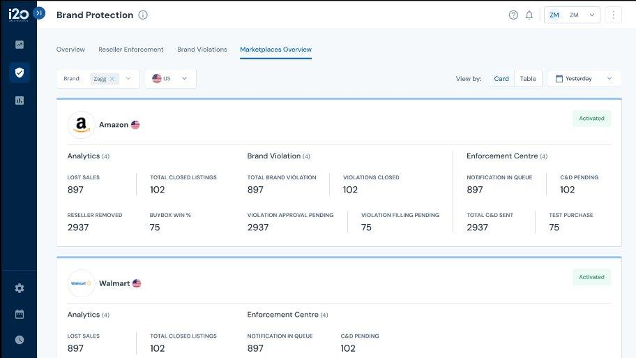
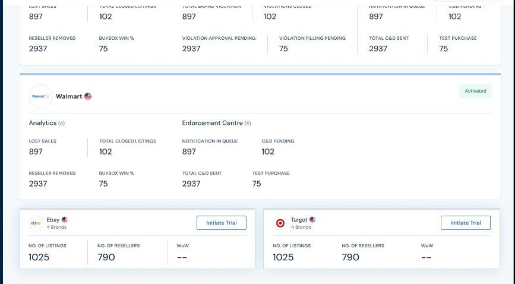
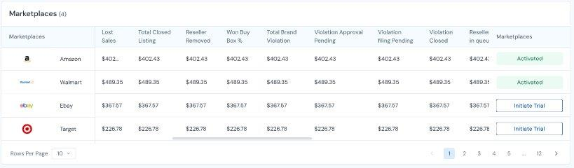

> *BP-MO-001* *\|* *Marketplace* *Overview*
>
> **i2o** **Retail**
>
> Product Requirements Document **Brand** **Protector** **–**
> **Marketplace** **Overview**
>
> **Document** **Owner:** \[PM Name\] **Last** **Updated:** 2026-03-03
> **Status:** Draft
>
> **SECTION** **A:** **EPIC** **DEFINITION**

||

> Page 1
>
> *BP-MO-001* *\|* *Marketplace* *Overview*
>
> **SECTION** **B:** **PROBLEM** **&** **OBJECTIVES**
>
> **B1.** **Problem** **Statement**
>
> Brand Protection users currently have no consolidated view of
> marketplace performance. To assess KPIs such as lost sales, closed
> listings, brand violations, and enforcement actions, users must
> navigate to multiple tabs (Analytics, Brand Violations, Enforcement
> Centre) and mentally aggregate data across Amazon, Walmart, eBay, and
> Target. This multi-tab workflow takes 15+ minutes per review session,
> creates room for error in manual comparison, and prevents quick
> cross-marketplace decision-making.
>
> The problem is compounded for accounts with multiple brands and
> regions, where the navigation overhead multiplies with each additional
> dimension. Clients and internal teams have repeatedly requested a
> single-screen overview that consolidates all marketplace KPIs without
> requiring tab-by-tab exploration.
>
> **B2.** **Why** **Now?**
>
> **Primary** **Driver:** Customer Demand + Operational Efficiency
>
> • Direct feedback from BP clients requesting a consolidated
> marketplace dashboard for weekly business reviews.
>
> • Internal account managers spend significant time compiling
> marketplace KPIs manually for client reporting.
>
> • With eBay and Target trial capabilities being introduced, a unified
> view is essential to showcase multi-marketplace value and drive trial
> adoption.
>
> • The underlying KPI data already exists in separate sub-modules;
> aggregation is the only missing layer.
>
> **B3.** **Who** **Benefits** **&** **How?**

> **B4.** **Success** **Metrics**
>
> Page 2
>
> *BP-MO-001* *\|* *Marketplace* *Overview*

||

> **B5.** **Scope**
>
> **In** **Scope**

||
||

> **Out** **of** **Scope**

||

> Page 3
>
> *BP-MO-001* *\|* *Marketplace* *Overview*

**SECTION** **C:** **USER** **STORIES**

Each user story follows the PRD skeleton format with story header,
statement, metadata, dependencies, user flow, UI screenshots (where
applicable), validation rules, corner cases (minimum 10), and acceptance
criteria in Given-When-Then format.

**Story** **ID:** BP-MO-001-US001

**Title:** Marketplace Overview Tab in Benefits

*As* *a* ***Brand*** ***Protection*** ***user**,* *I* *want* *to*
***see*** ***a*** ***Marketplace*** ***Overview*** ***tab*** ***under***
***Brand*** ***Protection*** ***\>*** ***Benefits**,* *so* *that*
***I*** ***can*** ***navigate*** ***to*** ***the*** ***consolidated***
***marketplace*** ***dashboard*** ***from*** ***the*** ***main***
***navigation***

**Modules:** Benefits, Navigation, Brand Protector **Priority:** P0
(Critical)

**Type:** UI

**Depends** **On:** None (first story in the epic)

**Blocks:** BP-MO-001-US002, US003, US004, US005, US006 (all stories
require the tab to exist)

**User** **Flow**

> 1\. User logs into the platform and navigates to Brand Protector in
> the left sidebar. 2. User expands Brand Protector and clicks Benefits.
>
> 3\. System displays the Benefits page with a new Marketplaces Overview
> tab in the top navigation bar (alongside existing tabs: Overview,
> Reseller Enforcement, Brand Violations).
>
> 4\. User clicks the Marketplaces Overview tab.
>
> 5\. System loads the Marketplace Overview page with default filters
> applied (all brands, all regions, last week calendar, Card view).

**UI** **Screens**

***Screenshot:*** ***Left*** ***Sidebar*** ***Navigation***

> Page 4
>
> *BP-MO-001* *\|* *Marketplace*
> *Overview* style="width:1.875in;height:3.90625in" />
>
> Key Elements: Brand Protector section in the left sidebar expands to
> show Benefits. The Marketplaces Overview tab will appear in the top
> navigation bar within the Benefits page alongside existing tabs.
>
> **Validation** **Rules**

||
||

> **Corner** **Cases** **&** **Error** **Handling**

||

> Page 5
>
> *BP-MO-001* *\|* *Marketplace* *Overview*

||
||

> **Acceptance** **Criteria**
>
> 6\. Given the user has an account with BP feature enabled, When they
> navigate to Brand Protector \> Benefits, Then a Marketplaces Overview
> tab is visible in the top navigation bar.
>
> 7\. Given the user clicks the Marketplaces Overview tab, When the page
> loads, Then the default state shows all brands, all regions, last week
> calendar, and Card view.
>
> 8\. Given the user does NOT have BP feature enabled, When they
> navigate to Brand Protector, Then the Marketplaces Overview tab is not
> visible.
>
> 9\. Given all acceptance criteria pass and QA is complete, When the PO
> reviews, Then the story is marked as Done (PO Sign-off required).
>
> **Story** **ID:** BP-MO-001-US002
>
> **Title:** Brand Filter, Region Filter, Calendar & View Toggle
>
> *As* *a* ***Brand*** ***Protection*** ***user**,* *I* *want* *to*
> ***filter*** ***the*** ***Marketplace*** ***Overview*** ***by***
> ***Brand,*** ***Region,*** ***and*** ***date*** ***range,*** ***and***
> ***toggle*** ***between*** ***Card*** ***and*** ***Table***
> ***view**,* *so* *that* ***I*** ***can*** ***customize*** ***the***
> ***dashboard*** ***to*** ***see*** ***KPIs*** ***for*** ***specific***
> ***brands,*** ***regions,*** ***and*** ***time*** ***periods***
> ***in*** ***my*** ***preferred*** ***format***
>
> **Modules:** Marketplace Overview, Filters **Priority:** P0 (Critical)
>
> **Type:** UI / Full-stack
>
> **Depends** **On:** BP-MO-001-US001 (tab must exist for filters to
> render on)
>
> **Blocks:** BP-MO-001-US003 (Card view data depends on filter
> selection); BP-MO-001-US004 (Table view data depends on filter
> selection)
>
> **User** **Flow**
>
> 10\. User lands on Marketplace Overview (default: all brands, all
> regions, last week, Card view). 11. User clicks the Brand filter
> dropdown. System shows all brands associated with the account. 12.
> User selects one or more brands. System filters KPI data to selected
> brands.
>
> Page 6
>
> *BP-MO-001* *\|* *Marketplace*
> *Overview* style="width:5.72917in;height:3.22917in" />
>
> 13\. User clicks the Region filter dropdown. System shows all regions
> enabled for the account (e.g., US, UK, DE).
>
> 14\. User selects a region. System filters KPI data to selected
> region.
>
> 15\. User sees the Calendar component defaulting to last week. Data
> displayed reflects the last full week.
>
> 16\. User toggles between Card and Table using the View by: Card \|
> Table toggle in the top-right. System switches the display format
> while retaining the same filter selections.
>
> **UI** **Screens**
>
> ***Screenshot:*** ***Filter*** ***Bar*** ***&*** ***Card*** ***View***
> ***Layout***
>
> Key Elements: Brand filter (multi-select dropdown), Region filter
> (dropdown showing enabled regions with flag icons), View by toggle
> (Card \| Table), Calendar component (defaults to last week). All
> filters are positioned in a horizontal filter bar above the
> marketplace cards.
>
> **Validation** **Rules**

||

> **Corner** **Cases** **&** **Error** **Handling**
>
> Page 7
>
> *BP-MO-001* *\|* *Marketplace* *Overview*

||

> **Acceptance** **Criteria**
>
> 17\. Given the user is on the Marketplace Overview page, When they
> open the Brand filter, Then all brands associated with the account are
> listed.
>
> 18\. Given the user is on the Marketplace Overview page, When they
> open the Region filter, Then only regions enabled for the account are
> listed.
>
> 19\. Given the user lands on Marketplace Overview, When the page
> loads, Then the Calendar defaults to last week and the View by toggle
> defaults to Card.
>
> 20\. Given the user toggles from Card to Table, When the view
> switches, Then the same filter selections and data are retained in the
> Table format.
>
> 21\. Given all acceptance criteria pass and QA is complete, When the
> PO reviews, Then the story is marked as Done (PO Sign-off required).
>
> **Story** **ID:** BP-MO-001-US003
>
> **Title:** Marketplace Card View (Activated & Trial Marketplaces)
>
> *As* *a* ***Brand*** ***Protection*** ***user**,* *I* *want* *to*
> ***see*** ***marketplace*** ***cards*** ***showing*** ***activation***
> ***status*** ***and*** ***KPIs*** ***grouped*** ***by***
> ***category*** ***for*** ***each*** ***marketplace**,* *so* *that*
> ***I*** ***can*** ***quickly*** ***assess*** ***the*** ***health***
> ***and*** ***performance*** ***of*** ***each*** ***marketplace***
> ***at*** ***a*** ***glance***
>
> **Modules:** Marketplace Overview **Priority:** P0 (Critical)
>
> Page 8
>
> *BP-MO-001* *\|* *Marketplace* *Overview*

**Type:** UI / Full-stack

**Depends** **On:** BP-MO-001-US001 (tab placement); BP-MO-001-US002
(filters determine data scope) **Blocks:** BP-MO-001-US005 (Initiate
Trial button on non-activated cards triggers email)

**Related:** BP-MO-001-US004 (Table view shows same data in different
format)

**User** **Flow**

> 22\. User is on Marketplace Overview with Card view selected
> (default).
>
> 23\. System renders a card for each marketplace: Amazon, Walmart,
> eBay, Target.
>
> 24\. For ACTIVATED marketplaces (e.g., Amazon, Walmart): Card shows
> marketplace logo, name, country flag, and a green Activated badge.
> KPIs are displayed grouped by category.
>
> 25\. Amazon Activated Card displays three sections:
>
> • Analytics (4 KPIs): Lost Sales, Total Closed Listings, Reseller
> Removed, Buybox Win % • Brand Violation (2 KPIs): Total Brand
> Violation, Violations Closed
>
> • Enforcement Centre (4 KPIs): Notification in Queue, C&D Pending,
> Total C&D Sent, Test Purchase
>
> 26\. Walmart Activated Card displays two sections (no Brand
> Violation):
>
> • Analytics (4 KPIs): Lost Sales, Total Closed Listings, Reseller
> Removed, Buybox Win %
>
> • Enforcement Centre (4 KPIs): Notification in Queue, C&D Pending,
> Total C&D Sent, Test Purchase
>
> 27\. For NON-ACTIVATED marketplaces (e.g., eBay, Target when not
> enabled): Card shows marketplace logo, name, country flag, and an
> Initiate Trial button. Three summary KPIs are displayed: No. of
> Listings, No. of Resellers, WoW.
>
> 28\. Each KPI value is fetched from the respective sub-module
> (Analytics, Brand Violations, Enforcement Centre) and aggregated for
> the selected brand, region, and week.

**UI** **Screens**

***Screenshot:*** ***Card*** ***View*** ***—*** ***Amazon*** ***&***
***Walmart*** ***(Activated)***

> Page 9
>
> *BP-MO-001* *\|* *Marketplace*
> *Overview* style="width:5.72917in;height:3.22917in" /> style="width:5.52083in;height:3.04167in" />
>
> ***Screenshot:*** ***Card*** ***View*** ***—*** ***Walmart***
> ***(Activated)*** ***+*** ***eBay*** ***&*** ***Target***
> ***(Initiate*** ***Trial)***
>
> Key Elements: Each activated marketplace card has a green Activated
> badge, marketplace logo with country flag, and KPI sections with
> category headers showing the count of KPIs (e.g., Analytics (4)).
> Non-activated marketplaces show a bordered card with Initiate Trial
> button and 3 summary KPIs. Cards are arranged vertically, full-width
> for activated and side-by-side for trial marketplaces.
>
> **KPI** **Definitions** **by** **Marketplace**

> Page 10
>
> *BP-MO-001* *\|* *Marketplace* *Overview*

> **Non-Activated** **Marketplace** **KPIs** **(eBay,** **Target** **—**
> **Trial** **State)**

> **Corner** **Cases** **&** **Error** **Handling**

> Page 11
>
> *BP-MO-001* *\|* *Marketplace* *Overview*

> **Acceptance** **Criteria**
>
> 29\. Given Amazon is activated for the account, When the Card view
> loads, Then the Amazon card shows a green Activated badge and displays
> Analytics (4 KPIs), Brand Violation (2 KPIs), and Enforcement Centre
> (4 KPIs).
>
> 30\. Given Walmart is activated for the account, When the Card view
> loads, Then the Walmart card shows a green Activated badge and
> displays Analytics (4 KPIs) and Enforcement Centre (4 KPIs) with no
> Brand Violation section.
>
> 31\. Given eBay is NOT activated, When the Card view loads, Then the
> eBay card shows an Initiate Trial button and displays 3 summary KPIs
> (No. of Listings, No. of Resellers, WoW).
>
> 32\. Given a marketplace becomes activated after initial setup, When
> the user loads Marketplace Overview, Then that marketplace card
> changes from Initiate Trial to Activated with full KPI sections.
>
> 33\. Given all KPIs for a marketplace are 0, When the Card view loads,
> Then all KPI values display as 0 (not blank or hidden).
>
> 34\. Given all acceptance criteria pass and QA is complete, When the
> PO reviews, Then the story is marked as Done (PO Sign-off required).

**Story** **ID:** BP-MO-001-US004 **Title:** Marketplace Table View

> *As* *a* ***Brand*** ***Protection*** ***user**,* *I* *want* *to*
> ***view*** ***all*** ***marketplace*** ***KPIs*** ***in*** ***a***
> ***tabular*** ***format**,* *so* *that* ***I*** ***can***
> ***compare*** ***marketplace*** ***performance*** ***side-by-side***
> ***in*** ***a*** ***structured*** ***data*** ***table***
>
> **Modules:** Marketplace Overview **Priority:** P0 (Critical)
>
> **Type:** UI
>
> **Depends** **On:** BP-MO-001-US002 (view toggle must exist);
> BP-MO-001-US003 (same data source as Card view)
>
> **Blocks:** None
>
> **Related:** BP-MO-001-US003 (Card view shows same data in card
> format)
>
> **User** **Flow**
>
> 35\. User clicks Table in the View by toggle.
>
> 36\. System renders a data table with one row per marketplace.
>
> 37\. Columns include: Marketplace (with logo), Lost Sales, Total
> Closed Listing, Reseller Removed, Won Buy Box %, Total Brand
> Violation, Violations Closed, Notification in Queue, C&D Pending,
> Total C&D Sent, Test Purchase, and a Status column (Activated /
> Initiate Trial button).
>
> 38\. For activated marketplaces (Amazon, Walmart), all applicable KPI
> values are populated. KPIs not applicable to a marketplace show --
> (e.g., Brand Violation columns for Walmart show --).
>
> 39\. For non-activated marketplaces (eBay, Target), the Status column
> shows the Initiate Trial button. KPI columns show available summary
> data where applicable.
>
> Page 12
>
> *BP-MO-001* *\|* *Marketplace*
> *Overview* style="width:5.83333in;height:1.70833in" />
>
> 40\. Table supports standard pagination (Rows per page selector).
>
> **UI** **Screens**
>
> ***Screenshot:*** ***Table*** ***View*** ***—*** ***All***
> ***Marketplaces***
>
> Key Elements: Table with marketplace logo + name in the first column,
> KPI value columns, and a status/action column on the right showing
> Activated badge (green) or Initiate Trial button. Rows per page
> selector at bottom-left with pagination controls at bottom-right.
>
> **Business** **Rules**
>
> • Table columns must match the KPIs displayed in Card view — same
> data, different format. • Columns not applicable to a marketplace must
> show -- (dash-dash), not 0 or blank.
>
> • Sorting: Default sort by marketplace name alphabetically. Column
> sorting is optional for MVP.
>
> • Pagination: Default 10 rows per page. Since there are only 4
> marketplaces in MVP, pagination controls should still render for
> future scalability.
>
> • Initiate Trial button in the table row must trigger the same email
> as the Card view button.
>
> **Corner** **Cases** **&** **Error** **Handling**

||

> Page 13
>
> *BP-MO-001* *\|* *Marketplace* *Overview*

||
||

> **Acceptance** **Criteria**
>
> 41\. Given the user selects Table view, When the view renders, Then a
> data table is shown with one row per marketplace and KPI columns
> matching the Card view data.
>
> 42\. Given Walmart does not have Brand Violation KPIs, When the Table
> view renders, Then Walmart’s Brand Violation columns show -- (not 0 or
> blank).
>
> 43\. Given a non-activated marketplace appears in the table, When the
> user views the Status column, Then an Initiate Trial button is
> displayed in that row.
>
> 44\. Given all acceptance criteria pass and QA is complete, When the
> PO reviews, Then the story is marked as Done (PO Sign-off required).
>
> **Story** **ID:** BP-MO-001-US005 **Title:** Initiate Trial Email
> Trigger
>
> *As* *a* ***Brand*** ***Protection*** ***user**,* *I* *want* *to*
> ***click*** ***Initiate*** ***Trial*** ***on*** ***a***
> ***non-activated*** ***marketplace*** ***and*** ***trigger*** ***an***
> ***email*** ***to*** ***the*** ***support*** ***team**,* *so* *that*
> ***the*** ***support*** ***team*** ***is*** ***notified*** ***to***
> ***run*** ***an*** ***L1*** ***audit*** ***for*** ***the***
> ***selected*** ***brand*** ***on*** ***that*** ***marketplace***
>
> **Modules:** Marketplace Overview, Email Notification **Priority:** P1
> (High)
>
> **Type:** UI / Backend
>
> **Depends** **On:** BP-MO-001-US003 (Initiate Trial button rendered on
> non-activated marketplace cards); BP-MO-001-US004 (Initiate Trial
> button in table rows)
>
> **Blocks:** None
>
> **User** **Flow**
>
> 45\. User sees a non-activated marketplace card (e.g., eBay) with an
> Initiate Trial button. 46. User clicks the Initiate Trial button.
>
> 47\. System triggers an email to the support team with the following:
> • Subject: Initiate L1 report for {Brand Name}
>
> • Body: Hey Team, can you run L1 audit for {Brand Name} on
> {Marketplace} 48. System shows a confirmation to the user: Trial
> request sent successfully.
>
> 49\. The Initiate Trial button may optionally change to Requested
> (disabled) to prevent duplicate submissions.
>
> **Business** **Rules**
>
> Page 14
>
> *BP-MO-001* *\|* *Marketplace*
> *Overview* style="width:5.52083in;height:3.04167in" />
>
> • IF user clicks Initiate Trial THEN send email with the currently
> selected brand name from the Brand filter and the marketplace name.
>
> • IF multiple brands are selected in the filter THEN use the
> primary/first brand name in the email subject. Alternatively, prompt
> the user to select a specific brand before sending.
>
> • The email recipient is the internal support team (configurable email
> address). • Email subject format: Initiate L1 report for {Brand Name}
>
> • Email body format: Hey Team, can you run L1 audit for {Brand Name}
> on {Marketplace}
>
> • This can be implemented as a frontend mailto link or a backend email
> API call — either approach is acceptable.
>
> **UI** **Screens**
>
> ***Screenshot:*** ***Initiate*** ***Trial*** ***Buttons*** ***on***
> ***eBay*** ***&*** ***Target*** ***Cards***
>
> **Corner** **Cases** **&** **Error** **Handling**

||
||

> Page 15
>
> *BP-MO-001* *\|* *Marketplace* *Overview*

||

> **Acceptance** **Criteria**
>
> 50\. Given a marketplace shows Initiate Trial, When the user clicks
> the button, Then an email is sent to the support team with subject:
> Initiate L1 report for {Brand Name} and body: Hey Team, can you run L1
> audit for {Brand Name} on {Marketplace}.
>
> 51\. Given the user clicks Initiate Trial, When the email is triggered
> successfully, Then a confirmation message is shown: Trial request sent
> successfully.
>
> 52\. Given the user has multiple brands selected, When they click
> Initiate Trial, Then the system prompts the user to select a specific
> brand for the trial request.
>
> 53\. Given all acceptance criteria pass and QA is complete, When the
> PO reviews, Then the story is marked as Done (PO Sign-off required).
>
> **Story** **ID:** BP-MO-001-US006
>
> **Title:** Weekly Data Refresh & Calendar Default
>
> *As* *a* ***Brand*** ***Protection*** ***user**,* *I* *want* *to*
> ***see*** ***KPI*** ***data*** ***that*** ***is*** ***refreshed***
> ***weekly*** ***with*** ***the*** ***calendar*** ***defaulting***
> ***to*** ***last*** ***week**,* *so* *that* ***I*** ***always***
> ***see*** ***the*** ***most*** ***recent*** ***complete***
> ***weekly*** ***data*** ***without*** ***manual*** ***intervention***
>
> **Modules:** Marketplace Overview, Data Pipeline **Priority:** P1
> (High)
>
> **Type:** Backend
>
> **Depends** **On:** BP-MO-001-US003 (Card view consumes refreshed
> data); BP-MO-001-US004 (Table view consumes refreshed data)
>
> **Blocks:** None
>
> **Business** **Logic** **Flow**
>
> 54\. Trigger: Scheduled weekly job runs after the week closes (e.g.,
> Monday 6:00 AM UTC).
>
> 55\. Validation: Verify all source data (Analytics, Brand Violations,
> Enforcement Centre) is available for the completed week.
>
> Page 16
>
> *BP-MO-001* *\|* *Marketplace* *Overview*
>
> 56\. Processing: Aggregate KPI values for each marketplace, brand, and
> region combination for the last complete week (Monday to Sunday).
>
> 57\. DB Operations: Store aggregated weekly snapshots; retain
> historical weeks for future trend analysis.
>
> 58\. Output: Updated KPI data available to Marketplace Overview;
> Calendar component reflects the last complete week.
>
> **Business** **Rules**
>
> • Calendar defaults to last complete week (Monday–Sunday). If today is
> Wednesday March 5, the default shows Feb 24 – Mar 2.
>
> • Data refresh happens weekly. KPI values shown on the dashboard do
> not change mid-week.
>
> • IF source data pipeline is delayed THEN show stale data indicator
> with the date range of the last available data.
>
> • Historical weekly data is retained to support future trend/WoW
> features.
>
> **Corner** **Cases** **&** **Error** **Handling**

||

> **Acceptance** **Criteria**
>
> Page 17
>
> *BP-MO-001* *\|* *Marketplace* *Overview*
>
> 59\. Given the user loads Marketplace Overview, When the page renders,
> Then the Calendar component defaults to the last complete week
> (Monday–Sunday).
>
> 60\. Given the weekly data refresh job runs, When it completes, Then
> all KPI values on the dashboard reflect the most recent complete
> week’s data.
>
> 61\. Given the weekly aggregation job fails, When the user loads the
> page, Then the last available week’s data is shown with a stale data
> indicator.
>
> 62\. Given all acceptance criteria pass and QA is complete, When the
> PO reviews, Then the story is marked as Done (PO Sign-off required).
>
> Page 18
>
> *BP-MO-001* *\|* *Marketplace* *Overview*
>
> **SECTION** **D:** **RELEASE** **PLAN** **&** **TIMELINE**
>
> **Release** **1:** **Core** **Dashboard**
>
> **Target** **Date:** End of Week 4
>
> **Goal:** Deliver the Marketplace Overview tab with filters, Card
> view, Table view, and weekly data refresh. **Duration:** 4 weeks (Week
> 1 – Week 4)

||
||

> **Timeline** **with** **Dependencies**
>
> • Week 1: BP-MO-001-US001 (Tab Placement) and start of US002
> (Filters) + US006 (Data Refresh backend) in parallel.
>
> • Week 1–2: BP-MO-001-US002 (Filters & View Toggle) completes —
> prerequisite for Card and Table views.
>
> • Week 2–4: BP-MO-001-US003 (Card View) — primary UI effort; depends
> on US001 and US002.
>
> • Week 3–4: BP-MO-001-US004 (Table View) — starts after Card view data
> layer is ready; shares data source.
>
> **Show** **Stoppers**
>
> • KPI aggregation APIs unavailable: If the underlying sub-module APIs
> (Analytics, Brand Violations, Enforcement Centre) are not accessible
> for cross-marketplace aggregation, the entire dashboard is blocked.
> Mitigation: Identify API contracts in Week 1; build mock data layer
> for frontend development if APIs are delayed.
>
> **Release** **2:** **Trial** **Engagement**
>
> **Target** **Date:** End of Week 5
>
> **Goal:** Enable the Initiate Trial email workflow for non-activated
> marketplaces. **Duration:** 1 week (Week 5)
>
> **Story** **ID** **Title** **Priority** **Dependencies** **Timeline**
>
> Page 19
>
> *BP-MO-001* *\|* *Marketplace* *Overview*

> **Timeline** **with** **Dependencies**
>
> • Week 5: BP-MO-001-US005 (Initiate Trial Email) — depends on US003
> and US004 being complete so the button is rendered.
>
> **Show** **Stoppers**
>
> • Email service access: If the email notification service is not
> available or the support team email address is not configured, the
> Initiate Trial feature cannot function. Mitigation: Use frontend
> mailto fallback if backend email service is delayed.
>
> **Future** **Backlog** **(Phase** **2+)**
>
> • Drill-down from KPI cards to underlying sub-module detail views. •
> Custom date range selection beyond the weekly calendar default.
>
> • WoW trend lines and sparklines within cards for visual trend
> analysis.
>
> • Full KPI parity for eBay and Target when activated (matching
> Amazon/Walmart KPI depth). • Export Marketplace Overview as PDF or
> Excel report.
>
> • Real-time or daily data refresh option.
>
> Page 20
>
> *BP-MO-001* *\|* *Marketplace* *Overview*
>
> **SECTION** **E:** **APPENDIX**
>
> **E1.** **Glossary**

> **E2.** **References**
>
> • Figma Design: \[Link to Figma mockups for Marketplace Overview\] •
> DB Schema Diagram: \[Link to KPI aggregation schema\]
>
> • Swagger API Docs: \[Link to sub-module API documentation\]
>
> • Research Documents: \[Link to client request tickets and feature
> research\]
>
> **E3.** **FAQ** **for** **Developers**
>
> **Q:** **Where** **does** **the** **KPI** **data** **come** **from?**
>
> A: Each KPI is sourced from existing Brand Protection sub-modules.
> Lost Sales, Total Closed Listings, Reseller Removed, and Buybox Win %
> come from the Analytics module. Total Brand Violation and Violations
> Closed come from the Brand Violations module. Notification in Queue,
> C&D Pending, Total C&D Sent, and Test Purchase come from the
> Enforcement Centre module. The Marketplace Overview aggregates these
> via the weekly refresh job. (See Section C, US006)
>
> **Q:** **Why** **does** **Walmart** **not** **have** **a** **Brand**
> **Violation** **section?**
>
> A: The Brand Violation workflow (classification, approval, filing) is
> currently only supported for Amazon. Walmart uses a different
> enforcement model with direct enforcement actions. When Brand
> Violation support is extended to Walmart in the future, the
> Marketplace Overview will automatically include it. (See Section C,
> US003 KPI table)
>
> **Q:** **What** **happens** **if** **a** **marketplace** **is**
> **activated** **mid-week?**
>
> Page 21
>
> *BP-MO-001* *\|* *Marketplace* *Overview*
>
> A: The marketplace card will update to Activated status immediately on
> the next page load. However, KPI data will only appear after the next
> weekly aggregation job runs and includes the newly activated
> marketplace. Until then, KPI values will show 0 or --. (See Section C,
> US003 corner cases)
>
> **Q:** **How** **is** **the** **Initiate** **Trial** **email**
> **sent?**
>
> A: Either approach is acceptable: (1) Frontend mailto link that opens
> the user’s email client with pre-filled subject and body, or (2)
> Backend API call that sends the email via the platform’s notification
> service. The subject is: Initiate L1 report for {Brand Name}, and the
> body is: Hey Team, can you run L1 audit for {Brand Name} on
> {Marketplace}. (See Section C, US005)
>
> **Q:** **Can** **eBay** **and** **Target** **ever** **show** **full**
> **KPIs** **like** **Amazon?**
>
> A: Yes. All four marketplaces can be activated depending on client
> setup. When eBay or Target are activated, they will display the full
> KPI set applicable to that marketplace (similar to how Walmart shows
> Analytics + Enforcement Centre). In the trial state, only 3 summary
> KPIs are shown: No. of Listings, No. of Resellers, WoW. (See Section
> B5, Out of Scope \#4 for phase 2 plans)
>
> **E4.** **Change** **Log**

