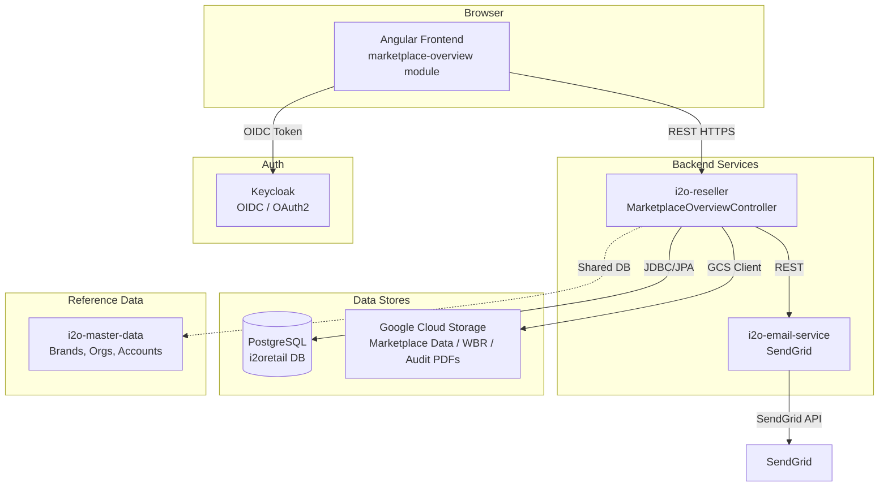

# Architecture Document — Marketplace Overview (Client-Facing Redesign)
**Project:** BP-MO-001 | **Release:** release_9 | **Date:** 2026-04-06
**Status:** Draft

---

## 1. Introduction & Goals

### 1.1 Purpose
This document describes the technical architecture for the **Marketplace Overview — Client-Facing Redesign** under Brand Protector. This release replaces the release_8 internal KPI dashboard with a redesigned client-facing screen that shows:

- **Active subscription cards** per marketplace + region with brand details, enforcement accounts, and navigation links
- **Unsubscribed marketplace cards** ranked by pain level (reseller count) with pilot/audit request CTAs
- **Brand and enforcement account filter bar**
- **Weekly Business Review (WBR) download** from GCP
- **Start Free Pilot** and **Request Audit Report** email workflows
- **Audit Report sample PDF** download

**PRD Reference:** `projects/marketplace-overview/release_9/docs/requirements/prd.md` (BP-MO-001, v1.0)

### 1.2 Quality Goals

| Priority | Goal | Metric |
|----------|------|--------|
| 1 | Performance | Screen loads < 3s (P95) — all subscription cards + unsubscribed cards rendered |
| 2 | Correctness | Subscription status, brand associations, and reseller counts match source data |
| 3 | Availability | 99.5% uptime for data read paths |
| 4 | Extensibility | Adding a new marketplace requires config change only — no core refactoring |
| 5 | Security | Multi-tenant isolation — `org_id` enforced on all queries; role-based access via Keycloak |

### 1.3 Stakeholders

| Role | Contact | Expectations |
|------|---------|--------------|
| Client (Brand Manager / VP eCommerce) | End user | Single screen for brand protection health, self-serve WBR, pilot/audit actions |
| i2o Account Manager | Internal | Reduced manual prep time; screen serves as client meeting artifact |
| Support Team (support@i2oretail.com) | Internal | Receive pilot/audit request emails with full context |
| Engineering Team | Sandeep (Tech Lead) | Maintainability, reuse of existing services and API patterns |
| Product Owner | Sunil | Feature completeness per PRD acceptance criteria |

### 1.4 Release 8 → Release 9 Delta Summary

| Aspect | Release 8 | Release 9 |
|--------|-----------|-----------|
| **Screen purpose** | Internal KPI dashboard (10 KPIs per marketplace) | Client-facing brand protection health overview |
| **Layout** | Card/Table toggle, 4 fixed marketplace cards | Two-column: Active Subscriptions (left) + Unsubscribed Marketplaces (right) |
| **Data model** | Weekly KPI snapshot from BigQuery aggregation | Subscription config + GCP bucket marketplace data (quarterly) |
| **Filters** | Brand, Region, Calendar, View Toggle | Brand, Enforcement Account, Region (US only in this release) |
| **New features** | Initiate Trial email | WBR download, Start Free Pilot, Request Audit Report, View Audit Sample, Enforcement account popup, Navigation links |
| **Data source** | BigQuery → PostgreSQL snapshot (weekly) | PostgreSQL config + GCP bucket (quarterly marketplace data, WBR artifacts, audit samples) |

### Change Log

| Date | Version | Description | Author |
|------|---------|-------------|--------|
| 2026-04-06 | v1.5 | Defined canonical WBR metadata lookup through `schedule_wbr_details` + `sw.gcs_location` JSON for latest date and download target | Sandeep |
| 2026-04-06 | v1.4 | Reverted active subscription sourcing to legacy `org_market_mapping` API path; brands from `brand_master`; enforcement accounts from `account` + `account_brand`; `ui_config` retained only for screen enablement | Sandeep |
| 2026-04-06 | v1.3 | Updated active subscription cards to be sourced from `ui_config` (same config source family as screen enablement) | Sandeep |
| 2026-04-06 | v1.2 | Replaced subscription-type-based navigation enablement with `ui_config`-based screen enablement query wrapped in `/marketplace-overview/config` | Sandeep |
| 2026-04-04 | v1.1 | Remediation update for architecture-review findings AR-001 to AR-008 | Sandeep |
| 2026-04-03 | v1.0 | Initial architecture for release_9 client-facing redesign | Sandeep |

### Change Notes (v1.2)

- Screen enablement now uses `i2oretail.ui_config` (`org_id` scoped) with property codes:
  - `BrandProtector` (BP navigation gate)
  - `BrandProtector.Enforcement_Center` (Enforcement screen link)
  - `BrandProtector.BrandViolation.BrandViolations` (Brand Violations link)
- `i2o-reseller` `GET /marketplace-overview/config` is the single API wrapper for this screen-enablement fetch logic.
- ADR link: `docs/design/ADR/adr-06-04-2026.MD` (see Section 15).

### Change Notes (v1.3)

- Active subscription cards are now sourced from `i2oretail.ui_config` instead of `org_market_mapping`.
- `GET /marketplace-overview/config` now wraps both:
  - active-subscription config rows from `ui_config`
  - screen-enablement rows from `ui_config`
- ADR link: `docs/design/ADR/adr-06-04-2026-02.MD` (see Section 15).

### Change Notes (v1.4)

- Active subscription marketplace+region mapping reverted to legacy `org_market_mapping` API path.
- Brands continue from `brand_master`.
- Enforcement accounts now explicitly use `account` joined to `account_brand` (`account_id`, `org_id` scoped).
- `ui_config` is retained only for screen enablement (`BrandProtector`, `BrandProtector.Enforcement_Center`, `BrandProtector.BrandViolation.BrandViolations`).
- ADR link: `docs/design/ADR/adr-06-04-2026-03.MD` (see Section 15).

### Change Notes (v1.5)

- WBR metadata is resolved from `i2oretail.schedule_wbr_details` joined through `schedule_master`, `organization`, `schedule_details`, and `report`.
- The backend computes `period` as the most recent Sunday date in `YYYY-MM-DD` form, then filters:
  - `stage = 'ARCHIVING'`
  - `status = 'SUCCESS'`
  - `r.report_title = 'Weekly Business Review BP Report'`
  - `o.org_id = :orgId`
- `sw.gcs_location` is stored as JSON. The backend parses that payload and uses the published GCS URL from the JSON as the WBR download target.
- `GET /marketplace-overview/config` uses the same lookup to populate `wbrInfo.available` and `wbrInfo.latestDate`.

### 1.5 Source Artifacts and Traceability Scope

| Artifact | Path | Status | Decision |
|----------|------|--------|----------|
| PRD | `projects/marketplace-overview/release_9/docs/requirements/prd.md` | Available | Authoritative product source for release_9 implementation scope |
| PID | Not found under `projects/marketplace-overview/release_9/docs` as of 2026-04-04 | Pending product decision | Before implementation approval, Product Owner must either provide PID path or explicitly sign off "PID not applicable for release_9" in this document's approval log |

---

## 2. Architecture Constraints

| Constraint | Background/Rationale |
|-----------|----------------------|
| Reuse existing Angular 15.2.10 frontend (`frontendapplication-i2oretail`) | Organization standard; existing `marketplace-overview` module from release_8 will be significantly reworked |
| Reuse Spring Boot 3.x backends (`i2o-reseller`, `i2o-email-service`) | Existing service mesh; no new microservices for MVP |
| TypeScript 4.9.5, Angular Material 15.2.9, RxJS 7.5.7 | Locked frontend stack versions |
| Keycloak for authentication | All services share Keycloak OAuth2/OIDC; org/user context derived from bearer token |
| PostgreSQL (Cloud SQL) for operational/config data | Subscription config, marketplace config, enforcement accounts stored in PostgreSQL |
| GCP Cloud Storage for marketplace data files and WBR artifacts | Data team populates buckets quarterly (marketplace data) and weekly (WBR); bucket URLs TBD by data team |
| Multi-tenant by `org_id` | All data queries filter by `org_id` extracted from Keycloak token — never from client payload |
| US region only in this release | Non-US regions deferred to Phase 2 |
| Quarterly data refresh for unsubscribed marketplace data | Data scraped quarterly by data team, stored in GCP bucket |
| Email via `i2o-email-service` (SendGrid) | Centralized email service for pilot/audit request emails |
| No Gen AI summary in this release | Deferred to future state (Phase 2+) |

---

## 3. Context and Scope

### 3.1 Business Context

| Communication Partner | Inputs | Outputs |
|----------------------|--------|---------|
| Client (Browser) | Brand/enforcement filter selections, pilot/audit requests, WBR download clicks | Rendered subscription cards, unsubscribed marketplace cards, WBR report download, confirmation messages |
| Support Team | — | Pilot request emails, audit request emails (to support@i2oretail.com) |
| Data Team | Quarterly marketplace data uploads to GCP, weekly WBR PDF uploads to GCP | — |
| Account Manager | — | Self-serve screen for client meetings |

### 3.2 Technical Context

```
┌─────────────────────────────────────────────────────────────────────────┐
│                      Browser (Angular 15.2.10)                         │
│      frontendapplication-i2oretail / marketplace-overview module       │
└──────────┬─────────────────┬───────────────────────────────────────────┘
           │ REST (HTTPS)    │ REST (HTTPS)
  ┌────────▼──────────┐  ┌──▼──────────────────────┐
  │   i2o-reseller    │  │   i2o-email-service      │
  │   (Spring Boot)   │  │   (Spring Boot/SendGrid) │
  └────┬────┬─────────┘  └──────────────────────────┘
       │    │
       │    │ GCS Client (signed URL generation, file downloads)
       │    └──────────────────────────────────────────────┐
       │ JDBC / JPA                                        │
  ┌────▼──────────────────────────────────┐  ┌─────────────▼──────────────┐
  │ PostgreSQL (i2oretail DB)             │  │ Google Cloud Storage        │
  │ - org_market_mapping                  │  │ - Marketplace data bucket   │
  │ - ui_config (screen enablement)       │  │   (quarterly JSON/CSV)      │
  │ - brand_master                        │  │ - WBR PDF bucket            │
  │ - account / account_brand             │  │   (weekly zip per client)   │
  │ - marketplace (reference)             │  │ - Audit sample PDF bucket   │
  │ - marketplace_pilot_requests          │  │                             │
  │ - ui_config / component (config)      │  └─────────────────────────────┘
  └───────────────────────────────────────┘

  ┌─────────────────────────────────────────┐
  │      i2o-master-data (Spring Boot)      │
  │  PostgreSQL — brand, org, marketplace,  │
  │  enforcement account data               │
  └─────────────────────────────────────────┘
```

| Neighboring System | Channel/Protocol | Details |
|-------------------|-----------------|---------|
| i2o-reseller | HTTPS REST | Primary backend for config, marketplace data, WBR, pilot/audit endpoints |
| i2o-email-service | HTTPS REST (internal) | Called by i2o-reseller to send pilot/audit emails via SendGrid |
| i2o-master-data | JDBC (shared PostgreSQL) | Source for brand, org, marketplace, enforcement account reference data |
| Google Cloud Storage | GCS Client Library | Marketplace data files (quarterly), WBR artifacts (weekly), audit sample PDFs |
| Keycloak | OIDC/OAuth2 | Authentication, user/org context, role-based access |

---

## 4. Solution Strategy & Project Modules

### 4.1 Key Architecture Decisions

| Decision | Choice | Rationale |
|----------|--------|-----------|
| Frontend Module | Rework existing `marketplace-overview` Angular module in `frontendapplication-i2oretail` | Module already exists from release_8; components will be replaced with new layout |
| Active Subscription Data | Read from legacy mapping path (`org_market_mapping` + `marketplace`) with org scope | Preserves existing marketplace/region mapping behavior and compatibility with older API flow |
| Unsubscribed Marketplace Data | Read brand-level marketplace data from GCP bucket (JSON) via new `i2o-reseller` endpoint | Supports PRD US003 requirement that brand filter affects unsubscribed cards by aggregating only selected brands |
| Unsubscribed Data Caching | Cache brand-level unsubscribed rows in PostgreSQL `marketplace_unsubscribed_cache` table with TTL | Avoid repeated GCS reads on every page load; aggregate by selected brand IDs at request time |
| WBR Download | Return published GCS URL resolved from `sw.gcs_location` JSON via `i2o-reseller` endpoint | Avoids proxying large files through the API; the published URL is object-specific and tenant-scoped by `org_id` |
| Audit Sample PDF | Serve from GCS signed URL | Separate pattern from WBR; static PDF stored in GCS |
| Pilot/Audit Email | Two new POST endpoints in `i2o-reseller`, both call `i2o-email-service` | Reuse existing email infrastructure; separate endpoints for distinct workflows |
| Pilot Request Tracking | New PostgreSQL table `marketplace_pilot_requests` | Track which user requested pilot for which marketplace; prevent duplicate requests |
| Pain Level Calculation | Server-side in `i2o-reseller` based on `total_resellers` from GCP data | 0–50 = Low, 51–200 = Medium, 201+ = High; calculated at API response time |
| Filter State | Frontend-only; no server-side persistence | Filters reset to defaults on page refresh (PRD requirement) |
| Enforcement Account Popup | Frontend component; data loaded with subscription config | Popup renders from already-loaded config data — no additional API call |
| Navigation Links | Frontend routing; conditional rendering based on `i2oretail.ui_config.property_cd` values for the org | `BrandProtector` controls BP navigation visibility; `BrandProtector.Enforcement_Center` controls Enforcement link; `BrandProtector.BrandViolation.BrandViolations` controls Brand Violations link (see Section 7.1). |
| Multi-brand in Email | All selected brands from filter captured in email body | PRD US005/US006 specify all filter-selected brands are included |

### 4.2 Modules Involved

| Module | Repository | Change Type | Description |
|--------|-----------|-------------|-------------|
| `frontendapplication-i2oretail` | i2o-retail/frontendapplication-i2oretail | REWORK Angular module | Replace release_8 KPI dashboard with new two-column client-facing layout |
| `i2o-reseller` | i2o-retail/i2o-reseller | NEW `marketplaceoverview` sub-package | New endpoints: config, unsubscribed data, WBR download, pilot, audit, audit sample |
| `i2o-email-service` | i2o-retail/i2o-email-service | No change | Consumed as-is for pilot/audit emails |
| `i2o-master-data` | i2o-retail/i2o-master-data | No schema change | Existing tables used: `org_market_mapping`, `marketplace`, `brand_master`, `account`, `account_brand`, `ui_config` |

---

## 5. Building Block View

### 5.1 Level 1: Overall System Diagram



### Contained Building Blocks

| Name | Responsibility |
|------|---------------|
| `marketplace-overview` (Angular module) | Client-facing UI: subscription cards, unsubscribed cards, filter bar, WBR report, pilot/audit dialogs, navigation |
| `MarketplaceOverviewController` (i2o-reseller) | REST API: config, unsubscribed data, WBR URL, pilot request, audit request, audit sample URL |
| `MarketplaceOverviewConfigService` | Load active subscriptions from `org_market_mapping`, brands from `brand_master`, enforcement accounts from `account` + `account_brand`, and enabled screens from `ui_config.property_cd` |
| `MarketplaceUnsubscribedDataService` | Read/cache unsubscribed marketplace data from GCS bucket |
| `MarketplaceWbrService` | Resolve published WBR URL from `sw.gcs_location` JSON |
| `MarketplacePilotService` | Handle pilot request: validate, persist, trigger email |
| `MarketplaceAuditService` | Handle audit request: validate, trigger email; serve audit sample URL |
| `i2o-email-service` | Send templated emails to support@i2oretail.com via SendGrid |
| PostgreSQL | Store subscription config, brand/org reference data, pilot request tracking |
| Google Cloud Storage | Store marketplace data files (quarterly), WBR artifacts (weekly), audit sample PDFs |

### 5.2 Level 2: Frontend Module Structure

```
src/app/modules/marketplace-overview/
├── marketplace-overview.module.ts                # Feature module (lazy-loaded)
├── marketplace-overview-routing.module.ts        # Route: /brand-protector/marketplace-overview
├── marketplace-overview.constants.ts             # Pain thresholds, status labels, navigation mappings
├── components/
│   ├── marketplace-overview-page/                # Parent page — two-column layout
│   │   ├── marketplace-overview-page.component.ts
│   │   ├── marketplace-overview-page.component.html
│   │   └── marketplace-overview-page.component.scss
│   ├── filter-bar/                               # Brand multi-select, Enforcement Account dropdown, Region pill, WBR card
│   │   ├── filter-bar.component.ts
│   │   ├── filter-bar.component.html
│   │   └── filter-bar.component.scss
│   ├── subscription-card/                        # Active subscription card (per marketplace+region)
│   │   ├── subscription-card.component.ts
│   │   ├── subscription-card.component.html
│   │   └── subscription-card.component.scss
│   ├── enforcement-popup/                        # Enforcement accounts popup overlay
│   │   ├── enforcement-popup.component.ts
│   │   ├── enforcement-popup.component.html
│   │   └── enforcement-popup.component.scss
│   ├── unsubscribed-card/                        # Unsubscribed marketplace card with pain badge
│   │   ├── unsubscribed-card.component.ts
│   │   ├── unsubscribed-card.component.html
│   │   └── unsubscribed-card.component.scss
│   ├── pilot-dialog/                             # Start Free Pilot confirmation modal
│   │   ├── pilot-dialog.component.ts
│   │   ├── pilot-dialog.component.html
│   │   └── pilot-dialog.component.scss
│   ├── audit-dialog/                             # Request Audit Report confirmation modal
│   │   ├── audit-dialog.component.ts
│   │   ├── audit-dialog.component.html
│   │   └── audit-dialog.component.scss
│   └── audit-sample-banner/                      # "Not sure what an audit includes?" banner
│       ├── audit-sample-banner.component.ts
│       ├── audit-sample-banner.component.html
│       └── audit-sample-banner.component.scss
├── models/
│   ├── subscription-card.model.ts                # ActiveSubscription, EnforcementAccount, BrandPill interfaces
│   ├── unsubscribed-marketplace.model.ts         # UnsubscribedMarketplace, PainLevel interfaces
│   ├── filter.model.ts                           # MarketplaceOverviewFilter, Brand, EnforcementAccount interfaces
│   └── wbr.model.ts                              # WbrInfo interface
├── services/
│   ├── marketplace-overview-api.service.ts       # HTTP calls via rest-api.service.ts
│   └── marketplace-overview-state.service.ts     # RxJS BehaviorSubject state management
└── pipes/
    └── pain-level.pipe.ts                        # Transform reseller count → pain badge label + color class
```

### 5.3 Level 2: Backend Sub-Package Structure

```
com.corecompete.i2o/
└── marketplaceoverview/
    ├── controller/
    │   └── MarketplaceOverviewController.java      # 6 endpoints (see Section 8)
    ├── service/
    │   ├── MarketplaceOverviewConfigService.java    # Subscription + filter config assembly
    │   ├── MarketplaceUnsubscribedDataService.java  # GCS read + PostgreSQL cache for marketplace data
    │   ├── MarketplaceWbrService.java               # Resolve published WBR URL from `sw.gcs_location` JSON
    │   ├── MarketplacePilotService.java             # Pilot request validation, persistence, email trigger
    │   └── MarketplaceAuditService.java             # Audit request email trigger + sample URL
    ├── dto/
    │   ├── MarketplaceOverviewConfigResponse.java   # Config payload with subscriptions, brands, enforcement accounts
    │   ├── ActiveSubscriptionDto.java               # Per-marketplace subscription card data
    │   ├── EnforcementAccountDto.java               # Account name + linked brands
    │   ├── UnsubscribedMarketplaceDto.java          # Marketplace data + pain level
    │   ├── PilotRequestDto.java                     # Pilot request input
    │   ├── AuditRequestDto.java                     # Audit request input
    │   ├── WbrDownloadResponse.java                 # Signed URL + metadata
    │   └── ApiResponse.java                         # Generic success/error response
    ├── entity/
    │   └── MarketplacePilotRequest.java             # JPA entity for pilot request tracking
    ├── repository/
    │   └── MarketplacePilotRequestRepository.java   # Spring Data JPA repository
    └── enums/
        ├── PainLevel.java                           # LOW, MEDIUM, HIGH with threshold logic
        └── MarketplaceStatus.java                   # ACTIVE, UNSUBSCRIBED
```

---

## 6. Runtime View — Key Scenarios

### 6.1 Load Marketplace Overview (Page Entry)

```
Browser                  i2o-reseller                           PostgreSQL / GCS
  │                           │                                      │
  │ GET /marketplace-overview/config                                 │
  │   (Header: Authorization: Bearer <keycloak_token>)               │
  │──────────────────────────>│                                      │
  │                           │── Extract org_id from token          │
  │                           │                                      │
  │                           │── SELECT omm.org_id, omm.marketplace_id, omm.channel_id,
  │                           │     m.platform, m.region, m.region_priority_order
  │                           │   FROM org_market_mapping omm
  │                           │   JOIN marketplace m ON omm.marketplace_id = m.marketplace_id
  │                           │   WHERE omm.org_id = ? ───────────────>│
  │                           │<── active subscriptions (legacy map) ──│
  │                           │                                      │
  │                           │── SELECT bm.brand, bm.brand_code
  │                           │   FROM brand_master bm
  │                           │   WHERE bm.org_id = ? AND bm.is_active = true ─>│
  │                           │<── brands[] ──────────────────────────│
  │                           │                                      │
  │                           │── SELECT a.account_id, a.account_name, a.marketplace_id,
  │                           │     ab.brand_id, bm.brand
  │                           │   FROM account a
  │                           │   JOIN account_brand ab ON a.account_id = ab.account_id
  │                           │   JOIN brand_master bm ON ab.brand_id = bm.id
  │                           │   WHERE a.org_id = ? ────────────────>│
  │                           │<── enforcement accounts + linked brands│
  │                           │                                      │
  │                           │── SELECT x.*
  │                           │   FROM i2oretail.ui_config x
  │                           │   WHERE x.org_id = ?
  │                           │     AND x.property_cd IN (
  │                           │       'BrandProtector',
  │                           │       'BrandProtector.Enforcement_Center',
  │                           │       'BrandProtector.BrandViolation.BrandViolations'
  │                           │     )
  │                           │   ORDER BY x.property_cd ─────────────>│
  │                           │<── ui_config rows for enabled screens ─│
  │                           │   → Resolve enabledModules flags        │
  │                           │                                      │
  │<── MarketplaceOverviewConfigResponse ────────────────────────────│
  │    { subscriptions[], brands[], enforcementAccounts[],           │
  │      enabledModules[], wbrInfo }                                 │
  │                                                                  │
  │ GET /marketplace-overview/unsubscribed-marketplaces?brands=1,2   │
  │──────────────────────────>│                                      │
  │                           │── Check PostgreSQL cache (TTL 24h)   │
  │                           │   IF cache fresh: query cached rows  │
  │                           │   by org_id + selected brand_ids      │
  │                           │   IF cache stale: read from GCS ────>│ GCS bucket
  │                           │     Parse brand-level JSON rows       │
  │                           │     Cache in PostgreSQL               │
  │                           │   Aggregate selected brands per       │
  │                           │   marketplace/region + compute pain   │
  │                           │   ORDER BY total_resellers DESC,      │
  │                           │            marketplace_name ASC        │
  │                           │<── unsubscribed marketplace data ────│
  │<── UnsubscribedMarketplaceDto[] ─────────────────────────────────│
  │    { marketplace, region, totalProducts, totalListings,          │
  │      totalResellers, painLevel, dataDate }                       │
  │                                                                  │
  │ Render two-column layout                                         │
```

### 6.2 Start Free Pilot Flow

**Failure branch:** If synchronous email send fails due to transport/5xx, backend writes `marketplace_email_outbox` and returns `202 Accepted` so user gets confirmation while delivery retries run asynchronously (see Section 12.1.1).

```
Browser                  i2o-reseller                   PostgreSQL     i2o-email-service    SendGrid
  │                           │                             │                │                │
  │ POST /marketplace-overview/start-pilot                  │                │                │
  │  { marketplace: "EBAY", region: "US",                   │                │                │
  │    brands: ["Denon","Polk"] }                           │                │                │
  │──────────────────────────>│                             │                │                │
  │                           │── Extract user name/email   │                │                │
  │                           │   from Keycloak token       │                │                │
  │                           │                             │                │                │
  │                           │── SELECT 1 FROM             │                │                │
  │                           │   marketplace_pilot_requests│                │                │
  │                           │   WHERE org_id=? AND        │                │                │
  │                           │   marketplace=? AND user=?  │                │                │
  │                           │──────────────────────────>  │                │                │
  │                           │<── exists? (duplicate check)│                │                │
  │                           │                             │                │                │
  │                           │── INSERT INTO               │                │                │
  │                           │   marketplace_pilot_requests│                │                │
  │                           │   (org_id, marketplace,     │                │                │
  │                           │    region, brands, user_*)  │                │                │
  │                           │──────────────────────────>  │                │                │
  │                           │                             │                │                │
  │                           │── POST /send-email ─────────│───────────────>│                │
  │                           │   { to: support@i2oretail,  │                │                │
  │                           │     subject, body with      │                │                │
  │                           │     user, brands, mktplace }│                │                │
  │                           │                             │                │── SendGrid ───>│
  │                           │                             │                │<── 202 ────────│
  │                           │<── 200 OK ──────────────────│────────────────│                │
  │<── { success: true,       │                             │                │                │
  │      message: "..." }     │                             │                │                │
  │                                                                                           │
  │ Disable "Start free pilot" button                                                        │
  │ Show confirmation modal                                                                  │
```

### 6.3 Request Audit Report Flow

**Failure branch:** Same as pilot flow for transport/5xx failures: persist to `marketplace_email_outbox`, return `202 Accepted`, retry in background per configured backoff (Section 12.1.1).

```
Browser                  i2o-reseller                   i2o-email-service    SendGrid
  │                           │                                │                │
  │ POST /marketplace-overview/request-audit                   │                │
  │  { marketplace: "EBAY", region: "US",                      │                │
  │    brands: ["Denon","Polk"] }                              │                │
  │──────────────────────────>│                                │                │
  │                           │── Extract user name/email      │                │
  │                           │   from Keycloak token          │                │
  │                           │                                │                │
  │                           │── POST /send-email ───────────>│                │
  │                           │   { to: support@i2oretail,     │                │
  │                           │     subject: "[Audit Request]  │                │
  │                           │     — {Marketplace} — {brands}"│                │
  │                           │     body: context fields }     │                │
  │                           │                                │── SendGrid ───>│
  │                           │                                │<── 202 ────────│
  │                           │<── 200 OK ─────────────────────│                │
  │<── { success: true,       │                                │                │
  │      message: "Your audit │                                │                │
  │      request ... confirmed│                                │                │
  │      ... 5 business days" }                                │                │
  │                                                                             │
  │ Show success modal                                                          │
```

### 6.4 WBR Download Flow

```
Browser                  i2o-reseller                      GCS
  │                           │                              │
  │ GET /marketplace-overview/wbr/download                   │
  │──────────────────────────>│                              │
  │                           │── Resolve WBR metadata row    │
  │                           │   for org_id + latest period  │
  │                           │── Determine latestPeriod     │
  │                           │   = last Sunday (YYYY-MM-DD) │
  │                           │── Run schedule_wbr_details   │
  │                           │   lookup joined to            │
  │                           │   schedule_master /           │
  │                           │   organization /              │
  │                           │   schedule_details / report   │
  │                           │   with ARCHIVING + SUCCESS    │
  │                           │   + Weekly Business Review    │
  │                           │   BP Report filters           │
  │                           │                              │
  │                           │── Parse sw.gcs_location JSON  │
  │                           │   and extract published URL   │
  │                           │<── resolved location / none   │
  │                           │                              │
  │                           │   IF location resolved:       │
  │                           │── Return published URL ─────>│
  │                           │<── download URL ─────────────│
  │                           │                              │
  │<── { downloadUrl, latestDate, fileName }                 │
  │                                                          │
  │ Browser navigates to published URL → WBR download starts  │
```

### 6.5 View Audit Sample PDF

Frontend applies a one-click guard on the trigger element and suppresses repeated clicks until URL resolution success/failure (Section 12.2).

```
Browser                  i2o-reseller                      GCS
  │                           │                              │
  │ GET /marketplace-overview/audit-sample                   │
  │──────────────────────────>│                              │
  │                           │── Generate signed URL for    │
  │                           │   audit sample PDF blob ───>│
  │                           │<── signed URL ────────────────│
  │<── { downloadUrl }        │                              │
  │                                                          │
  │ Browser opens/downloads PDF                              │
```

---

## 7. Data Architecture

### 7.1 PostgreSQL Tables (Existing — Read-Only from i2o-reseller)

These tables are owned by `i2o-master-data`. `i2o-reseller` reads them via shared PostgreSQL access.

#### `org_market_mapping` + `marketplace` — Active Marketplace Subscriptions
```sql
-- Existing table (no change required)
-- Determines which marketplace+region combos are active for a client
SELECT omm.org_id, omm.marketplace_id, omm.channel_id,
       m.platform, m.region, m.region_priority_order
FROM org_market_mapping omm
JOIN marketplace m ON omm.marketplace_id = m.marketplace_id
WHERE omm.org_id = :org_id;
```

#### `brand_master` — Client Brands
```sql
-- Existing table (no change required)
SELECT id, brand, brand_code, org_id, marketplace_ids, is_active
FROM brand_master
WHERE org_id = :org_id AND is_active = true;
```

#### `account` + `account_brand` — Enforcement Accounts
```sql
-- Existing table (no change required)
-- Returns enforcement account names and their linked brands
SELECT a.account_id, a.account_name, a.marketplace_id,
       ab.brand_id, bm.brand
FROM account a
JOIN account_brand ab ON a.account_id = ab.account_id
JOIN brand_master bm ON ab.brand_id = bm.id
WHERE a.org_id = :org_id;
```

#### `ui_config` — Module/Screen Enablement

```sql
-- Existing table (no schema change required)
-- Determines which Brand Protector screens/navigation links are enabled
SELECT x.*
FROM i2oretail.ui_config x
WHERE x.org_id = :org_id
  AND x.property_cd IN (
    'BrandProtector',
    'BrandProtector.Enforcement_Center',
    'BrandProtector.BrandViolation.BrandViolations'
  )
ORDER BY x.property_cd;
```

**Property Code → Screen Mapping:**

| property_cd | UI Meaning | Analytics Link | Enforcement Link | Brand Violations Link |
|-------------|------------|:-:|:-:|:-:|
| `BrandProtector` | BP module access + screen navigation gate | Y | N | N |
| `BrandProtector.Enforcement_Center` | Enforcement screen enablement | N | Y | N |
| `BrandProtector.BrandViolation.BrandViolations` | Brand Violations screen enablement | N | N | Y |

**Logic Summary:**
- `BrandProtector` controls whether Marketplace Overview BP navigation and "View analytics" are visible.
- `BrandProtector.Enforcement_Center` independently controls "View enforcement".
- `BrandProtector.BrandViolation.BrandViolations` independently controls "Brand Violations".
- If `BrandProtector` is absent, all three links are hidden for this module (defensive gate).

**Implementation (backend service):**
```java
public class UiConfigScreenEnablementResolver {
    private static final String BP = "BrandProtector";
    private static final String ENFORCEMENT = "BrandProtector.Enforcement_Center";
    private static final String BRAND_VIOLATIONS = "BrandProtector.BrandViolation.BrandViolations";

    public EnabledModules resolve(Set<String> propertyCodes) {
        boolean bpEnabled = propertyCodes.contains(BP);
        boolean enforcementEnabled = bpEnabled && propertyCodes.contains(ENFORCEMENT);
        boolean brandViolationsEnabled = bpEnabled && propertyCodes.contains(BRAND_VIOLATIONS);
        return new EnabledModules(
            /* analytics */       bpEnabled,
            /* enforcement */     enforcementEnabled,
            /* brandViolations */ brandViolationsEnabled
        );
    }
}
```

### 7.2 PostgreSQL Tables (New)

#### `marketplace_pilot_requests` — Pilot Request Tracking
```sql
CREATE TABLE IF NOT EXISTS marketplace_pilot_requests (
  id              BIGSERIAL PRIMARY KEY,
  org_id          BIGINT NOT NULL,
  marketplace     VARCHAR(64) NOT NULL,    -- e.g. 'EBAY', 'TIKTOK_SHOP'
  region          VARCHAR(32) NOT NULL,    -- e.g. 'US'
  brands          TEXT NOT NULL,           -- comma-separated brand names from filter
  user_name       VARCHAR(255) NOT NULL,   -- from Keycloak token
  user_email      VARCHAR(255) NOT NULL,   -- from Keycloak token
  status          VARCHAR(32) NOT NULL DEFAULT 'REQUESTED',  -- REQUESTED | IN_PROGRESS | COMPLETED
  requested_at    TIMESTAMPTZ NOT NULL DEFAULT NOW(),
  updated_at      TIMESTAMPTZ NOT NULL DEFAULT NOW(),

  CONSTRAINT uq_pilot_request
    UNIQUE (org_id, marketplace, region, user_email)
);

CREATE INDEX IF NOT EXISTS idx_pilot_request_lookup
  ON marketplace_pilot_requests (org_id, marketplace, region);
```

**Purpose:** Track pilot requests per user/marketplace to:
- Disable "Start free pilot" button on page load if already requested (PRD US005)
- Show tooltip "Free pilot requested" on hover
- Prevent duplicate submissions

#### `marketplace_email_outbox` — Email Retry Queue
```sql
CREATE TABLE IF NOT EXISTS marketplace_email_outbox (
  id                BIGSERIAL PRIMARY KEY,
  org_id            BIGINT NOT NULL,
  request_type      VARCHAR(32) NOT NULL,     -- PILOT | AUDIT
  marketplace       VARCHAR(64) NOT NULL,
  region            VARCHAR(32) NOT NULL,
  user_email        VARCHAR(255) NOT NULL,
  payload_json      JSONB NOT NULL,           -- canonical email payload
  status            VARCHAR(32) NOT NULL,     -- PENDING | RETRYING | SENT | FAILED
  attempt_count     INT NOT NULL DEFAULT 0,
  next_retry_at     TIMESTAMPTZ,
  last_error        TEXT,
  created_at        TIMESTAMPTZ NOT NULL DEFAULT NOW(),
  updated_at        TIMESTAMPTZ NOT NULL DEFAULT NOW()
);

CREATE INDEX IF NOT EXISTS idx_marketplace_email_outbox_retry
  ON marketplace_email_outbox (status, next_retry_at);
```

**Purpose:** Persist retryable email failures (transport timeout, DNS/connectivity, HTTP 5xx from `i2o-email-service`) so users can receive optimistic success without losing requests. Retry policy is config-driven (Section 10.3).

#### `marketplace_unsubscribed_cache` — Cached GCP Marketplace Data
```sql
CREATE TABLE IF NOT EXISTS marketplace_unsubscribed_cache (
  id                BIGSERIAL PRIMARY KEY,
  org_id            BIGINT NOT NULL,
  brand_id          BIGINT NOT NULL,
  brand_name        VARCHAR(255) NOT NULL,
  marketplace       VARCHAR(64) NOT NULL,
  region            VARCHAR(32) NOT NULL,
  total_products    BIGINT,
  total_listings    BIGINT,
  total_resellers   BIGINT,
  data_date         DATE,                    -- data freshness date from GCP file
  gcp_file_path     VARCHAR(512),            -- source GCP object path
  cached_at         TIMESTAMPTZ NOT NULL DEFAULT NOW(),
  expires_at        TIMESTAMPTZ NOT NULL,    -- cached_at + 24h

  CONSTRAINT uq_unsubscribed_cache
    UNIQUE (org_id, brand_id, marketplace, region)
);

CREATE INDEX IF NOT EXISTS idx_unsubscribed_cache_lookup
  ON marketplace_unsubscribed_cache (org_id, brand_id, expires_at);
```

**Purpose:** Cache brand-level marketplace rows from GCP so that unsubscribed cards can be recomputed for any selected brand set (PRD US003). Data refreshes when cache expires (24h TTL) or when GCP file timestamp changes.

### 7.3 GCP Cloud Storage Bucket Structure

```
gs://{wbr-bucket}/
└── {org_id}/
    └── wbr/
        └── {year}/
            └── {week_number}/
                └── wbr_{org_name}_{date}.pptx    # Published WBR artifact referenced by sw.gcs_location

gs://{marketplace-data-bucket}/
└── {org_id}/
    └── unsubscribed/
        └── marketplace_data_{date}.json          # Quarterly marketplace data

gs://{audit-sample-bucket}/
└── samples/
    └── i2o_brand_protection_audit_sample.pdf     # Static sample PDF
```

**Assumption:** Bucket names and exact paths will be provided by the data team. The `org_id` prefix ensures tenant isolation at the storage level. Bucket URLs stored in `application_properties` table (`module='marketplace_overview'`).

### 7.4 GCP Marketplace Data JSON Schema (from GCS Bucket)

```json
{
  "data_date": "2026-03-18",
  "rows": [
    {
      "brand_id": 1,
      "brand_name": "Denon",
      "marketplace": "EBAY",
      "region": "US",
      "total_products": 3420,
      "total_listings": 1025,
      "total_resellers": 790
    },
    {
      "brand_id": 2,
      "brand_name": "Polk",
      "marketplace": "TIKTOK_SHOP",
      "region": "US",
      "total_products": 1840,
      "total_listings": 620,
      "total_resellers": 45
    }
  ]
}
```

**Contract:** Brand-level rows are required for release_9 so `/unsubscribed-marketplaces` can aggregate by selected brand IDs. If this schema is not provided, production go-live is blocked by the dependency gate in Section 10.5.

### 7.5 Key TypeScript Interfaces (Frontend)

```typescript
// models/subscription-card.model.ts

export interface ActiveSubscription {
  marketplace: string;         // 'Amazon', 'Walmart', etc.
  region: string;              // 'US', 'UK', etc.
  logoUrl: string;             // marketplace logo asset path
  brandCount: number;
  brands: BrandPill[];
  enforcementAccountCount: number;
  enforcementAccounts: EnforcementAccount[];
  enabledModules: EnabledModules;   // derived from ui_config property_cd values; determines which nav links render
}

export interface BrandPill {
  id: string;
  name: string;                // display name for pill
}

export interface EnforcementAccount {
  accountName: string;
  linkedBrands: BrandPill[];
}

export interface EnabledModules {
  analytics: boolean;          // "View analytics →" link
  enforcement: boolean;        // "View enforcement →" link
  brandViolations: boolean;    // "Brand Violations →" link
}

export const MODULE_NAVIGATION: Record<string, string> = {
  analytics: '/brand-protector/benefits',
  enforcement: '/brand-protector/enforcement-center',
  brandViolations: '/brand-protector/brand-violations',
};

// models/unsubscribed-marketplace.model.ts

export type PainLevel = 'LOW' | 'MEDIUM' | 'HIGH';

export interface UnsubscribedMarketplace {
  marketplace: string;
  region: string;
  logoUrl: string;
  dataDate: string;            // ISO date — data freshness
  totalProducts: number;
  totalListings: number;
  totalResellers: number;
  painLevel: PainLevel;        // derived from totalResellers
  pilotRequested: boolean;     // true if pilot already requested by this user
}

// models/filter.model.ts

export interface MarketplaceOverviewFilter {
  selectedBrands: string[];     // brand IDs (or 'ALL')
  selectedEnforcementAccount: string | null;  // account ID or null for all
  region: string;               // 'US' default (single value this release)
}

// models/wbr.model.ts

export interface WbrInfo {
  available: boolean;
  latestDate: string | null;    // ISO date from latest successful ARCHIVING WBR row
  downloadUrl: string | null;   // populated on click, not on config load
}
```

---

## 8. API Specification

All endpoints are in `i2o-reseller` under the `/marketplace-overview/` path prefix. All endpoints require Keycloak Bearer token. `org_id` is extracted from the token — never from the client payload.

### 8.1 GET `/marketplace-overview/config`

Returns full configuration for the Marketplace Overview page: active subscriptions (resolved from legacy `org_market_mapping` path), brands (`brand_master`), enforcement accounts (`account` + `account_brand`), screen enablement (resolved from `ui_config`), WBR availability, and pilot request status.

**Active-subscription query wrapped by this API:**
```sql
SELECT omm.org_id, omm.marketplace_id, omm.channel_id,
       m.platform, m.region, m.region_priority_order
FROM org_market_mapping omm
JOIN marketplace m ON omm.marketplace_id = m.marketplace_id
WHERE omm.org_id = :org_id;
```

**Brand query wrapped by this API:**
```sql
SELECT id, brand, brand_code, org_id, marketplace_ids, is_active
FROM brand_master
WHERE org_id = :org_id
  AND is_active = true;
```

**Enforcement account query wrapped by this API:**
```sql
SELECT a.account_id, a.account_name, a.marketplace_id, ab.brand_id, bm.brand
FROM account a
JOIN account_brand ab ON a.account_id = ab.account_id
JOIN brand_master bm ON ab.brand_id = bm.id
WHERE a.org_id = :org_id;
```

**Screen enablement query wrapped by this API (single backend contract in `i2o-reseller`):**
```sql
SELECT x.*
FROM i2oretail.ui_config x
WHERE x.org_id = :org_id
  AND x.property_cd IN (
    'BrandProtector',
    'BrandProtector.Enforcement_Center',
    'BrandProtector.BrandViolation.BrandViolations'
  )
ORDER BY x.property_cd;
```

**WBR metadata query wrapped by this API:**
```sql
select o.org_id, r.report_id, r.report_title, sw.gcs_location
from i2oretail.schedule_wbr_details sw
join i2oretail.schedule_master sm on sw.schedule_id = sm.schedule_id
join i2oretail.organization o on o.org_id = sm.org_id
join i2oretail.schedule_details sd on sm.schedule_id = sd.schedule_id
join i2oretail.report r on sd.report_id = r.report_id
where period = :latestPeriod
  and stage = 'ARCHIVING'
  and status = 'SUCCESS'
  and r.report_title = 'Weekly Business Review BP Report'
  and o.org_id = :orgId;
```

`latestPeriod` is the last completed Sunday date in `YYYY-MM-DD` format. The backend parses `sw.gcs_location` JSON and uses the published `PPT url` from the payload as the latest WBR target.

**Response:**
```json
{
  "subscriptions": [
    {
      "marketplace": "Amazon",
      "region": "US",
      "logoUrl": "/assets/logos/amazon.svg",
      "brandCount": 6,
      "brands": [
        { "id": "1", "name": "Denon" },
        { "id": "2", "name": "Polk" },
        { "id": "3", "name": "Definitive Technology" },
        { "id": "4", "name": "Audyssey Laboratories, Inc." },
        { "id": "5", "name": "Bowers & Wilkins" },
        { "id": "6", "name": "Store" }
      ],
      "enforcementAccountCount": 2,
      "enforcementAccounts": [
        {
          "accountName": "D&M Holdings Account",
          "linkedBrands": [
            { "id": "1", "name": "Denon" },
            { "id": "3", "name": "Definitive Technology" },
            { "id": "4", "name": "Audyssey Laboratories, Inc." }
          ]
        },
        {
          "accountName": "B&W Group Account",
          "linkedBrands": [
            { "id": "5", "name": "Bowers & Wilkins" }
          ]
        }
      ],
      "enabledModules": {
        "analytics": true,
        "enforcement": true,
        "brandViolations": true
      }
    },
    {
      "marketplace": "Walmart",
      "region": "US",
      "logoUrl": "/assets/logos/walmart.svg",
      "brandCount": 6,
      "brands": ["...same brands..."],
      "enforcementAccountCount": 1,
      "enforcementAccounts": ["..."],
      "enabledModules": {
        "analytics": true,
        "enforcement": true,
        "brandViolations": true
      }
    }
  ],
  "screenEnablement": {
    "source": "ui_config",
    "propertyCodes": [
      "BrandProtector",
      "BrandProtector.Enforcement_Center",
      "BrandProtector.BrandViolation.BrandViolations"
    ]
  },
  "activeSubscriptionSource": {
    "source": "org_market_mapping",
    "path": "legacy_marketplace_region_mapping_api"
  },
  "brands": [
    { "id": "1", "name": "Denon" },
    { "id": "2", "name": "Polk" },
    { "id": "3", "name": "Definitive Technology" },
    { "id": "4", "name": "Audyssey Laboratories, Inc." },
    { "id": "5", "name": "Bowers & Wilkins" },
    { "id": "6", "name": "Store" }
  ],
  "enforcementAccounts": [
    { "id": "ea1", "accountName": "D&M Holdings Account" },
    { "id": "ea2", "accountName": "B&W Group Account" }
  ],
  "wbrInfo": {
    "available": true,
    "latestDate": "2026-03-29"
  },
  "pilotRequests": [
    { "marketplace": "EBAY", "region": "US", "status": "REQUESTED" }
  ]
}
```

### 8.2 GET `/marketplace-overview/unsubscribed-marketplaces`

Returns unsubscribed marketplace data with pain levels. Filters out marketplaces the client is already subscribed to and applies brand filtering to this column using the same selected brand set as the subscription column (PRD US003).

**Query Parameters:**
- `brands` (optional): comma-separated brand IDs for filtering. If omitted, backend treats all org brands as selected.

**Response:**
```json
{
  "dataDate": "2026-03-18",
  "appliedBrandIds": ["1", "2"],
  "marketplaces": [
    {
      "marketplace": "eBay",
      "region": "US",
      "logoUrl": "/assets/logos/ebay.svg",
      "totalProducts": 3420,
      "totalListings": 1025,
      "totalResellers": 790,
      "painLevel": "HIGH",
      "dataDate": "2026-03-18"
    },
    {
      "marketplace": "TikTok Shop",
      "region": "US",
      "logoUrl": "/assets/logos/tiktok.svg",
      "totalProducts": 1840,
      "totalListings": 620,
      "totalResellers": 45,
      "painLevel": "LOW",
      "dataDate": "2026-03-18"
    }
  ]
}
```

**Deterministic Ordering Contract (PRD US002 corner case):**

```sql
-- final response order for unsubscribed cards
ORDER BY total_resellers DESC, marketplace_name ASC
```

**Pain Level Calculation (server-side):**
```java
public enum PainLevel {
    LOW(0, 50),      // green badge
    MEDIUM(51, 200), // amber badge
    HIGH(201, Integer.MAX_VALUE); // red badge

    public static PainLevel fromResellerCount(int count) {
        if (count <= 50) return LOW;
        if (count <= 200) return MEDIUM;
        return HIGH;
    }
}
```

### 8.3 GET `/marketplace-overview/wbr/download`

Resolves the latest archived WBR artifact for the current org, then returns the published GCS download target from `sw.gcs_location` JSON.

**Lookup contract:**
1. Derive `latestPeriod` as the most recent Sunday date in `YYYY-MM-DD` format.
2. Run the same `schedule_wbr_details` / `schedule_master` / `organization` / `schedule_details` / `report` query used by `/config`.
3. Parse `sw.gcs_location` JSON and select the published `PPT url` to expose as `downloadUrl`.
4. If no row exists, return 404 with `Report not yet available for this period.`

**Response (200 OK):**
```json
{
  "downloadUrl": "https://storage.googleapis.com/...(published URL)...",
  "fileName": "wbr_ClientName_2026-03-29.pptx",
  "latestDate": "2026-03-29"
}
```

**Response (404 — WBR not available):**
```json
{
  "success": false,
  "message": "Report not yet available for this period."
}
```

### 8.4 POST `/marketplace-overview/start-pilot`

Triggers a free pilot request email to support team. Tracks request to prevent duplicates.

**Request:**
```json
{
  "marketplace": "EBAY",
  "region": "US",
  "brands": ["Denon", "Polk"]
}
```

> Note: `brands` is an array of brand names selected in the filter at time of click. `userName` and `userEmail` are extracted from the Keycloak token — not from the request payload.

**Response (200 OK):**
```json
{
  "success": true,
  "message": "You're all set! Our team will reach out to kick off your free pilot on eBay."
}
```

**Response (409 — Already requested):**
```json
{
  "success": false,
  "message": "Free pilot already requested for eBay US."
}
```

**Response (400 — No brands selected):**
```json
{
  "success": false,
  "message": "Please select at least one brand in the filter before requesting a pilot."
}
```

**Response (202 — Accepted, queued for retry):**
```json
{
  "success": true,
  "message": "Your pilot request was received. Our team will reach out shortly.",
  "deliveryState": "QUEUED_RETRY"
}
```

**Email Payload to i2o-email-service:**

| Field | Source | Example |
|-------|--------|---------|
| `to` | Config (`application_properties`) | support@i2oretail.com |
| `subject` | Template | "Free Pilot Request — eBay US — Denon, Polk" |
| `body.userName` | Keycloak token | "Sunil Kumar" |
| `body.userEmail` | Keycloak token | "sunil@clientdomain.com" |
| `body.brands` | Request payload | "Denon, Polk" |
| `body.marketplace` | Request payload | "eBay" |
| `body.region` | Request payload | "US" |

### 8.5 POST `/marketplace-overview/request-audit`

Triggers an audit report request email. Allows duplicate requests (with `[DUPLICATE]` flag in subject).

**Request:**
```json
{
  "marketplace": "EBAY",
  "region": "US",
  "brands": ["Denon", "Polk"]
}
```

**Response (200 OK):**
```json
{
  "success": true,
  "message": "Your audit request for Denon, Polk on eBay is confirmed. Your downloadable report will be ready within 5 business days."
}
```

**Response (202 — Accepted, queued for retry):**
```json
{
  "success": true,
  "message": "Your audit request is confirmed. Delivery is being finalized.",
  "deliveryState": "QUEUED_RETRY"
}
```

**Duplicate Handling (PRD US006):**
If the same audit is requested twice, the email subject is prefixed with `[DUPLICATE]`:
- First: `"Audit Request — eBay US — Denon"`
- Subsequent: `"[DUPLICATE] Audit Request — eBay US — Denon"`

**Authoritative failure semantics:** See Section 12.1.1 for class-based behavior and retry ownership.

### 8.6 GET `/marketplace-overview/audit-sample`

Returns a signed GCS URL for the static audit sample PDF.

Frontend applies one-click guard for this action (disable until URL resolution succeeds/fails) to prevent duplicate rapid-click downloads.

**Response (200 OK):**
```json
{
  "downloadUrl": "https://storage.googleapis.com/...(signed URL)...",
  "fileName": "i2o_brand_protection_audit_sample.pdf"
}
```

**Response (404 — Sample not available):**
```json
{
  "success": false,
  "message": "Sample not available. Please contact support."
}
```

---

## 9. UI/UX Architecture

### 9.1 Page Layout

The Marketplace Overview uses a **two-column layout** with a full-width filter bar:

```
┌──────────────────────────────────────────────────────────────────┐
│ Brand Protection                                                  │
│ [Marketplaces Overview]  [Admin]                                  │
├──────────────────────────────────────────────────────────────────┤
│ Filter Bar                                                        │
│ Brand: [6 Brands selected ▼]  [2 Enforcement Accounts ▼]  US ●  │
│                                                                    │
│        Weekly business review · Latest: Mar 28, 2026 · [View →]  │
├──────────────────────────┬───────────────────────────────────────┤
│  ACTIVE SUBSCRIPTIONS    │  TOP UNSUBSCRIBED MARKETPLACES        │
│                          │                                        │
│  ┌────────────────────┐  │  ┌─ Not sure what an audit includes? ┐│
│  │ 🅰 Amazon US       │  │  │  [Audit Report →]                 ││
│  │ 6 brands · 2 enf.  │  │  └───────────────────────────────────┘│
│  │ Active Subscription │  │                                        │
│  │ [brand pills...]   │  │  ┌────────────────────────────────────┐│
│  │ View analytics →   │  │  │ 🛒 eBay US                       ││
│  │ View enforcement → │  │  │ Data as of Mar 18, 2026           ││
│  │ Brand Violations → │  │  │ Total Products: 3,420              ││
│  └────────────────────┘  │  │ Total Listings: 1,025              ││
│                          │  │ Total Resellers: 790 [HIGH PAIN]   ││
│  ┌────────────────────┐  │  │ [Start free pilot] [Request Audit] ││
│  │ 🏪 Walmart US     │  │  └────────────────────────────────────┘│
│  │ 6 brands · 1 enf.  │  │                                        │
│  │ Active Subscription │  │  ┌────────────────────────────────────┐│
│  │ [brand pills...]   │  │  │ 📱 TikTok Shop US                ││
│  │ View analytics →   │  │  │ Data as of Mar 18, 2026           ││
│  │ View enforcement → │  │  │ Total Products: 1,840              ││
│  │ Brand Violations → │  │  │ Total Listings: 620                ││
│  └────────────────────┘  │  │ Total Resellers: 45 [LOW PAIN]    ││
│                          │  │ [Start free pilot] [Request Audit] ││
│                          │  └────────────────────────────────────┘│
└──────────────────────────┴───────────────────────────────────────┘
```

### 9.2 Component Hierarchy

```
<marketplace-overview-page>                       (route component)
├── <filter-bar>                                  (full-width top bar)
│   ├── <brand-multi-select>                      (searchable dropdown — existing common component)
│   ├── <enforcement-account-dropdown>            (dropdown — existing common component)
│   ├── <region-pill>                             (US only in this release)
│   └── <wbr-card>                                (right-aligned, shows latest date + View link)
│
├── <div class="active-subscriptions-column">     (left column — ~55% width)
│   ├── <h3>ACTIVE SUBSCRIPTIONS</h3>
│   └── <subscription-card *ngFor>                (one per marketplace+region)
│       ├── marketplace logo + name + region
│       ├── brand count + enforcement count (clickable → popup)
│       ├── "Active Subscription" badge
│       ├── brand pills
│       ├── <enforcement-popup *ngIf="showPopup"> (overlay on click)
│       └── navigation links (conditional)
│
└── <div class="unsubscribed-column">             (right column — ~45% width)
    ├── <h3>TOP UNSUBSCRIBED MARKETPLACES</h3>
    ├── <audit-sample-banner>                     ("Not sure what an audit includes?")
    └── <unsubscribed-card *ngFor>                (ranked by totalResellers DESC, marketplace ASC as tiebreaker)
        ├── marketplace logo + name + region
        ├── data freshness date
        ├── Total Products, Total Listings, Total Resellers
        ├── pain badge (Low/Medium/High)
        ├── "Start free pilot" button (or disabled with tooltip)
        └── "Request Audit Report" button
```

### 9.3 Navigation Mapping

| Link Label | Destination Route | Condition |
|-----------|------------------|-----------|
| View analytics → | `/brand-protector/benefits` | `enabledModules.analytics = true` (derived from `BrandProtector`) |
| View enforcement → | `/brand-protector/enforcement-center` | `enabledModules.enforcement = true` (derived from `BrandProtector.Enforcement_Center`) |
| Brand Violations → | `/brand-protector/brand-violations` | `enabledModules.brandViolations = true` (derived from `BrandProtector.BrandViolation.BrandViolations`) |

All navigation uses Angular Router `routerLink` — same-app navigation, no page reload.

### 9.4 Filter Behavior

| Filter | Type | Default | Behavior on Change |
|--------|------|---------|-------------------|
| Brand | Multi-select searchable dropdown | All brands selected | Both columns update: subscription cards filter by brand; unsubscribed cards recompute totals only for selected brands (API `brands` query param). Brands captured in pilot/audit emails reflect current filter selection. |
| Enforcement Account | Single-select dropdown | All accounts | Subscription cards filter to show only those with selected account |
| Region | Pill/chip | US | Fixed to US in this release |

**Filter reset:** All filters reset to defaults on page refresh (no URL state or session persistence).

### 9.5 Responsive Design

| Breakpoint | Layout |
|-----------|--------|
| Desktop (≥1200px) | Two-column side-by-side layout (55%/45% split) |
| Tablet (768–1199px) | Two-column narrower; cards stack vertically within each column |
| Mobile (<768px) | Single column — Active Subscriptions above Unsubscribed Marketplaces |

### 9.6 Empty States

| Scenario | Display |
|---------|---------|
| No active subscriptions | Empty state: "No active subscriptions found. Contact your AM." |
| No unsubscribed marketplaces | Empty state: "No unmonitored marketplaces detected." |
| GCP marketplace data unavailable | Card renders with `—` for all metrics and "Data pending" label |
| WBR not available for current period | "Report not yet available for this period" |
| All brands deselected in filter | "Select at least one brand" message in both columns |
| Data older than 90 days | Yellow clock icon with "Data may be outdated" on unsubscribed cards |

---

## 10. Deployment & Operations

### 10.1 Deployment Architecture

| Component | Deployment Target | Notes |
|-----------|------------------|-------|
| `frontendapplication-i2oretail` | Firebase Hosting (existing) | Angular build deployed as static assets |
| `i2o-reseller` | GCP App Engine Flex (existing WAR) | New `marketplaceoverview` package deployed with existing service |
| `i2o-email-service` | GCP Cloud Run (existing) | No deployment change — consumed as-is |
| PostgreSQL | GCP Cloud SQL (existing) | DDL migration for 3 new tables |
| GCS Buckets | GCP Cloud Storage (existing/new) | Data team configures buckets; API reads from them |

### 10.2 Environment Strategy

| Environment | PostgreSQL | GCS Buckets | Email Recipient |
|------------|-----------|-------------|-----------------|
| Dev | `i2oretail_dev` | Dev bucket (mock data) | dev-support@i2oretail.com |
| Staging | `i2oretail_staging` | Staging bucket (sample data) | staging-support@i2oretail.com |
| Production | `i2oretail_prod` | Production bucket (real data) | support@i2oretail.com |

### 10.3 Configuration

All environment-specific values stored in `application_properties` table:

| Module | Property | Description |
|--------|----------|-------------|
| `marketplace_overview` | `wbr_gcs_bucket` | GCS bucket name for WBR artifacts |
| `marketplace_overview` | `marketplace_data_gcs_bucket` | GCS bucket for quarterly marketplace data |
| `marketplace_overview` | `audit_sample_gcs_bucket` | GCS bucket for audit sample PDFs |
| `marketplace_overview` | `audit_sample_path` | Object path within bucket |
| `marketplace_overview` | `support_email` | Target email for pilot/audit requests |
| `marketplace_overview` | `wbr_path_template` | GCS path template: `{org_id}/wbr/{year}/{week}/` |
| `marketplace_overview` | `unsubscribed_cache_ttl_hours` | Cache TTL (default: 24) |
| `marketplace_overview` | `signed_url_expiry_minutes` | Signed URL expiry (default: 15) |
| `marketplace_overview` | `email_retry_max_attempts` | Max retries for transport/5xx email failures (default: 6) |
| `marketplace_overview` | `email_retry_backoff_minutes` | Comma-separated backoff schedule (default: `1,5,15,30,60,120`) |

### 10.4 Database Migration

**Migration file:** `V{version}__marketplace_overview_release_9.sql`

Contents:
1. `CREATE TABLE marketplace_pilot_requests` (Section 7.2)
2. `CREATE TABLE marketplace_unsubscribed_cache` (Section 7.2)
3. `CREATE TABLE marketplace_email_outbox` (Section 7.2)
4. `INSERT INTO application_properties` for all config keys (Section 10.3)

**Rollback:** `DROP TABLE IF EXISTS marketplace_email_outbox; DROP TABLE IF EXISTS marketplace_pilot_requests; DROP TABLE IF EXISTS marketplace_unsubscribed_cache;`

### 10.5 External Dependency Go/No-Go Gate

Promotion from dev to staging/prod is blocked until every `Go/No-Go` row below is `Closed`.

| Dependency | Story Impact | Owner | Due Date | Go/No-Go | Fallback Plan |
|------------|--------------|-------|----------|----------|---------------|
| GCP bucket names/paths for marketplace data, WBR, audit sample | US002, US004, US007 | Data Team | 2026-04-11 | Open | Dev/staging use mock buckets only; production deployment blocked |
| Brand-level marketplace JSON schema confirmed (`brand_id`, `brand_name`, marketplace metrics) | US002, US003 | Data Team + Backend Lead | 2026-04-11 | Open | Temporary parser adapter allowed in dev; production blocked if brand-level contract missing |
| Legacy marketplace-region mapping API contract (`org_market_mapping` + `marketplace`) signed off for active subscriptions | US001 | Backend Lead | 2026-04-12 | Open | Dev/staging can use fallback mock mapping payload; production blocked until contract validation |
| `ui_config` screen-enablement contract signed off (property codes `BrandProtector`, `BrandProtector.Enforcement_Center`, `BrandProtector.BrandViolation.BrandViolations`) | US009 | Backend Lead | 2026-04-12 | Open | Dev/staging can use seeded `ui_config` rows; production blocked until contract validation |
| Support email trigger path validated end-to-end (`i2o-reseller` -> `i2o-email-service` -> SendGrid) | US005, US006 | Platform + Support Ops | 2026-04-12 | Open | Use non-prod alias in dev/staging; production blocked until successful smoke test |
| PID disposition captured (PID path provided OR Product sign-off "not applicable") | Governance / release approval | Product Owner | 2026-04-10 | Open | Architecture remains `Not Approved` until disposition is recorded |

**Promotion rule:** CI/CD promotion job checks a release checklist artifact. If any row is not `Closed`, deployment to production is rejected.

---

## 11. Security

### 11.1 Authentication & Authorization

| Control | Implementation |
|---------|---------------|
| Authentication | Keycloak OIDC — bearer token required on all `/marketplace-overview/*` endpoints |
| Authorization | BP feature flag check (existing `RolesBasedAuthGuard` in frontend, Keycloak role check in backend) |
| Tenant Isolation | `org_id` extracted from Keycloak token, injected into every PostgreSQL query |
| Session Management | Keycloak token lifecycle; standard session timeout redirect to login |

### 11.2 Data Security

| Concern | Mitigation |
|---------|-----------|
| Cross-tenant data access | `org_id` is never accepted from client request payload; always derived from bearer token server-side |
| GCS signed URL leakage | URLs expire in 15 minutes; scoped to specific object path |
| Email content injection | `userName` and `userEmail` sourced from Keycloak token, not client payload. Brand names validated against `brand_master` |
| CSRF | Angular XSRF-TOKEN cookie + interceptor (existing) |
| XSS | Angular template sanitization (existing); no raw HTML injection from API responses |
| Data in transit | HTTPS enforced on all API calls and GCS signed URLs |

### 11.3 Rate Limiting

| Endpoint | Rate Limit | Scope | Action on Exceed |
|---------|-----------|-------|-----------------|
| `POST /marketplace-overview/start-pilot` | 5 requests / minute | Per user (Keycloak subject) | HTTP 429 Too Many Requests |
| `POST /marketplace-overview/request-audit` | 5 requests / minute | Per user (Keycloak subject) | HTTP 429 Too Many Requests |
| `GET /marketplace-overview/wbr/download` | 10 requests / minute | Per user | HTTP 429 Too Many Requests |
| `GET /marketplace-overview/config` | 30 requests / minute | Per user | HTTP 429 Too Many Requests |
| `GET /marketplace-overview/unsubscribed-marketplaces` | 30 requests / minute | Per user | HTTP 429 Too Many Requests |

**Implementation:** Use `bucket4j-spring-boot-starter` (already available via `i2o-framework` dependency) with Keycloak subject claim as the rate-limit key. Configure via `application_properties` for per-environment tuning.

### 11.4 Input Validation

| Endpoint | Validation Rules |
|---------|-----------------|
| `start-pilot` | `marketplace` must be a known unsubscribed marketplace for the org; `brands` must exist in `brand_master` for org; `region` must be 'US'; Keycloak token must include `email` and display name claims |
| `request-audit` | Same as start-pilot (except duplicate request is allowed) |
| `wbr/download` | No input — org-scoped via token |
| `audit-sample` | No input — static resource |

---

## 12. Cross-Cutting Concepts

### 12.1 Error Handling Strategy

| Layer | Pattern |
|-------|---------|
| Frontend | Toast notifications for transient errors (validation/auth failures, network issues). In-place error states for data unavailability (card shows "Data unavailable"). Retry buttons where applicable. |
| Backend | Standard `ApiResponse` wrapper with `success: boolean` and `message: string`. HTTP status codes: 200 (success), 400 (validation), 404 (not found), 409 (conflict/duplicate), 500 (server error). |
| GCS | If blob not found → 404. If bucket unavailable → 500 with user-friendly message. Last cached data served with staleness indicator. |
| Email | Canonical behavior is error-class based (Section 12.1.1): validation/auth returns blocking error; transport/5xx returns optimistic success and queues retry; async delivery failures are retried server-side with ops alerting. |

#### 12.1.1 Canonical Pilot/Audit Failure Decision Table

| Failure Class | Detection Point | API Behavior | UI Behavior | Server Action |
|---------------|-----------------|--------------|-------------|---------------|
| Validation or auth identity failure (`brands` empty, marketplace invalid, token missing email) | Before calling `i2o-email-service` | Return `400`/`401` with actionable message | Show error toast/modal; do not disable pilot button | No outbox write |
| Sync transport failure (`timeout`, DNS/connectivity) or `5xx` from `i2o-email-service` | During synchronous send call | Return `202 Accepted` with confirmation message | Show success confirmation | Persist payload to `marketplace_email_outbox` with retry schedule |
| Async delivery failure (SendGrid reject/bounce from webhook) | After initial accepted response | No retroactive API error to user | No UI rollback | Move outbox record to `RETRYING`; retry until `email_retry_max_attempts`; alert Support Ops on terminal `FAILED` |
| Duplicate pilot request | `marketplace_pilot_requests` unique constraint | Return `409` | Keep button disabled with tooltip "Free pilot requested" | No email send |
| Duplicate audit request | Request dedupe check in `MarketplaceAuditService` | Return `200` | Show success confirmation | Send email with `[DUPLICATE]` subject prefix |

### 12.2 Debouncing

| Action | Debounce |
|--------|----------|
| Brand filter toggle | 300ms debounce on filter change before API refetch |
| Start Free Pilot button | Button disabled immediately on click; re-enabled only on error |
| Request Audit Report button | Button disabled during API call; re-enabled on completion |
| WBR download | Button disabled during download preparation |
| Audit Sample download | One-click guard: disable link/button until download URL resolves or fails (max guard window 3s) to prevent duplicate downloads |

### 12.3 Caching

| Data | Strategy | TTL |
|------|---------|-----|
| Subscription config | Frontend in-memory (via `BehaviorSubject`) | Page session — refetched on each page entry |
| Unsubscribed marketplace data | PostgreSQL brand-level cache (server-side), aggregated per selected brand IDs at request time | 24 hours (configurable via `application_properties`) |
| GCS signed URLs | Not cached — generated fresh per request | URL expires in 15 minutes |
| Brand/enforcement filter options | Loaded with config — no separate cache | Page session |

### 12.4 Observability

| Metric | Implementation | Owner |
|--------|---------------|-------|
| Page load time | Frontend Performance API timing | Frontend Lead |
| API response times | Micrometer metrics on all `/marketplace-overview/*` endpoints | Backend Lead |
| Email delivery status | SendGrid webhook events tracked in `i2o-email-service` + outbox status metrics | Platform Team |
| GCS operation failures | Cloud Logging (existing GCP setup) | Backend Lead |
| Pilot request count | PostgreSQL query on `marketplace_pilot_requests` | Product Analytics |
| Cache hit/miss rate | Log metric on `marketplace_unsubscribed_cache` lookups | Backend Lead |
| KPI event ingestion lag | Event pipeline lag monitor (frontend event -> analytics sink) | Product Analytics |

### 12.5 Product KPI Instrumentation Plan

PRD success metrics (pilot requests, audit requests, WBR downloads, DAU) are implemented using the event contract below.

| Event Name | Trigger | Required Dimensions |
|------------|---------|---------------------|
| `mo_screen_viewed` | Marketplace Overview page loads successfully | `org_id`, `user_id`, `brand_filter`, `enforcement_filter`, `region`, `bp_enabled`, `enforcement_enabled`, `brand_violations_enabled`, `session_id`, `event_ts` |
| `mo_pilot_requested` | `start-pilot` accepted (200/202) | `org_id`, `user_id`, `marketplace`, `region`, `brand_filter`, `request_status`, `event_ts` |
| `mo_audit_requested` | `request-audit` accepted | `org_id`, `user_id`, `marketplace`, `region`, `brand_filter`, `duplicate_flag`, `event_ts` |
| `mo_wbr_download_initiated` | User clicks WBR View and API returns the published WBR URL | `org_id`, `user_id`, `latest_wbr_date`, `event_ts` |
| `mo_wbr_download_completed` | Browser download completion callback fires (or published-URL access log confirmation) | `org_id`, `user_id`, `file_name`, `event_ts` |
| `mo_audit_sample_downloaded` | Audit sample signed URL resolved and opened/downloaded | `org_id`, `user_id`, `event_ts` |

**Dashboard & cadence**
- Owner: Product Analytics
- Dashboard: `Brand Protector / Marketplace Overview KPI`
- Weekly review: every Monday 10:00 IST with Product + Engineering + AM
- Release gate: production launch requires dashboard widgets for all PRD B4 metrics and a validated event backfill test in staging

---

## 13. Quality Attributes & Testing Strategy

### 13.1 Testing Approach

| Test Type | Tool | Scope |
|-----------|------|-------|
| Unit Tests (Frontend) | Jasmine/Karma | All components, services, pipes |
| Unit Tests (Backend) | JUnit 5 + Mockito | All services, controller methods |
| Integration Tests (Backend) | Testcontainers + JUnit | PostgreSQL queries, GCS integration |
| E2E Tests | Playwright ^1.58.x | Full user flows: page load, filter, pilot request, WBR download |
| API Contract Tests | REST Assured | All 6 endpoints with valid/invalid payloads |
| Failure Semantics Tests | JUnit + REST Assured | Validate 400/401 blocking errors vs 202 optimistic acceptance + outbox writes for pilot/audit flows |
| Ordering Determinism Tests | Integration Tests | Validate unsubscribed ordering uses `total_resellers DESC, marketplace_name ASC` for ties |
| Analytics Event Contract Tests | Playwright + event sink assertions | Validate required KPI events and dimensions are emitted for PRD B4 metrics |

### 13.2 Performance Targets

| Metric | Target | Measurement |
|--------|--------|-------------|
| Config API response | < 500ms (P95) | Micrometer |
| Unsubscribed data API response | < 800ms (P95) with cache hit | Micrometer |
| WBR URL resolution | < 300ms (P95) | Micrometer |
| Total page load (including both API calls) | < 3s (P95) | Playwright + Performance API |
| Email trigger response | < 2s (P95) | Micrometer |

### 13.3 Coding Standards

- **Frontend:** Follow `frontendapplication-i2oretail` conventions — Observable-first, RxJS patterns, Angular Material components
- **Backend:** Follow `i2o-framework` conventions — Spring Boot patterns, JPA repositories, DTO mapping
- **API naming:** RESTful paths under `/marketplace-overview/`
- **Error codes:** Standard HTTP status codes with `ApiResponse` wrapper
- **Logging:** SLF4J with structured log fields (org_id, marketplace, action)

### 13.4 Accessibility (WCAG 2.1 AA)

**Compliance Target:** WCAG 2.1 Level AA

#### Component-Level ARIA & Semantic Guidance

| Component | Semantic HTML | ARIA Attributes | Keyboard Navigation |
|-----------|--------------|-----------------|---------------------|
| `subscription-card` | `<article>` wrapper with `<h4>` for marketplace name | `role="article"`, `aria-label="Amazon US Active Subscription"` | Tab to card, Enter to expand enforcement popup |
| `unsubscribed-card` | `<article>` wrapper with `<h4>` for marketplace name | `role="article"`, `aria-label="eBay US — High pain level"` | Tab to card, Tab to CTA buttons |
| `enforcement-popup` | `<div role="dialog">` with `<ul>` for account list | `role="dialog"`, `aria-modal="true"`, `aria-labelledby` pointing to heading | Escape to close, Tab cycles within popup, focus trapped while open |
| `pilot-dialog` | `<dialog>` or `<div role="dialog">` | `role="dialog"`, `aria-modal="true"`, `aria-describedby` for confirmation text | Focus moves to dialog on open, Escape to dismiss, Enter to confirm |
| `audit-dialog` | Same as pilot-dialog | Same pattern | Same pattern |
| `filter-bar` brand dropdown | `<select>` or `<mat-select>` | `aria-label="Filter by brand"`, `aria-multiselectable="true"` | Arrow keys to navigate options, Space to toggle selection |
| `filter-bar` enforcement dropdown | `<mat-select>` | `aria-label="Filter by enforcement account"` | Arrow keys + Enter to select |
| Pain badge | `<span>` with text + color | `aria-label="High pain — 790 resellers"` (text alternative for color) | Not interactive — info only |
| Navigation links | `<a routerLink>` | `aria-label="View analytics for Amazon US"` | Tab + Enter to navigate |
| WBR download link | `<a>` or `<button>` | `aria-label="Download Weekly Business Review — Latest March 28, 2026"` | Tab + Enter |

#### Focus Management

- **Modal open:** Focus moves to first focusable element inside the dialog. Previous focus position is stored.
- **Modal close:** Focus returns to the element that triggered the dialog (e.g., "Start free pilot" button).
- **Enforcement popup open:** Focus moves to popup heading. Tab cycles through account list items.
- **Enforcement popup close:** Focus returns to the "N enforcement accounts" link.
- **Filter change:** Focus remains on the filter element. Screen reader announces "Results updated" via `aria-live="polite"` region.

#### Color Independence

Pain badges must not rely on color alone:
- **Low pain:** Green badge with text "Low" + down-arrow icon
- **Medium pain:** Amber badge with text "Medium" + dash icon
- **High pain:** Red badge with text "High" + up-arrow icon

#### Accessibility Testing

| Tool | Integration Point | Purpose |
|------|------------------|---------|
| axe-core | Jasmine/Karma unit tests | Automated WCAG rule checks per component |
| Lighthouse CI | CI/CD pipeline | Accessibility score regression detection |
| Manual keyboard testing | QA test plan | Tab order, focus trap, screen reader flow verification |

---

## 14. Risks and Technical Debt

| Risk/Debt | Impact | Mitigation Strategy |
|-----------|--------|---------------------|
| PID artifact missing or unconfirmed as N/A | **HIGH** — Architecture sign-off may be blocked by governance gap | Product Owner must provide PID path or sign-off "PID not applicable" before implementation approval (Sections 1.5, 10.5, 17). |
| GCP bucket URLs not yet confirmed by data team | **HIGH** — Blocks unsubscribed data, WBR download, audit sample | Use mock data for dev/staging. Bucket URLs must be resolved by end of Week 1. Config stored in `application_properties` for easy update. |
| GCP marketplace data JSON schema not finalized | **MEDIUM** — Parser may need rework | Define adapter pattern in `MarketplaceUnsubscribedDataService` to isolate parsing logic. |
| `ui_config` property code drift across environments | **MEDIUM** — Navigation links may render incorrectly if expected property keys are missing/renamed | Add startup validation in `i2o-reseller` for required screen keys and include integration tests seeded with `BrandProtector`, `BrandProtector.Enforcement_Center`, `BrandProtector.BrandViolation.BrandViolations`. |
| Email service (support@i2oretail.com) not configured for trigger address | **MEDIUM** — Pilot/audit emails may not be received | Test with internal email alias in dev/staging. Switch to production address before go-live. |
| Enforcement account schema (`account` / `account_brand`) may differ by environment | **MEDIUM** — Query may fail | Validate `account.account_id`, `account.org_id`, and `account_brand.account_id` mapping in Week 1. Adapt DTO mapping if columns differ. |
| Release_8 frontend module needs significant rework | **LOW** — Effort estimation may be off | Module structure preserved; components replaced. Common components (filter dropdowns) reused. |
| Quarterly data may be stale for unsubscribed marketplaces | **LOW** — User sees old data | Show data freshness date on every card. Warning icon if data > 90 days old. |
| Signed URL expiry (15 min) may cause failed downloads for large WBR files | **LOW** — Download timeout | Increase to 30 min if needed. Frontend shows loading indicator. |

---

## 15. Architecture Decisions (ADR Summary)

ADR records are tracked in `docs/design/ADR/` and summarized below.

| ADR ID | Date | Decision | Rationale | Consequence |
|--------|------|----------|-----------|-------------|
| ADR-001 | 2026-04-03 | Replace release_8 card/table toggle with dedicated two-column layout | Matches client-facing UX intent and separates active vs unsubscribed actions clearly | Existing release_8 components are reworked rather than incrementally extended |
| ADR-002 | 2026-04-03 | Use GCS signed URLs for WBR and audit sample downloads | Avoid API proxy load for large files; preserve object-level access control and expiry | Download reliability depends on bucket readiness and signed URL expiry tuning |
| ADR-003 | 2026-04-03 | Cache GCP unsubscribed data in PostgreSQL with brand-level rows and 24h TTL | Supports PRD US003 brand-filter behavior across unsubscribed cards without repeated GCS reads | Requires data team to provide brand-level schema and backend aggregation logic |
| ADR-004 | 2026-04-04 | Resolve pilot/audit email failure contradiction using error-class decision table | PRD contains conflicting outcomes (error+retry vs optimistic success+silent retry) | Implementation must include `marketplace_email_outbox` and retry/alert operations |
| ADR-005 | 2026-04-06 | Switch navigation/screen enablement source from `organization.subscription_type` mapping to `ui_config.property_cd` query wrapped by `GET /marketplace-overview/config` | Aligns module gating with tenant-specific UI config and requested property-code contract for org-level enablement | Removes static subscription-type coupling; requires validated `ui_config` seed/config in each environment |
| ADR-006 | 2026-04-06 | Switch active subscription card source from `org_market_mapping` to `ui_config` rows consumed by `GET /marketplace-overview/config` | Keeps active-card rendering in the same org-level configuration source family as navigation/screen enablement | Reduces split-source config but adds dependency on `ui_config` payload consistency for card composition |
| ADR-007 | 2026-04-06 | Revert active subscription source to legacy `org_market_mapping` API path; keep only screen enablement in `ui_config` | Aligns with current implementation directive: marketplace/region mapping from legacy API, brands from `brand_master`, enforcement accounts from `account` + `account_brand`, while retaining `ui_config` only for navigation/screen gates | Supersedes ADR-006 and restores split-source model with lower migration risk for release_9 |

---

## 16. Glossary

| Term | Definition |
|------|-----------|
| Active Subscription | A marketplace + region combination that the client is currently enrolled in for brand protection monitoring |
| Unsubscribed Marketplace | A marketplace where i2o has detected reseller activity but the client has not enrolled |
| Pain Level | Risk classification: 0–50 resellers = Low, 51–200 = Medium, 201+ = High |
| WBR | Weekly Business Review — zip of brand-level PDFs |
| Free Pilot | No-commitment trial of i2o monitoring on a specific marketplace |
| Audit Report | L1-level unauthorized reseller activity report |
| Enforcement Account | An i2o operational account for enforcement actions on a marketplace |
| GCS Signed URL | Time-limited authenticated URL for direct GCS object download |

---

## 17. Implementation Readiness & Next Steps

### Architect Prompt for Implementation Agents

The architecture is ready for implementation when:
1. All dependency rows in Section 10.5 are marked `Closed` (including GCP paths, brand-level data schema, legacy mapping API contract, `ui_config` screen-enablement contract, and email trigger readiness)
2. `account` + `account_brand` schema columns are confirmed (Open Item #2)
3. Product Owner records PID disposition (PID path or explicit "PID not applicable for release_9")
4. KPI dashboard in Section 12.5 is created in staging with validated event flow for PRD B4 metrics

**Implementation order (suggested):**
1. **Week 1–2:** US001 (Active Subscriptions) + US003 (Filters) + US002 (Unsubscribed Marketplaces) — core screen with both columns
2. **Week 2–3:** US004 (WBR Download) + US005 (Start Free Pilot) + US006 (Request Audit Report)
3. **Week 3:** US007 (View Audit Sample)
4. **Week 3–4:** US009 (Navigation Links) — depends on `ui_config` screen-enablement API contract being stable

---

## 18. Architect Checklist Validation

Checklist source: `/Users/sandeepofficial/.codex/skills/generate-update-architecture/checklist/architect-checklist.md`  
Validation mode: Comprehensive (full-stack sections evaluated)

| Checklist Section | Result | Evidence |
|-------------------|--------|----------|
| 1. Requirements Alignment | PASS | PRD user stories and acceptance behaviors are mapped through Sections 6, 8, 9, 12, 13. Active subscriptions use legacy mapping path, while screen enablement uses `ui_config` (Sections 6.1, 7.1, 8.1, 9.3). |
| 2. Architecture Fundamentals | PASS | Clear context/system diagrams and component responsibilities (Sections 3, 5). Runtime flows specify query-level behavior (Section 6). |
| 3. Technical Stack & Decisions | PASS | Versioned stack and decision rationale maintained (Sections 2, 4). Decision updates now reflect legacy mapping for active subscriptions plus `ui_config` screen enablement (Section 4.1, ADR-005, ADR-007). |
| 4. Frontend Design & Implementation | PASS | Component hierarchy, routing, conditions, responsive behavior, and API integration are specified (Sections 5.2, 8, 9). |
| 5. Resilience & Operational Readiness | PASS | Error handling, retries, caching, observability, and dependency gate are explicit (Sections 10, 12). |
| 6. Security & Compliance | PASS | AuthN/AuthZ, tenant isolation, rate limiting, input validation, and transport controls are documented (Section 11). |
| 7. Implementation Guidance | PASS | Coding/testing standards, endpoint contracts, migration notes, and implementation order are documented (Sections 8, 10.4, 13, 17). |
| 8. Dependency & Integration Management | PASS | Internal/external dependencies and fallbacks are tracked in go/no-go table (Section 10.5), including legacy mapping API and `ui_config` screen-enablement contracts. |
| 9. AI Agent Implementation Suitability | PASS | Module/package structure, DTO boundaries, deterministic contracts, and explicit query/mapping logic are documented (Sections 5.3, 7.1, 8.1). |
| 10. Accessibility Implementation | PASS | WCAG 2.1 AA requirements, ARIA guidance, keyboard/focus behaviors, and testing approach are defined (Section 13.4). |

**Checklist remediation summary**
- No critical checklist failures remain after the v1.4 update.
- Residual governance dependency: PID disposition is still open and tracked as a release gate (Sections 1.5, 10.5, 14, 17).
