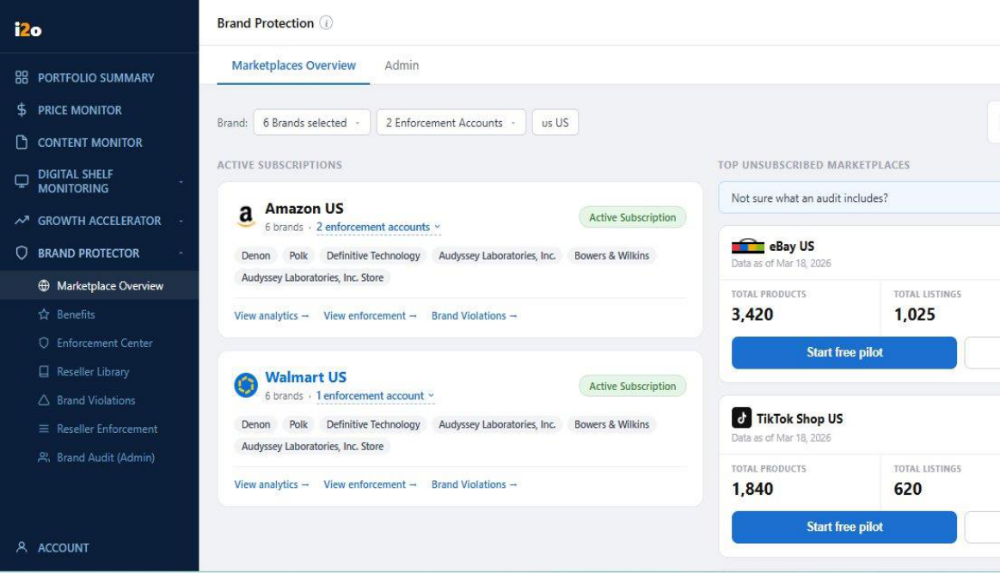
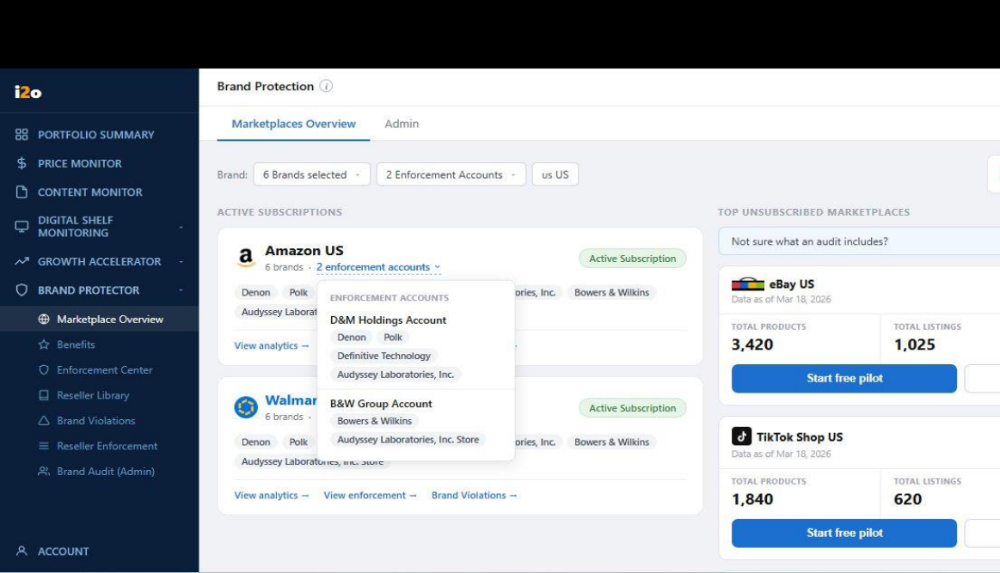

## **i2o Retail**

Product Requirements Document **BP-MO-001 — Brand Protection: Marketplace Overview**

Document Owner: Sunil Tech Lead: Sandeep Last Updated: 03 April 2026 Status: Draft

## **SECTION A: EPIC DEFINITION**

Purpose: Identify and classify the epic.

||BP-MO-001|
|---|---|
|**Epic ID**||
||BP - Marketplace Overview - Client-Facing Overview Screen|
|**Epic Name**||
|**Epic Type**|Module Enhancement|
|**Parent Epic**|N/A|
||BP (Brand Protector)|
|**Products**||
|||
|**Modules**|Marketplace Overview|
||Module Enhancement | Client-Facing|
|**Flags**||
|**Priority**|P0 — Critical (MVP required)|
|**Target Release**|Q2 2026 — April Release|
|||
||Sunil|
|**Epic Owner**||
|**Tech Lead**|Sandeep|
||4 weeks|
|**Timeline**||
|**Known Blockers**|GCP bucket for WBR and marketplace data not yet finalised — URLs to be provided by data team|
|||

## **SECTION B: PROBLEM & OBJECTIVES**

Purpose: Establish the "why" with data-backed justification.

## **B1. Problem Statement**

Brand managers and VP-level eCommerce clients at i2o have no single screen to understand their brand protection health across active and unmonitored marketplaces. Today, clients must navigate multiple screens to find active subscription details, receive WBR reports via email, and have no visibility of unauthorized reseller activity on platforms they are not subscribed to. This means grey market risk on high-volume marketplaces (eBay, TikTok Shop, Target) goes undetected until the client proactively asks — by which time the damage to pricing integrity and brand equity has already occurred.

Evidence: Internal review session (CEO Manu Sareen, Mar 2026) identified the current Marketplace Overview as providing zero client benefit — "we're shoving things in with no utilization." The redesign is required before the April 2026 client release.

## **B2. Why Now?**

Primary driver: April 2026 product release deadline confirmed by CEO. Secondary drivers:

- Client-facing self-serve requirement — AMs currently prepare data manually for every client call, which is not scalable.

- Revenue opportunity — surfacing unmonitored marketplace risk directly to the client is the most direct conversion path from free pilot to paid subscription.

- Grey market data is being scraped quarterly for beauty, electronics and other verticals — the data exists but has no client-facing consumption layer.

## **B3. Who Benefits & How?**

|||||
|---|---|---|---|
|**Persona**|**Pain**|**Solution Benefit**|**Impact (Quantified)**|
|||||
|Client (Brand Manager / VP eCommerce)|No single view of brand protection health across marketplaces|See active subscriptions, unmonitored marketplace risk and WBR from one screen|Reduce time-to-insight from days (email) to seconds (self-serve)|
|Client (Brand Manager)|Unaware of unauthorized reseller activity on unmonitored platforms|Pain-ranked unsubscribed marketplace cards with reseller counts prompt action|Expected to increase pilot request conversion by surfacing risk proactively|
|i2o Account Manager|Must manually prepare data for client calls|Screen serves as self- serve artifact for client meetings|Reduce AM prep time per client review|

## **B4. Success Metrics**

||||||
|---|---|---|---|---|
|**Metric**|**Baseline**|**Target**|**Timeline**|**Measurement**|
||||||
|Pilot requests via screen|0 (new feature)|5+ requests/month per client|Q2 2026|Support email count|
|Audit report requests via screen|0 (new feature)|3+ requests/month per client|Q2 2026|Support email count|
|WBR download rate|0 (email only today)|80% of clients download at least once per month|Q2 2026|GCP download logs|
|Screen adoption (DAU)|0 (new screen)|60% of active clients view screen weekly|Q3 2026|Session analytics|

## **B5. Scope**

## **In Scope**

- Active subscription cards per marketplace + region based on client config

- Top unsubscribed marketplace cards with pain ranking (resellers: 0–50 Low, 51–200 Medium, 201+ High)

- Brand and enforcement account filter bar

- Weekly Business Review download (zip of all brand PDFs from GCP)

- Start Free Pilot flow with email notification to support@i2oretail.com

- Request Audit Report flow with email notification to support@i2oretail.com

- View Audit Report sample PDF

- Navigation links from subscription cards to Analytics, Enforcement, Brand Violations (subscription-gated)

## **Out of Scope**

- Admin screen — Brand Audit scheduling and table (covered in separate PRD BP-BA-001)

- Real-time reseller data refresh (data is quarterly from GCP bucket)

- Counterfeit monitoring (different product line)

- Non-US regions in this release

- Gen AI summary (future state — placeholder only if time permits)

## **SECTION C: USER STORIES**

## **US001 — View Active Subscriptions**

||BP-MO-001-US001|
|---|---|
|**Story ID**||
|**Title**|View Active Subscriptions|
||UI / Full-stack|
|**Type**||
|**Priority**|P0 — Critical|
|**Modules**|Marketplace Overview|
|||
||None|
|**Depends On**||
|**Blocks**|None|

_As a client, I want to see my active marketplace subscriptions with brand details and navigation links, so that I can confirm my brand protection coverage at a glance._

## **User Flow**

1. Client logs in → navigates to Brand Protection → Marketplaces Overview tab

2. System reads client subscription config and renders one card per active marketplace + region

3. Each card shows: marketplace logo, marketplace name + region, brand count, enforcement account count (clickable), brand pills, Active badge, and navigation links

4. Client clicks "2 enforcement accounts" → popup shows account name and linked brands

5. Client clicks "View analytics →", "View enforcement →", or "Brand Violations →" → navigates to respective module

## **UI Screens**

_Figure 1: Marketplace Overview — Active Subscriptions (default state)_

_Figure 2: Marketplace Overview — Enforcement Accounts popup expanded_

## **Validation Rules**

- Marketplace card only renders if client has an active subscription for that specific marketplace + region combination.

- Navigation links (View analytics, View enforcement, Brand Violations) only render if client has that module enabled in their subscription.

- Enforcement account popup shows account name and associated brands only — no other data.

- If enforcement account count is 0, show "0 enforcement accounts" — clicking shows empty state with message "No enforcement accounts linked."

## **Corner Cases**

||||
|---|---|---|
|**What Could Go Wrong**|**How Handled**|**User Experience**|
||||
|Client has only 1 marketplace subscribed|Render only that 1 card — do not show empty slots|Clean single card view|
|Client has Amazon US + Amazon UK|Render as 2 separate cards|Two cards, each with correct region flag|
|Client has 0 active subscriptions|Show empty state with message|Empty state: "No active subscriptions found. Contact your AM."|
|Brand Violations module is disabled|Brand Violations link is not rendered|Only View analytics and View enforcement links show|
|Enforcement module is disabled|View enforcement link is not rendered|Only applicable links render|
|More than 6 brands linked|All brands show as pills — no truncation|"Audyssey Laboratories, Inc. Store" wraps cleanly|
|Enforcement account count is 0|Show "0 enforcement accounts" — popup shows empty state|User sees "No enforcement accounts linked."|
|Clicking enforcement accounts when popup already open|Toggle close|Popup closes on second click|
|Session times out while viewing|Redirect to login page|Standard session timeout handling|
|Client subscription expires mid- session|Reflect updated state on next full page load|No live expiry — state refreshed on reload|

## **Acceptance Criteria**

|**Given**|**When**|**Then**|
|---|---|---|
||||
|Client is subscribed to Amazon US only|Marketplace Overview loads|Only Amazon US card appears — no other cards rendered|
|Client has Brand Violations disabled|Subscription card renders|"Brand Violations →" link is not visible on any card|
|Client clicks "2 enforcement accounts"|Popup opens|Popup shows: account names + linked brand pills for each account|

||||
|---|---|---|
|Client has no active subscriptions|Screen loads|Empty state shown with message to contact AM|
|All ACs pass + QA complete|PO reviews|Story = Done (PO Sign-off required)|

## **US002 — View Top Unsubscribed Marketplaces**

|**Story ID**|BP-MO-001-US002|
|---|---|
||View Top Unsubscribed Marketplaces|
|**Title**||
||UI / Full-stack|
|**Type**||
|**Priority**|P0 — Critical|
||Marketplace Overview|
|**Modules**||
|**Depends On**|None|
||None|
|**Blocks**||
|||

_As a client, I want to see the top unmonitored marketplaces ranked by pain level based on reseller count, so that I understand where my brand is most exposed and can take action._

## **User Flow**

6. Screen loads → system reads marketplace data from GCP bucket

7. Top unsubscribed marketplaces are ranked by reseller count (highest first)

8. Each card shows: marketplace logo + name + region, data freshness date, Total Products, Total Listings, Total Resellers, pain badge

9. Pain badge is calculated: 0–50 resellers = Low (green), 51–200 = Medium (amber), 201+ = High (red)

10. Two CTAs per card: "Start free pilot" (primary) and "Request Audit Report" (secondary)

## **Pain Level Logic**

|||||
|---|---|---|---|
|**Reseller Count**|**Pain Badge**|**Badge Color**|**CTA Emphasis**|
|0 – 50|Low pain|Green|Both CTAs shown equally|
|51 – 200|Medium pain||Both CTAs shown equally|
|||Amber||
|201+|High pain|High pain (red)|Start free pilot emphasized|
|||||

## **Corner Cases**

||||
|---|---|---|
|**What Could Go Wrong**|**How Handled**|**User Experience**|
||||
|Marketplace data not yet available from GCP|Show "Data unavailable" placeholder on card|Card renders with — for all metrics and "Data pending" label|
|All shown marketplaces are already subscribed|Filter those out — show next available unsubscribed|No duplicate cards with active subscriptions|
|Reseller count is exactly 50 (boundary)|50 = Low pain badge|Low badge renders|
|Reseller count is exactly 51 (boundary)|51 = Medium pain badge|Medium badge renders|

||||
|---|---|---|
|Reseller count is exactly 201 (boundary)|201 = High pain badge|High badge renders|
|GCP bucket unavailable|Show last cached data with "Data as of [date]" indicator|User sees stale data with timestamp — no blank screen|
|Only 1 unsubscribed marketplace exists|Show 1 card only|Single card layout — no empty placeholder cards|
|Total products = 0 but resellers > 0|Show both numbers as-is|0 products, N resellers — both rendered|
|Data date is older than 90 days|Show warning indicator on card|Yellow clock icon with "Data may be outdated"|
|Two marketplaces have same reseller count|Alphabetical as tiebreaker|Consistent order on every load|

## **Acceptance Criteria**

||||
|---|---|---|
|**Given**|**When**|**Then**|
||||
|Marketplace has 790 resellers|Card renders|High pain badge shown in red — Total Resellers value in red|
|Marketplace has 45 resellers|Card renders|Low pain badge shown in green|
|Marketplace has 120 resellers|Card renders|Medium pain badge shown in amber|
|GCP data is unavailable|Screen loads|Card shows "Data unavailable" state — screen does not crash|
|All ACs pass + QA complete|PO reviews|Story = Done (PO Sign-off required)|

## **US003 — Filter by Brand and Enforcement Account**

|**Story ID**|BP-MO-001-US003|
|---|---|
||Filter by Brand and Enforcement Account|
|**Title**||
||UI / Full-stack|
|**Type**||
|**Priority**|P0 — Critical|
||Marketplace Overview|
|**Modules**||
|**Depends On**|None|
||None|
|**Blocks**||
|||

_As a client, I want to filter the Marketplace Overview by brand and enforcement account, so that I can focus on data relevant to a specific brand context._

## **User Flow**

11. Filter bar renders at top with: Brand multi-select dropdown, Enforcement Accounts dropdown, Region pill

12. Default state: all brands selected, all enforcement accounts selected, US region

13. Client opens Brand dropdown → searchable list of all brands linked to their account

14. Client selects/deselects brands → screen updates to reflect selected brand data

15. Brand selection also determines which brands are captured in pilot and audit email requests

## **Corner Cases**

|**What Could Go Wrong**|**How Handled**|**User Experience**|
|---|---|---|
||||
|User deselects all brands|Show empty state on both columns|Empty state with message: "Select at least one brand"|
|User selects 1 brand from 6|Both columns reflect that brand's data only|Active subscription and unsubscribed cards update|
|Brand list has 10+ items|Dropdown is scrollable|Search field available for quick filtering|
|User searches for non-existent brand|Show "No results" state|No results message inside dropdown|
|Filter resets on page refresh|Load with all brands selected by default|Full selection on every fresh load|
|User rapidly toggles brands|Debounce filter updates|No UI flicker or broken state during rapid toggling|
|Enforcement account filter changes|Active subscription cards filter accordingly|Cards re-render with filtered data|
|Region filter is US (default)|Only US marketplace cards show|Non-US cards hidden in this release|
|Only 1 brand in account|Dropdown shows 1 item — pre-selected|No dropdown needed; brand pill shows brand name|

User clears all filters

Screen reloads to default (all Default state restored selected)

## **Acceptance Criteria**

||||
|---|---|---|
|**Given**|**When**|**Then**|
||||
|User selects "Denon" only|Filter applied|Only Denon-related data shown across all cards|
|User clicks enforcement account dropdown|Dropdown opens|List shows account names with linked brands|
|User clears all brand selections|Filter applied|Empty state shown with prompt to select a brand|
|All ACs pass + QA complete|PO reviews|Story = Done (PO Sign-off required)|

## **US004 — Access Weekly Business Review**

|**Story ID**|BP-MO-001-US004|
|---|---|
||Access Weekly Business Review|
|**Title**||
||UI / Full-stack|
|**Type**||
|**Priority**|P1 — High|
||Marketplace Overview|
|**Modules**||
|**Depends On**|None|
||None|
|**Blocks**||
|||

_As a client, I want to download my latest Weekly Business Review directly from the overview screen, so that I can access my brand protection report without searching my email._

## **User Flow**

16. WBR card renders in top-right of filter bar: "Weekly business review · Latest: Mar 28, 2026 · View →"

17. Client clicks "View →"

18. System fetches zip file from GCP bucket containing all brand-level WBR PDFs for the client

19. Zip file downloads to client's device

## **Corner Cases**

||||
|---|---|---|
|**What Could Go Wrong**|**How Handled**|**User Experience**|
||||
|No WBR exists for current month|Show "Report not yet available for this period"|User sees friendly message — no crash|
|WBR zip contains 1 brand PDF only|Zip still downloads correctly|Single PDF in zip — no error|
|WBR zip is large (50MB+)|Show loading indicator during download|Spinner with "Preparing your download…"|
|GCP bucket is unavailable|Show error toast|Toast: "Unable to download. Please try again later."|
|User clicks download while another is in progress|Prevent duplicate download|Button disabled during active download|
|WBR not yet uploaded by AM for this period|Show "Report not yet available"|Clear message — no broken download link|
|Some brand PDFs missing from zip|Include available ones only — note in filename|Zip contains what is available|
|Download fails midway|Show error with retry option|Toast: "Download failed. Retry?" with retry button|
|Session expires before download completes|Handle gracefully — redirect to login|Standard session handling|

Zip file is corrupted on GCP

Surface error to user Toast: "Report could not be opened. Please contact support."

## **Acceptance Criteria**

||||
|---|---|---|
|**Given**|**When**|**Then**|
||||
|WBR exists for current period|User clicks "View →"|Zip file downloads containing all brand-level WBR PDFs|
|No WBR exists|User clicks "View →"|User sees "Report not yet available" message — no download initiated|
|GCP bucket is unavailable|User clicks "View →"|Error toast shown — no crash|
|All ACs pass + QA complete|PO reviews|Story = Done (PO Sign-off required)|

## **US005 — Start Free Pilot**

|**Story ID**|BP-MO-001-US005|
|---|---|
||Start Free Pilot|
|**Title**||
||UI / Full-stack|
|**Type**||
|**Priority**|P1 — High|
||Marketplace Overview|
|**Modules**||
|**Depends On**|None|
||None|
|**Blocks**||
|||

## _As a client, I want to request a free pilot for an unsubscribed marketplace, so that i2o can begin monitoring and demonstrate value before I commit to a full subscription._

## **User Flow**

20. Client clicks "Start free pilot" on an unsubscribed marketplace card

21. Confirmation modal opens: "You're all set! Our team will reach out to kick off your free pilot on [Marketplace]."

22. Client clicks Confirm

23. System captures: user name + email (from auth/session token), brands (from top filter selection), marketplace name, region

24. Email triggered to support@i2oretail.com with all captured fields

25. "Start free pilot" button is disabled — greyed out

26. On hover over disabled button: tooltip shows "Free pilot requested"

## **Email Capture Fields**

|**Field**|**Source**|**Example**|
|---|---|---|
||||
|User Name|Auth/session token|Sunil Kumar|
|User Email|Auth/session token|sunil@clientdomain.com|
|Brand(s)|Top filter — brands selected at time of click|Denon, Polk|
|Marketplace|Marketplace card|eBay|
|Region|Marketplace card|US|

## **Corner Cases**

||||
|---|---|---|
|**What Could Go Wrong**|**How Handled**|**User Experience**|
||||
|No brands selected in filter|Block submission — show validation error|Prompt: "Please select at least one brand in the filter before requesting a pilot."|
|Email trigger to support@i2oretail.com fails|Show error toast — do not disable button — allow retry|Toast: "Failed to submit request. Please try again."|

||||
|---|---|---|
|User clicks confirm twice rapidly|Debounce — prevent duplicate email sends|Only 1 email sent regardless of click speed|
|Support email server is unreachable|Log failure server-side, queue retry|User sees success — backend handles retry silently|
|Auth token has no user email|Block submission — show error|Error: "Unable to identify your account. Please contact support."|
|Pilot already requested (same marketplace, same user)|Button is pre-disabled on page load — tooltip shows "Free pilot requested"|User cannot re-request for same marketplace|
|Multiple brands selected in filter|All selected brands captured in email|Email body lists all selected brands|
|User dismisses modal before confirming|No email sent — button stays active|Modal closes — no state change|
|Network drops during confirmation|Show error — button stays active|Toast: "Connection lost. Please try again."|
|User hovers over disabled pilot button|Tooltip renders|Tooltip: "Free pilot requested"|

## **Acceptance Criteria**

||||
|---|---|---|
|**Given**|**When**|**Then**|
||||
|Client clicks "Start free pilot" and confirms|Confirmation submitted|Email sent to support@i2oretail.com with user name, email, brand(s) from filter, marketplace, region|
|Pilot is confirmed|User views button again|Button is disabled and greyed out|
|User hovers over disabled pilot button|Hover state|Tooltip shows "Free pilot requested"|
|No brands selected in filter|User clicks Start free pilot|Validation error shown — modal does not open|
|All ACs pass + QA complete|PO reviews|Story = Done (PO Sign-off required)|

## **US006 — Request Audit Report**

|**Story ID**|BP-MO-001-US006|
|---|---|
||Request Audit Report|
|**Title**||
||UI / Full-stack|
|**Type**||
|**Priority**|P1 — High|
||Marketplace Overview|
|**Modules**||
|**Depends On**|None|
||None|
|**Blocks**||
|||

_As a client, I want to request an audit report for an unsubscribed marketplace, so that I receive a detailed view of unauthorized reseller activity on that platform._

## **User Flow**

27. Client clicks "Request Audit Report" on an unsubscribed marketplace card

28. Confirmation modal opens with request summary

29. Client clicks Confirm

30. System captures: user name + email (session), brands (from filter), marketplace, region

31. Email triggered to support@i2oretail.com

32. Success message: "Your audit request for [brand] on [marketplace] is confirmed. Your downloadable report will be ready within 5 business days."

## **Corner Cases**

||||
|---|---|---|
|**What Could Go Wrong**|**How Handled**|**User Experience**|
||||
|No brands selected in filter|Block submission — show validation|Prompt: "Please select at least one brand before requesting an audit."|
|Email trigger fails|Show error — do not lock button — allow retry|Toast: "Failed to submit. Please try again."|
|Same audit requested twice|Allow — flag duplicate in email subject line|Second email subject: "[DUPLICATE] Audit Request — eBay US — Denon"|
|Auth token has no user email|Block submission — show error|Error: "Unable to identify your account. Please contact support."|
|Multiple brands selected|All captured in email|Email lists all selected brands|
|User closes modal mid-flow|No request sent — no state change|Modal closes cleanly|
|Support email server is down|Queue and retry server-side|User sees success confirmation — retry handled silently|

||||
|---|---|---|
|Region not determinable|Use region shown on marketplace card|Default to card's displayed region|
|Network failure during submission|Show retry option|Toast: "Connection lost. Retry?" with retry button|
|Pilot already confirmed for same marketplace|Allow audit request independently|Both pilot + audit emails sent — separate actions|

## **Acceptance Criteria**

||||
|---|---|---|
|**Given**|**When**|**Then**|
||||
|Client clicks "Request Audit Report" and confirms|Form submitted|Email sent to support@i2oretail.com with user name, email, brand(s), marketplace, region|
|Brands selected in filter|Audit is requested|Only the selected brands appear in the email — not all account brands|
|Audit confirmed|Success message shown|"Your audit request for [brand] on [marketplace] is confirmed. Your downloadable report will be ready within 5 business days."|
|All ACs pass + QA complete|PO reviews|Story = Done (PO Sign-off required)|

## **US007 — View Audit Report Sample**

|**Story ID**|BP-MO-001-US007|
|---|---|
||View Audit Report Sample|
|**Title**||
||UI / Full-stack|
|**Type**||
|**Priority**|P2 — Medium|
||Marketplace Overview|
|**Modules**||
|**Depends On**|None|
||None|
|**Blocks**||
|||

_As a client, I want to download a sample audit report, so that I understand what I will receive before committing to an audit request._

## **User Flow**

33. Client sees "Not sure what an audit includes?" banner above unsubscribed marketplace cards 34. Client clicks "Audit Report →"

35. Sample PDF opens/downloads — branded as "i2o Brand Protection Audit for {Brand Name}"

## **Sample Report Content**

- Cover: i2o Brand Protection Audit for {Brand Name}

- Date: {Discovery Month} {Discovery Year}

- Platform: {Marketplace} {Region}

- Listings with highest reseller pressure

- Resellers with multiple listings

- Benefits of Brand Protection — Before / After comparison

- Contact: info@i2oretail.com | i2oretail.com

## **Corner Cases**

|**What Could Go Wrong**|**How Handled**|**User Experience**|
|---|---|---|
||||
|Sample PDF missing from GCP|Show error message|Toast: "Sample not available. Please contact support."|
|PDF is corrupted|Show error|Toast: "Unable to open sample. Please contact support."|
|User clicks link multiple times rapidly|Open/download only once — debounce|No duplicate downloads|
|User is on mobile browser|PDF opens in browser tab|Standard mobile PDF handling|
|PDF takes long to load from GCP|Show loading indicator|Spinner shown until PDF ready|

## **Acceptance Criteria**

||||
|---|---|---|
|**Given**|**When**|**Then**|
||||
|Client clicks "Audit Report →"|Link clicked|Sample PDF downloads/opens showing i2o audit template with Brand, Date, Platform, Listings, Resellers, Benefits sections|
|PDF missing from GCP|Client clicks link|Error toast shown — no broken download|
|All ACs pass + QA complete|PO reviews|Story = Done (PO Sign-off required)|

## **US009 — Navigate to Analytics, Enforcement, Brand Violations**

|**Story ID**|BP-MO-001-US009|
|---|---|
||Navigate to Analytics, Enforcement, Brand Violations|
|**Title**||
||UI / Full-stack|
|**Type**||
|**Priority**|P1 — High|
||Marketplace Overview|
|**Modules**||
|**Depends On**|None|
||None|
|**Blocks**||
|||

_As a client, I want quick navigation links from each active subscription card to my Analytics, Enforcement and Brand Violations screens, so that I can drill into details without searching the navigation._

## **User Flow**

36. Active subscription card renders with links at the bottom: "View analytics →", "View enforcement →", "Brand Violations →"

37. Links render only if the client has that module enabled in their subscription config

38. Client clicks "View analytics →" → navigates to Benefits Portal screen (same app)

39. Client clicks "View enforcement →" → navigates to Enforcement Center screen (same app)

40. Client clicks "Brand Violations →" → navigates to Brand Violations screen (same app)

## **Navigation Mapping**

||||
|---|---|---|
|**Link Label**|**Destination Screen**|**Condition to Show**|
||||
|View analytics →|Benefits Portal|Client has Analytics module enabled|
|View enforcement →|Enforcement Center|Client has Enforcement module enabled|
|Brand Violations →|Brand Violations|Client has Brand Violations module enabled|

## **Corner Cases**

|**What Could Go Wrong**|**How Handled**|**User Experience**|
|---|---|---|
||||
|Client has analytics module disabled|View analytics link not rendered|Only applicable links show on card|
|Client has enforcement module disabled|View enforcement link not rendered|Only applicable links show on card|
|Client has brand violations disabled|Brand Violations link not rendered|Only applicable links show on card|
|All 3 modules disabled|No links render — card shows subscription info only|Card still shows brand pills and Active badge|

||||
|---|---|---|
|Navigation target screen is unavailable|Show error page gracefully|Standard app error handling — not a blank screen|
|Client navigates away and presses back|Returns to Marketplace Overview with filters intact|Filter state preserved via session|

## **Acceptance Criteria**

||||
|---|---|---|
|**Given**|**When**|**Then**|
||||
|Client has analytics enabled|Client clicks "View analytics →"|Navigates to Benefits Portal screen within same app|
|Client has enforcement enabled|Client clicks "View enforcement →"|Navigates to Enforcement Center within same app|
|Client has brand violations disabled|Subscription card renders|"Brand Violations →" link is not rendered on the card|
|Client navigates to another screen and presses back|Back button pressed|Returns to Marketplace Overview with filter state intact|
|All ACs pass + QA complete|PO reviews|Story = Done (PO Sign-off required)|

## **SECTION D: RELEASE PLAN & TIMELINE**

## **Release 1 — BP-MO-001 Marketplace Overview**

**Release Name:** Brand Protection Marketplace Overview — Client-Facing Redesign **Target Date:** April 2026

**Goal:** Deliver a self-serve client-facing overview screen that shows active brand protection coverage, unmonitored marketplace risk, and provides direct actions (pilot, audit, WBR download). **Duration:** 4 weeks (Week of 7 Apr → Week of 30 Apr 2026)

|||||||
|---|---|---|---|---|---|
|**Story ID**|**Title**|**Priority**|**Dependencies**|**Timeline**|**Status**|
|US001|View Active Subscriptions||Auth/session|Week 1–2||
|||P0|||Backlog|
|US002|View Top Unsubscribed Marketplaces|P0|GCP data bucket, US001|Week 1–2|Backlog|
|||||||
|US003|Filter by Brand and Enforcement Account||US001|Week 1–2||
|||P0|||Backlog|
|||||||
|US004|Access Weekly Business Review|P1|GCP WBR bucket|Week 2–3|Backlog|
|||||||
|US005|Start Free Pilot|P1|US001, US002, Auth|Week 2–3|Backlog|
|||||||
|US006|Request Audit Report||US001, US002, Auth|Week 2–3||
|||P1|||Backlog|
|||||||
|US007|View Audit Report Sample|P2|GCP bucket|Week 3|Backlog|
|US009|Navigate to Analytics, Enforcement, Brand Violations||US001, Subscription config|Week 3–4||
|||P1|||Backlog|
|||||||

## **Timeline with Dependencies**

- Week 1–2: US001 (Active Subscriptions), US002 (Unsubscribed Marketplaces), US003 (Filters) — core screen must complete before actions are built

- Week 2–3: US004 (WBR), US005 (Start Pilot), US006 (Request Audit) — depends on GCP bucket URLs confirmed by data team

- Week 3: US007 (Sample Audit Report) — depends on audit PDF uploaded to GCP

- Week 3–4: US009 (Navigation links) — depends on US001 and subscription config API

## **Show Stoppers**

|||
|---|---|
|**Blocker**|**Mitigation**|
|||
|GCP bucket URLs for WBR and marketplace data not confirmed by data team|Use placeholder/mock data in design; swap URLs on confirmation. Must be resolved by end of Week 1.|
|Client subscription config API not available|Use hardcoded config for demo client; real API integration in Week 3–4.|

Email service (support@i2oretail.com) not Test with internal email alias; switch to support configured for trigger address before go-live.

## **Future Backlog**

- Gen AI account summary banner (Phase 2) — requires DS infrastructure

- Non-US region support (Phase 2) — UK, CA, IN, DE, AU, FR, JP

- Additional unsubscribed marketplaces as data becomes available (eBay, TikTok Shop, Target confirmed; 2 more pending AM research)

- Live reseller count refresh (Phase 3) — currently quarterly

## **SECTION E: APPENDIX**

## **E1. Glossary**

|||
|---|---|
|**Term**|**Definition**|
|||
|**Active Subscription**|A marketplace + region combination that the client is currently enrolled in for brand protection monitoring and enforcement.|
|**Unsubscribed** **Marketplace**|A marketplace where i2o has detected reseller activity for the client's brands but the client has not enrolled in brand protection.|
|**Pain Level**|Risk classification based on number of unauthorized resellers: 0–50 = Low, 51–200 = Medium, 201+ = High.|
|**WBR**|Weekly Business Review — a PDF report prepared by the AM team summarising brand protection performance. Delivered as a zip of brand- level PDFs.|
|**Free Pilot**|A no-commitment trial of i2o brand protection monitoring on a specific marketplace, requested by client.|
|**Audit Report**|An L1-level report showing unauthorized reseller activity, listings with highest reseller pressure, and brand protection benefits for a specific marketplace.|
|**Enforcement Account**|An i2o operational account used to execute enforcement actions (C&D, listing removals) on behalf of the client on a given marketplace.|
|**GCP Bucket**|Google Cloud Platform object storage bucket where marketplace data and WBR PDFs are stored and served from.|
|**Grey Market**|Authentic products sold through unauthorized distribution channels — not counterfeit but in breach of brand agreements.|

## **E2. References**

- Figma Design: [Link to be added by design team]

- Prototype HTML: brand_protection_marketplaces.html (shared via OneDrive)

- CEO Review Recording: Review_-_Marketplace_overview.vtt (attached)

- Sample Audit Report: BP_Audit_Slide.pptx (attached)

- PRD Template: i2o_PRD_Template.pdf (attached)

- DB Schema: [Link to be added by Sandeep]

- Swagger API Docs: [Link to be added by Sandeep]

## **E3. FAQ for Developers**

## **Q: How is the user's name and email captured for pilot/audit emails?**

A: From the authenticated session/auth token — the client is already logged in. No manual entry required. If the token is missing the email, block submission and show an error. (Ref: US005, US006)

## **Q: Where does marketplace data (resellers, listings, products) come from?**

A: From a GCP bucket that the data team populates quarterly. The bucket URL will be provided before Week 2. Until confirmed, use mock data. (Ref: US002)

## **Q: How do we know which modules a client has enabled?**

A: From the client subscription config — an API or config table that maps client ID to enabled modules (Analytics, Enforcement, Brand Violations). Sandeep to confirm API shape. (Ref: US001, US009)

## **Q: What happens if the support email fails to send?**

A: Show an error toast to the user and allow retry. Do not disable the button. Log the failure server-side for retry queue. (Ref: US005, US006)

## **Q: Is the enforcement accounts popup part of the filter or the subscription card?**

A: It is part of the subscription card — clicking "N enforcement accounts" on the card opens a popup showing account names and linked brands. It is not connected to the filter bar. (Ref: US001)

## **E4. Change Log**

||||||
|---|---|---|---|---|
|**Date**|**Version**|**Author**|**Changes**|**Sections** **Affected**|
||||||
|03 Apr 2026|v1.0|Sunil|Initial PRD creation|All|

---

## Extracted Images

| # | File | Dimensions | Size |
|---|------|------------|------|
| 1 | BP-MO-001-PRD.pdf-0006-00.png | 1163x667 | 409.7KB |
| 2 | BP-MO-001-PRD.pdf-0006-02.png | 1163x667 | 380.2KB |
