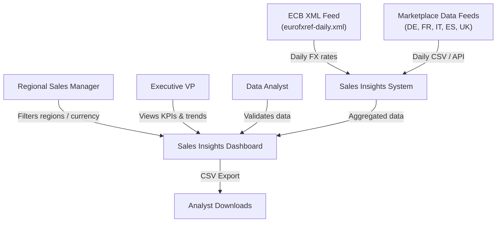
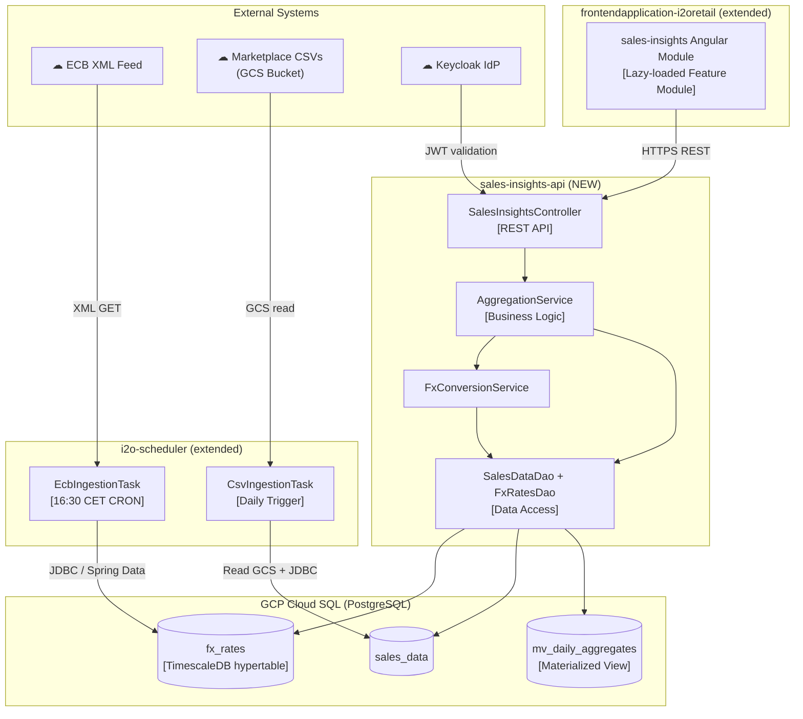
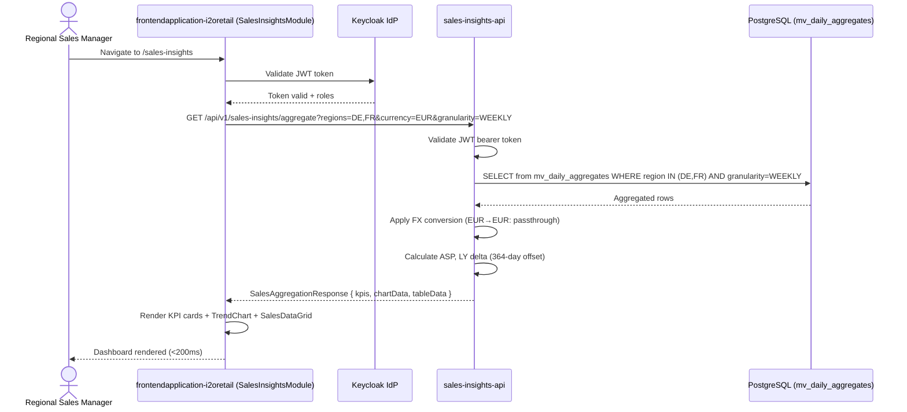
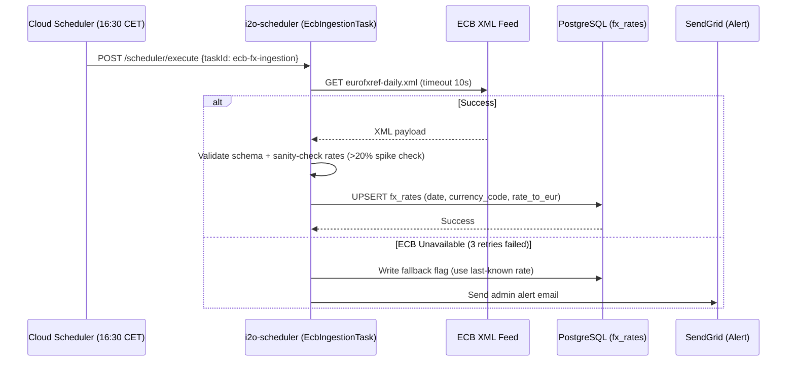
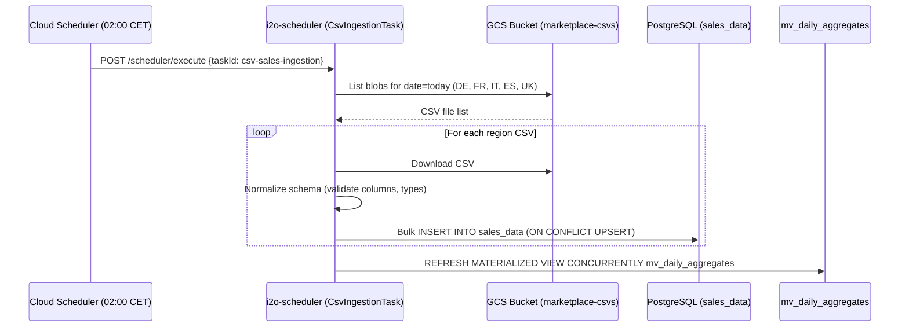
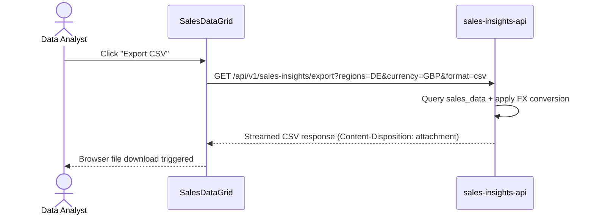
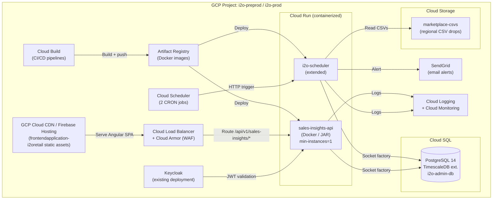

# GA-SI-001 – Architecture Document (arc42)
# Growth Accelerator — Sales Insights — Unified EMEA Sales Dashboard

> **Template:** arc42-architecture-v1 | **Status:** Draft | **Target Release:** Q2 2026

---

## Change Log

| Date | Version | Description | Author |
|------|---------|-------------|--------|
| 2026-02-26 | 1.0.0 | Initial architecture document | AI Agent |

---

## 1. Introduction and Goals

### 1.1 Requirements Overview

The **Sales Insights** module addresses fragmented, manual EMEA sales reporting across five regional marketplaces (DE, FR, IT, ES, UK) for Panasonic. Currently, regional managers spend 4–6 hours per week on manual FX lookups and spreadsheet merging, causing a 2–3 day reporting lag and data inconsistency.

This system delivers:
- **Automated ECB FX rate ingestion** — daily CRON fetch from the European Central Bank XML feed into PostgreSQL
- **Unified multi-region sales aggregation** — on-the-fly currency conversion with <200ms response
- **Interactive EMEA Command Center** — trend charts, KPI cards, and SKU-level data grid

For full functional requirements, refer to the [PRD](../requirements/prd.md).

### 1.2 Quality Goals

| Priority | Quality Goal | Scenario / Motivation |
|----------|-------------|-----------------------|
| P1 | **Performance** | Dashboard API responds in <200ms P95 for aggregated queries across 5 regions |
| P2 | **Reliability** | ECB ingestion succeeds or gracefully falls back; system uptime ≥99.5% |
| P3 | **Maintainability** | New currencies or regions added via config only; no code changes required |
| P4 | **Security** | All endpoints protected by existing Keycloak SSO; region-level RBAC enforced |
| P5 | **Scalability** | Supports 10× data growth and additional EMEA regions without re-architecture |

### 1.3 Stakeholders

| Role / Name | Contact | Expectations |
|------------|---------|--------------|
| PM — Sandeep | Internal | On-time delivery, meets PRD acceptance criteria |
| Regional Sales Manager | End User | Automated reporting, zero FX manual effort |
| Executive VP | End User | Real-time unified EMEA performance view |
| Data Analyst | End User | Single Source of Truth, 100% consistency |
| Tech Lead — AI Agent | Engineering | Clean architecture aligned with existing i2o microservices |
| DevOps / Platform Team | Internal | Deployment on GCP following existing i2o patterns |

---

## 2. Architecture Constraints

| Constraint | Background / Rationale |
|-----------|------------------------|
| **GCP-only infrastructure** | Organization mandates GCP (Cloud SQL, Cloud Run, Cloud Scheduler, BigQuery) |
| **Existing i2o microservices must be reused** | No new infrastructure; `i2o-admin`, `i2o-scheduler`, `frontendapplication-i2oretail` extended |
| **Keycloak for authentication** | SSO is mandated; all new endpoints protected via existing Keycloak realm |
| **PostgreSQL (Cloud SQL)** | Organizational standard for transactional data; TimescaleDB extension for `fx_rates` time-series optimization |
| **Java 17 / Spring Boot 3.x for new backend modules** | Align with `i2o-scheduler` stack (newest active service) |
| **Angular 15 + TypeScript for frontend** | Align with `frontendapplication-i2oretail` stack |
| **ECB XML feed as FX source** | Contractual and business requirement; no custom rates in MVP |
| **Cold-path (batch) data refresh: daily** | Real-time streaming is out of scope for MVP |
| **Q2 2026 delivery target** | 8-week timeline — forces scope discipline |

---

## 3. Context and Scope

### 3.1 Business Context



| Communication Partner | Inputs | Outputs |
|----------------------|--------|---------|
| ECB XML API | — | Daily EUR reference exchange rates (XML) |
| Marketplace Data Feeds | — | Regional sales CSVs (SKU, revenue, units) |
| Regional Sales Manager | Filter selections (region, currency, granularity) | Aggregated KPIs, charts, data grid |
| Executive VP | Read-only dashboard view | Real-time EMEA performance summary |
| Data Analyst | Filter + export | CSV download of filtered SKU data |
| Keycloak IdP | Auth token | User identity + role claims |

### 3.2 Technical Context

| Neighboring System | Channel / Protocol | Details |
|-------------------|-------------------|---------|
| ECB XML Feed | HTTPS / REST (GET) | `https://www.ecb.europa.eu/stats/eurofxref/eurofxref-daily.xml` — polled by CRON |
| Marketplace CSV Source | GCS / SFTP | Regional sales CSVs landed to GCS bucket by upstream pipelines |
| Keycloak | HTTPS / OAuth2 + OIDC | JWT bearer token validation via existing i2o realm |
| Cloud SQL (PostgreSQL) | Cloud SQL socket factory (TCP/5432) | `fx_rates`, `sales_data`, `aggregation_cache` tables |
| Cloud Scheduler | gRPC / HTTP | Triggers CRON job at 16:30 CET daily |
| frontendapplication-i2oretail | HTTPS / REST | Angular SPA calls Sales Insights API via `/api/v1/sales-insights/*` |
| SendGrid | HTTPS / REST | Alert emails on ingestion failure |
| GCP Cloud Logging | gRPC | Centralized structured logs |

---

## 4. Solution Strategy & Project Modules

### Strategy Summary

The Sales Insights feature is implemented as a **thin vertical slice** extending existing i2o microservices rather than introducing new infrastructure:

1.  **Currency Conversion Service** — A new scheduled task inside `i2o-scheduler` handles daily ECB ingestion. `i2o-scheduler` already owns CRON infrastructure, retry logic, and SendGrid alerts.

2.  **Sales Insights API** — A new Spring Boot module (`sales-insights-api`) deployed as a Cloud Run service, responsible for data ingestion from GCS, aggregation queries, and REST API exposure. This follows the same Java 17 / Spring Boot 3.x patterns established by `i2o-scheduler`.

3.  **Sales Insights Frontend** — A new feature module (`SalesInsightsModule`) added to `frontendapplication-i2oretail`. It follows the existing feature-based DDD architecture (Angular Material, ECharts, RxJS, Keycloak Angular).

4.  **Database** — Two new tables (`fx_rates`, `sales_data`) added to the existing `i2o-admin` Cloud SQL PostgreSQL instance. A materialized view (`mv_daily_aggregates`) handles pre-aggregation for performance.

### Key Technology Choices

| Decision | Choice | Rationale |
|----------|--------|-----------|
| Backend language | Java 17 / Spring Boot 3.1.x | Aligns with `i2o-scheduler` (newest service) |
| Frontend framework | Angular 15 + TypeScript | Aligns with `frontendapplication-i2oretail` |
| UI components | Angular Material + PrimeNG + Bootstrap | Existing design system |
| Charts | ECharts 6.0 | Existing chart library in `frontendapplication-i2oretail` |
| Data grid | AG Grid Enterprise 21.x | Already licensed and used across the frontend app |
| Database | PostgreSQL (Cloud SQL) with TimescaleDB | Time-series optimized for `fx_rates` |
| Scheduler | `i2o-scheduler` (existing) | Owns CRON infrastructure |
| Deployment | Cloud Run (containerized JAR) | Standard i2o deployment pattern |
| Auth | Keycloak Angular 13.x (existing) | Mandated SSO; `KeycloakBearerInterceptor` pattern already in use |

### Project Modules

| Module | Repository | Role |
|--------|-----------|------|
| `sales-insights-api` | `i2o-retail/sales-insights-api` **(NEW)** | Core backend: ingestion, aggregation API |
| `i2o-scheduler` (extended) | `i2o-retail/i2o-scheduler` **(MODIFIED)** | ECB CRON task + CSV ingestion trigger |
| `frontendapplication-i2oretail` (extended) | `i2o-retail/frontendapplication-i2oretail` **(MODIFIED)** | New `sales-insights` Angular lazy-loaded module |
| Cloud SQL PostgreSQL | GCP managed | `fx_rates`, `sales_data`, materialized views |

---

## 5. Building Block View

### 5.1 Level 1: Whitebox Overall System



#### Contained Building Blocks

| Name | Responsibility |
|------|---------------|
| `SalesInsightsModule` (FE) | Angular lazy-loaded feature module: filter bar, KPI cards, ECharts trend chart, AG Grid data grid, CSV export |
| `SalesInsightsController` | Exposes `/api/v1/sales-insights/*` REST endpoints; JWT auth guard |
| `AggregationService` | Multi-region aggregation logic; applies FX conversion; applies LY offset (364 days) |
| `FxConversionService` | Converts between any supported currency using rates stored in `fx_rates` |
| `SalesDataDao` / `FxRatesDao` | Spring Data JPA repositories for `sales_data` and `fx_rates` tables |
| `EcbIngestionTask` | Spring scheduled task; fetches ECB XML, validates, UPSERTs into `fx_rates`; retries ×3 |
| `CsvIngestionTask` | Reads regional CSVs from GCS, normalizes schema, bulk-inserts into `sales_data` |
| `fx_rates` table | `date`, `currency_code`, `rate_to_eur` — partitioned by month (TimescaleDB) |
| `sales_data` table | `date`, `region`, `sku`, `product_name`, `local_revenue`, `units`, `currency_code` |
| `mv_daily_aggregates` | Pre-aggregated daily totals per region/currency; refreshed nightly |

### 5.2 Level 2: sales-insights-api Detail

```
sales-insights-api/
├── src/main/java/com/corecompete/i2o/salesinsights/
│   ├── config/           # Spring Security (JWT), CORS, Swagger config
│   ├── controller/       # SalesInsightsController
│   ├── dto/              # Request/Response DTOs
│   │   ├── SalesQueryRequest.java
│   │   ├── SalesAggregationResponse.java
│   │   ├── FxRateResponse.java
│   │   └── KpiSummaryResponse.java
│   ├── model/            # JPA entities (SalesData, FxRate)
│   ├── repository/       # Spring Data JPA repositories
│   ├── service/
│   │   ├── AggregationService.java
│   │   └── FxConversionService.java
│   └── exception/        # GlobalExceptionHandler
└── src/main/resources/
    ├── application-{env}.properties
    └── db/migration/     # Flyway migrations
```

### 5.2 Level 2: frontendapplication-i2oretail Feature Module

```
src/app/modules/sales-insights/
├── sales-insights.module.ts              # Angular lazy-loaded module definition
├── sales-insights-routing.module.ts      # Module routes (/sales-insights)
├── components/
│   ├── sales-filter-bar/                 # Region, currency, granularity selectors
│   │   ├── sales-filter-bar.component.ts
│   │   ├── sales-filter-bar.component.html
│   │   └── sales-filter-bar.component.scss
│   ├── kpi-card-group/                   # Revenue, Units, ASP summary cards
│   ├── trend-chart/                      # ECharts multi-line area chart
│   ├── sales-data-grid/                  # AG Grid Enterprise + search + CSV export
│   └── stale-data-badge/                 # Warning indicator for >24h stale regions
├── services/
│   ├── sales-insights-api.service.ts     # HTTP calls via rest-api.service.ts pattern
│   └── sales-insights-state.service.ts   # RxJS BehaviorSubject state management
└── models/
    └── sales-insights.model.ts           # TypeScript interfaces (SalesQuery, KpiSummary, etc.)
```

### 5.3 Level 3: EcbIngestionTask Detail

The `EcbIngestionTask` in `i2o-scheduler` implements the following algorithm:

```
1. Cloud Scheduler fires POST /scheduler/execute {taskId: "ecb-fx-ingestion"} @ 16:30 CET
2. EcbIngestionTask.execute():
   a. HTTP GET https://www.ecb.europa.eu/stats/eurofxref/eurofxref-daily.xml (timeout: 10s)
   b. Validate XML schema (content-type, root element, minimum currencies present)
   c. Check for >20% rate change vs. previous day → flag for review if detected
   d. Parse currency/rate pairs
   e. UPSERT into fx_rates WHERE (date, currency_code) ON CONFLICT DO UPDATE
   f. On IOException/timeout: retry with exponential backoff (3×: 2s, 4s, 8s)
   g. After 3 failures: send SendGrid admin alert; write last-known-rate fallback flag
```

---

## 6. Runtime View

### 6.1 Scenario: User Views EMEA Dashboard



### 6.2 Scenario: ECB FX Rate Daily Ingestion



### 6.3 Scenario: CSV Sales Data Ingestion



### 6.4 Scenario: CSV Export



---

## 7. Deployment View

### 7.1 Infrastructure Level 1 — GCP



### 7.2 Infrastructure Level 2 — Environments

| Environment | Purpose | Notes |
|------------|---------|-------|
| `local` | Developer workstation | PostgreSQL in Docker; mock ECB feed |
| `dev` | CI integration | Cloud SQL dev instance; real ECB feed |
| `qa` / `uat` | QA + UAT sign-off | Separate Cloud SQL instance; anonymized data |
| `preprod` | Pre-production validation | Mirror of prod; real ECB, synthetic sales data |
| `prod` | Production | Cloud SQL HA; Cloud Armor WAF; min 2 Cloud Run instances |

---

## 8. Cross-cutting Concepts

### 8.1 Security

- **Authentication:** All API routes protected by Spring Security + JWT (Keycloak bearer token). `frontendapplication-i2oretail` uses the existing `KeycloakBearerInterceptor` which auto-attaches tokens to all HTTP requests — the `sales-insights-api.service.ts` inherits this transparently via the app's `auth.interceptor.ts`.
- **Authorization:** Region-level RBAC. `SalesInsightsController` validates that requested regions are present in the JWT `allowed_regions` claim. Existing `RoleBasedAuthGuard` from `frontendapplication-i2oretail` protects the `/sales-insights` route.
- **Transport:** HTTPS enforced end-to-end. Cloud Armor WAF blocks SQL injection and XSS at the edge.
- **Secret Management:** Database credentials and API keys in **GCP Secret Manager**; no secrets in application config files.
- **Data Protection:** Sales revenue data encrypted at rest (Cloud SQL CMEK). PII not present in sales aggregation data.

### 8.2 Error Handling & Resilience

- **ECB Ingestion:** Retry ×3 with exponential backoff (2s, 4s, 8s). After all retries fail: use last-known rate + send SendGrid admin alert.
- **API Timeouts:** Database queries enforce a 5-second JPA timeout. Frontend shows "Request timed out, narrow filters" for 408.
- **Stale Data Indicator:** If the latest `sales_data.ingestion_date` for a region is >24 hours old, the API response includes `stale: true` for that region.
- **Frontend Error Handling:** Angular `ErrorHandler` and component-level error states wrap chart and grid components; render "Unable to load" widget on failure.
- **Global Exception Handler:** `GlobalExceptionHandler` maps domain exceptions to RFC 7807 Problem Detail responses.

### 8.3 Logging & Observability

- **Structured logging:** All services use GCP Cloud Logging with JSON format (trace IDs via Micrometer Tracing).
- **Key metrics tracked (Cloud Monitoring):** `ecb_ingestion_success_rate`, `api_p95_latency_ms`, `sales_data_freshness_hours`.
- **Alerting:** P95 latency >500ms triggers alert; ingestion failure triggers SendGrid admin alert.
- **Audit trail:** All API calls logged with user ID, requested regions, and timestamp.

### 8.4 Performance

- **Materialized View Strategy:** `mv_daily_aggregates` pre-computes daily totals per region/currency. Refreshed nightly via `REFRESH MATERIALIZED VIEW CONCURRENTLY`. Dashboard queries hit the view, not raw `sales_data`.
- **PostgreSQL Indexes:**
  - `fx_rates`: compound index on `(date DESC, currency_code)`
  - `sales_data`: compound index on `(date, region, sku)`
  - `mv_daily_aggregates`: index on `(granularity, date, region)`
- **Frontend Debounce:** Filter changes debounced 300ms (RxJS `debounceTime` operator) before API call; `switchMap` from RxJS automatically cancels preceding in-flight requests.
- **AG Grid Enterprise Virtualization:** Row virtualization enabled; handles 10k+ rows without DOM bloat. Enterprise license already active in `frontendapplication-i2oretail`.

### 8.5 Currency Conversion Pattern

The conversion formula for a value in `local_currency → target_currency`:
```
converted_value = local_value
    ÷ FX(local_currency → EUR)     # normalize to EUR base
    × FX(EUR → target_currency)    # convert to chosen display currency
```
Where `FX(X → EUR) = rate_to_eur` stored in `fx_rates`.  
If `target_currency == EUR`, conversion is a passthrough.  
If currency not found in `fx_rates`, API returns HTTP 422 with `"Currency Not Supported"`.

---

## 9. Architecture Decisions

### ADR-001: Extend i2o-scheduler for ECB CRON Task
- **Decision:** Add `EcbIngestionTask` to existing `i2o-scheduler` rather than a separate Cloud Function.
- **Rationale:** `i2o-scheduler` already owns CRON infrastructure, retry logic, SendGrid alert integration, and Cloud SQL connectivity. Zero new infrastructure cost.
- **Trade-off:** Increases `i2o-scheduler` scope; mitigated by clean task encapsulation.

### ADR-002: New `sales-insights-api` Microservice (not extend i2o-admin)
- **Decision:** Create a new `sales-insights-api` Cloud Run service rather than extending `i2o-admin`.
- **Rationale:** `i2o-admin` uses Java 8 / Spring Boot 2.3.4 (EOL). Isolating concerns prevents coupling sales analytics to the legacy admin service.
- **Trade-off:** New service to maintain; offset by alignment with `i2o-scheduler` stack (Java 17 / Spring Boot 3.1.x).

### ADR-007: Frontend in `frontendapplication-i2oretail` (Angular 15)
- **Decision:** Implement the Sales Insights UI as a new lazy-loaded Angular module inside `frontendapplication-i2oretail` rather than `i2o-admin-UI`.
- **Rationale:** `frontendapplication-i2oretail` is the customer-facing retail analytics SPA where EMEA sales data belongs. It already has AG Grid Enterprise (licensed), ECharts, Keycloak Angular, and a `modules/sales-analysis/` precedent. `i2o-admin-UI` is an internal ops tool.
- **Trade-off:** Angular 15 (not latest) — no breaking upgrades needed; existing patterns align fully.

### ADR-003: Materialized View for Aggregation Performance
- **Decision:** Pre-compute `mv_daily_aggregates` nightly rather than querying `sales_data` on every API call.
- **Rationale:** PRD requires <200ms P95. Raw aggregation across multi-year data for 5 regions can exceed 1s without pre-computation.
- **Trade-off:** Data is nightly-stale (acceptable for daily cold-path); `CONCURRENTLY` refresh ensures zero read downtime.

### ADR-004: AG Grid Enterprise for Data Grid
- **Decision:** Use AG Grid Enterprise (already licensed in `frontendapplication-i2oretail`).
- **Rationale:** PRD explicitly calls out AG Grid for virtualized rendering of 10k+ rows. Enterprise edition is already active — no additional licensing cost.
- **Trade-off:** Tight coupling to enterprise license; mitigated by existing org-wide license.

### ADR-005: TimescaleDB Extension on Existing Cloud SQL
- **Decision:** Enable TimescaleDB on the existing PostgreSQL instance and convert `fx_rates` to a hypertable.
- **Rationale:** `fx_rates` is a time-series table; TimescaleDB provides automatic partitioning and time-based query optimization at negligible overhead.
- **Trade-off:** Extension dependency; CloudSQL supports TimescaleDB from PostgreSQL 14+.

### ADR-006: LY (Last Year) via 364-Day Offset
- **Decision:** LY metrics use a 364-day (52-week) offset rather than calendar-year offset.
- **Rationale:** Per PRD FAQ — comparing same day-of-week is critical for retail accuracy (e.g., Monday WBR vs previous Monday WBR).
- **Trade-off:** LY dates do not align with strict calendar years; clearly labelled in UI.

---

## 10. Quality Requirements

### 10.1 Quality Requirements Overview

The system must satisfy strict latency targets (<200ms P95 dashboard load), achieve high reliability for the daily ingestion pipeline (graceful ECB fallback), and enforce region-level data security. The primary quality concern is **performance**, since replacing manual spreadsheet merging with an interactive dashboard must feel instant to justify adoption.

### 10.2 Quality Scenarios

| ID | Name | Stimulus | Response | Metric |
|----|------|---------|---------|--------|
| QS-01 | Dashboard Latency | User applies region + currency filter | API returns aggregated data | P95 <200ms |
| QS-02 | ECB Failure Recovery | ECB feed unreachable | System falls back to last rate; sends admin alert | Recovery in <30s |
| QS-03 | Large Grid Rendering | 10,000 SKU rows displayed | No browser lag; smooth scroll | Frame rate >30fps |
| QS-04 | CSV Export — Large Dataset | User exports 100k rows | Download completes or shows "check email" notification | No timeout; partial UX |
| QS-05 | Unauthorized Region Access | User requests region not in their JWT | API returns 403 | Zero data leakage |
| QS-06 | Duplicate FX Insert | ECB CRON runs twice same day | UPSERT — no duplicate records | One row per (date, currency) |
| QS-07 | Stale Data Indicator | Sales CSV delayed >24h for UK | Dashboard shows stale warning for UK region | Warning visible in <5s of page load |
| QS-08 | New Currency Support | Admin adds `MXN` to active_currencies config | System converts and displays MXN without a code release | Config-only change |

---

## 11. Risks and Technical Debt

| Risk / Debt | Impact | Mitigation Strategy |
|------------|--------|---------------------|
| **ECB XML feed schema change** | High — breaks ingestion, stale FX data | XML schema validation on every fetch; dev team alert; automated smoke tests |
| **Marketplace CSV schema drift** | High — breaks sales_data ingestion | Schema validation at ingestion; CI test with schema contract files |
| **i2o-admin Java 8 EOL** | Medium — limits future extensibility of admin service | Isolated; `sales-insights-api` on Java 17 avoids spreading tech debt |
| **TimescaleDB upgrade risk on shared Cloud SQL** | Medium — shared DB instance; extension upgrade could affect other services | Test in `dev`/`qa` first; maintenance window coordination |
| **Materialized view staleness during refresh** | Low — `CONCURRENTLY` refresh used; no lock contention | Monitor refresh duration; add refresh health metric |
| **AG Grid Enterprise license renewal** | Low | Enterprise license managed at org level; coordinate renewal with platform team annually |
| **Single GCS bucket for all regions (write contention)** | Low for MVP | Use region-prefixed paths; monitor for future high-volume regions |

---

## 12. Glossary

| Term | Definition |
|------|-----------|
| **ASP** | Average Selling Price = Total Revenue ÷ Total Units |
| **ECB** | European Central Bank — authoritative source for EUR reference exchange rates |
| **FX** | Foreign Exchange — conversion between currencies |
| **LY** | Last Year — comparison metric using a 364-day (52-week) offset |
| **Cold Path** | Batch data processing for non-real-time ingestion (daily cadence) |
| **WBR** | Weekly Business Review — primary reporting cadence |
| **TimescaleDB** | PostgreSQL extension for time-series optimization via automatic hypertable partitioning |
| **Hypertable** | A TimescaleDB concept: a PostgreSQL table automatically partitioned by time |
| **mv_daily_aggregates** | Materialized view pre-computing daily sales totals by region, currency, and granularity |
| **Keycloak** | Open-source Identity Provider used for SSO across all i2o services |
| **Cloud Run** | Google Cloud managed container execution platform (serverless) |
| **ADR** | Architecture Decision Record — documents significant technical decisions |
| **UPSERT** | INSERT ... ON CONFLICT DO UPDATE — idempotent database write |

---

## Next Steps

### Architect Prompt

> **For the implementing AI agent or Tech Lead:**
>
> This architecture document is **implementation-ready**. Begin with the following sequence:
>
> **Sprint 1 (Weeks 1–3: Alpha — Core Pipeline)**
> 1. **DB Migrations:** Create Flyway scripts for `fx_rates` (TimescaleDB hypertable), `sales_data`, and `mv_daily_aggregates` — add to `sales-insights-api/src/main/resources/db/migration/`.
> 2. **EcbIngestionTask:** Implement in `i2o-scheduler` — wire into `SchedulerTaskService`; configure Cloud Scheduler at 16:30 CET.
> 3. **CsvIngestionTask:** Implement GCS reader + bulk inserter for regional CSVs in `i2o-scheduler`.
> 4. **sales-insights-api bootstrap:** Initialize Spring Boot 3.1.x project; configure Cloud SQL socket factory, Keycloak JWT filter, Swagger/OpenAPI.
>
> **Sprint 2 (Weeks 4–8: Beta — MVP Dashboard)**
> 5. **AggregationService + FxConversionService:** Implement with materialized view query + LY 364-day offset logic.
> 6. **REST API endpoints:** `GET /aggregate`, `GET /currencies`, `GET /stale-status`, `GET /export`.
> 7. **SalesInsightsModule (FE — Angular):**
>    - Create `src/app/modules/sales-insights/` following the existing `modules/sales-analysis/` pattern.
>    - Register the lazy-loaded route in `src/app/app-routing.module.ts`.
>    - Build components: `SalesFilterBarComponent` (multi-select dropdowns via PrimeNG), `KpiCardGroupComponent`, `TrendChartComponent` (ECharts `ngx-echarts`), `SalesDataGridComponent` (AG Grid Enterprise).
>    - Use `SalesInsightsStateService` (RxJS BehaviorSubjects) + `SalesInsightsApiService` (extends `rest-api.service.ts` pattern).
>    - Add nav link to app sidebar.
> 8. **Integration testing:** Validate FX conversion accuracy; performance-test aggregation queries; E2E test filter → chart update (Protractor).
> 9. **UAT + PO sign-off** against acceptance criteria in PRD sections US001–US003.
>
> **Key files to create:**
> - `i2o-scheduler/src/main/java/.../task/EcbIngestionTask.java`
> - `i2o-scheduler/src/main/java/.../task/CsvIngestionTask.java`
> - `sales-insights-api/` — new project root
> - `frontendapplication-i2oretail/src/app/modules/sales-insights/` — new Angular module directory
> - `frontendapplication-i2oretail/src/app/app-routing.module.ts` — add lazy route for `/sales-insights`

---

*Document generated: 2026-02-26 | Version: 1.0.0 | Status: Draft — Pending Architecture Review*
