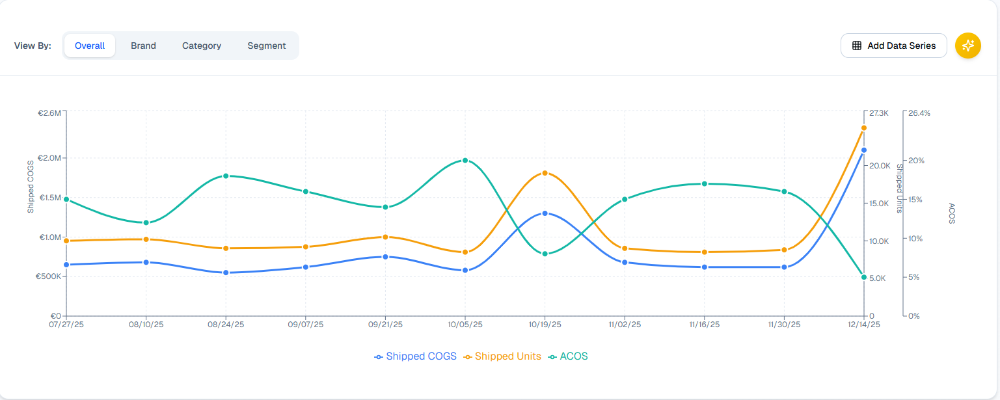

# Sales Insights - Multi Region (Panasonic EMEA) – Product Requirements Document (PRD)

| Metadata | Details |
| :--- | :--- |
| **Author** | AI Agent |
| **Stakeholders** | Regional Sales Managers, EMEA Executive Leadership |
| **Jira Epic** | [Link to Jira Epic] |
| **Confluence Page** | [Link to Confluence] |
| **Version** | 2.0 |
| **Status** | DRAFT |
| **Last Updated** | 2026-01-21 |

# 1. Executive Summary & Strategic Context

## 1.1 Executive Summary
Panasonic EMEA faces significant inefficiency due to fragmented sales reporting across five regional marketplaces (DE, FR, IT, ES, UK), requiring manual currency conversion and spreadsheet stitching. This initiative delivers a unified **Sales Command Center** that automates the ingestion of sales data and historical exchange rates (ECB), enabling "Zero Lag" reporting. This solution will reduce reporting turnaround from days to seconds and ensure 100% data consistency for strategic decision-making.

## 1.2 Strategic Context & Business Case

### Business Objectives
*   **Operational Efficiency:** Reduce weekly reporting time by 90%.
*   **Strategic Agility:** Enable leadership to view aggregated EMEA performance in any currency (EUR, USD, etc.) instantly.
*   **Data Integrity:** Eliminate human error associated with manual currency math and file merging.

### Strategic Alignment
*   **Supports "One Panasonic" Vision:** Harmonizes data across disjointed regional silos.
*   **Data-Driven Decision Making:** Moves the organization from reactive spreadsheet reporting to proactive trend analysis.

### Success Metrics & KPIs
| Metric | Baseline | Target | Measurement Method | Timeline |
| :--- | :--- | :--- | :--- | :--- |
| **Reporting Turnaround** | 2-3 Days | < 5 Seconds | Time to generate WBR | Launch + 1 Month |
| **Adoption** | N/A | 100% | % of Regional Managers using Dashboard | Launch + 3 Months |
| **Dashboard Latency** | N/A | < 200ms | P95 Page Load Time | Launch |

## 1.3 Problem Statement & User Research

### Problem Overview
Regional Sales Managers currently spend valuable time manually downloading reports, looking up exchange rates for specific dates, and merging excel files. This "Cold Path" of data processing introduces latency and errors, preventing timely responses to market trends.

### User Personas
*   **Primary: Regional Sales Manager.** *Goal:* Track weekly performance vs targets.
*   **Secondary: Executive VP.** *Goal:* High-level EMEA view in Euro. 
### Current State
*   **Process:** Manual CSV downloads -> Manual FX lookup -> Excel Merge.
*   **Limitations:** Error-prone, slow, static currency (hard to pivot from EUR to USD).

# 2. Solution Overview

## 2.1 Proposed Solution
**Sales Command Center:** A web-based dashboard that ingests daily sales logs and standardizes them into a central database. It automatically fetches daily exchange rates from the ECB XML feed and stores them. The system performs on-the-fly aggregation, allowing users to switch between regions, time granularities (Daily/Weekly/Monthly), and display currencies instantly.

## 2.2 Solution Design Principles
*   **Zero Lag:** Interaction with filters must feel instantaneous.
*   **Smart Defaults:** Auto-select currency based on user locale, but allow overrides.
*   **Trust by Design:** Always use official ECB historical rates; transparently show the rate used.

## 2.3 User Value Proposition
*   **Regional Manager:** Save 4-6 hours per week on reporting tasks.
*   **Executive:** Real-time visibility into pan-European performance without waiting for manual compilation.

# 3. Scope & Release Planning

## 3.1 Minimum Viable Product (MVP)
### In Scope (MVP)
*   **Regions:** Germany (DE), France (FR), Italy (IT), Spain (ES), UK.
*   **Time Granularity:** Daily, Weekly, Monthly, Quarterly.
*   **Currency Support:** EUR, GBP, USD, CAD, MXN (Historical conversion).
*   **Metrics:** Revenue (Ordered/Shipped/LY), Units, Inventory Snapshots.
*   **UI:** Dashboard with Trend Chart, Summary Cards, and Data Grid.

### Out of Scope (MVP)
*   Custom user-defined exchange rates.
*   Real-time (hourly) data streams.
*   Predictive forecasting.

## 3.2 Dependencies
| Dependency | Type | Status | Mitigation |
| :--- | :--- | :--- | :--- |
| **ECB XML Feed** | External Data | Stable | Cache rates locally; fallback to last known healthy rate. |
| **Region Sales Data** | Internal Data | Available | Rigid schema validation on ingestion. |

# 4. Detailed Requirements

## 4.1 User Stories (Epics)
| Story ID | User Story | Priority | Story Points |
| :--- | :--- | :--- | :--- |
| **EPIC-01** | **Project & Monorepo Init** As a Dev, I want a monorepo structure so I can share types between FE and BE. | Must | 3 |
| **EPIC-02** | **ECB Rate Ingestion** As a System, I want to fetch/store daily ECB rates so I have a trusted FX history. | Must | 5 |
| **EPIC-03** | **Sales Data Aggregation** As a User, I want to filter sales by region and see totals in my chosen currency. | Must | 13 |
| **EPIC-04** | **Dashboard Visualization** As a User, I want to see trend lines and KPIs to spot performance intervals. | Must | 8 |

## 4.2 Functional Requirements (FR)
| ID | Requirement | Priority |
| :--- | :--- | :--- |
| **FR1** | The system shall ingest sales data from DE, FR, IT, ES, and UK regions daily. | Must |
| **FR2** | The system shall allow users to toggle Time Granularity: Daily, Weekly, Monthly, Quarterly. | Must |
| **FR3** | The system shall convert all sales data to **Euro (EUR)** as the *primary base currency* using historical rates. | Must |
| **FR4** | The system shall support converting this base EUR value to display currencies: GBP, USD, CAD, MXN. | Must | 
| **FR5** | The system shall display metrics defined in the **Metric Dictionary** (below). | Must |
| **FR6** | The system shall cache ECB rates to ensure availability during external API outages. | Must |
| **FR7** | The system shall default the currency selector based on user locale (Smart Default). | Should |

### Metric Dictionary
| Category | Metric Name | Definition | FX Conversion? |
| :--- | :--- | :--- | :--- |
| **Revenue** | **Ordered Revenue** | Total value of orders placed. | YES |
| | **Shipped COGS** | Cost of Goods Sold for shipped items. | YES |
| | **LY Revenue** | Last Year's Ordered Revenue. | YES |
| | **LY Shipped COGS** | Last Year's COGS. | YES |
| | **Promo Spend** | Spend on promotional activities. | YES |
| **Units** | **Ordered Units** | Total quantity ordered. | NO |
| | **Shipped Units** | Total quantity shipped. | NO |
| | **Returns** | Quantity returned. | NO |
| **Derived** | **ASP** | Ordered Revenue / Ordered Units. | Recalculated |
| | **Conversion %** | (Ordered Units / Traffic) * 100. | Recalculated |
| | **Promo ROAS** | Ordered Revenue / Promo Spend. | Recalculated |
| **Inventory**| **Sellable On Hand** | Availability snapshot at period end. | NO |

## 4.3 Non-Functional Requirements (NFR)
*   **NFR-001 (Performance):** Dashboard pages must load within 200ms (P95).
*   **NFR-002 (Accuracy):** Currency conversion must strictly use official ECB historical rates.
*   **NFR-003 (Availability):** System must be resilient to ECB feed outages (Fallback to cache).

## 4.4 Data Requirements
*   **Source:** ECB Daily XML Feed (`https://www.ecb.europa.eu/stats/eurofxref/eurofxref-daily.xml`).
*   **Refresh:** Daily at ~16:30 CET.
*   **Retention:** Indefinite storage of daily rates for historical reporting.

# 5. User Experience & Design

## 5.1 UX Vision
A "Sales Insights" screen that provides a consolidated view of sales data for multiple regions and currencies.

## 5.2 Core Screens Behaviour
*   **Global Dashboard:** Main view with "Context Bar" (Time/Region/Currency props) and Trend Chart.
*   **Detail Grid:** Tabular view below the chart for SKU-level investigation.
*   **Filter Bar:** Filter by Region, Time Granularity, and Currency. Allow Multiple selection of Region.
*   **Summary Cards:** Display key metrics (Revenue, Units, Inventory) for selected regions as selected by the user.
*   **Context Bar:** Display selected Region, Time Granularity, and Currency.

## 5.3 Reference Mockups (Snapshots)

**Snapshot 1: Main Dashboard:** Showcases the current example of the dashboard opening screen.
!

**Snapshot 2: Currency Filter:** Showcases the selections expected to be available on the currency filter.
!

**Snapshot 3: Region Filter:** Showcases the selections expected to be available on the region filter.
!

**Snapshot 4: Time Series Graph:** Showcases the Graph expected to be available on the time series graph.
!

**Snapshot 5: Detailed Table:** Showcases the Detailed View By Table with multiple levels of aggregation for user visualization.
!

## 5.4 Target Platforms
*   **Desktop Only** (Optimized for data-heavy analysis).

# 6. Technical Architecture (High-Level)

## 6.1 Architecture Approach
A **Microservices** architecture within a **Monorepo**:
1.  **Ingestion Service (Cold Path):** Node.js script triggered by CRON. Fetches Sales Data & ECB XML. Normalizes and stores in DB.
2.  **Aggregation Service (Hot Path):** Node.js/Python API. Handles query params (Region, Currency, Date). Performs on-the-fly summation and currency conversion using stored rates.
3.  **Frontend:** React Single Page App (SPA). Local state management for filters.

## 6.2 Tech Stack
*   **Frontend:** React, Recharts (for trends), AG Grid (for tables).
*   **Backend:** Node.js (Express/NestJS).
*   **Database:** PostgreSQL (TimescaleDB extension recommended for time-series).

# 7. Go-to-Market & Launch

## 7.1 Launch Timeline
*   **Alpha (Dev):** Core Pipeline & FX Ingestion verifying data accuracy.
*   **Beta (Internal):** Release to 2 Regional Managers for data validation vs Excel.
*   **GA:** Full rollout to all 5 regions + Execs.

## 7.2 Success Tracking
*   **Accuracy Check:** Compare Dashboard Output vs Manual Excel for Week 1.
*   **Load Testing:** Ensure <200ms response on full quarterly aggregation.

# 8. Risks & Mitigation

## 8.1 Risk Register
| Risk ID | Risk Description | Likelihood | Impact | Mitigation |
| :--- | :--- | :--- | :--- | :--- |
| **RISK-001** | **ECB Feed Changes/Down** | Low | High | Self-healing ingestion (retry logic) + Cache. |
| **RISK-002** | **Aggregation Slowness** | Medium | High | Pre-compute daily aggregates in Base Currency (EUR). |
| **RISK-003** | **Data Gaps in Region Logs** | Medium | Medium | Alerting system on ingestion failure; "Stale Data" warning on UI. |

# 9. Team & Governance (Placeholder)
*   **Product Manager:** [Name]
*   **Tech Lead:** [Name]
*   **Lead Developer:** [Name]
*   **Designer:** [Name]

# 10. Appendices

## 10.1 Glossary
*   **ECB:** European Central Bank (Source of Truth for FX).
*   **Cold Path:** Batch processing of data (non-real-time).
*   **WBR:** Weekly Business Review.
*   **ASP:** Average Selling Price.
*   **COGS:** Cost of Goods Sold.

## 10.2 Change Log
| Date | Version | Description | Author |
| :--- | :--- | :--- | :--- |
| 2026-01-21 | 2.0 | Major Rewrite to Enhanced Jira Template | AI Agent |
| 2026-01-21 | 1.2 | Simplified Jira Template Update | AI Agent |
| 2026-01-13 | 1.0 | Initial MVP Draft | AI Agent |

