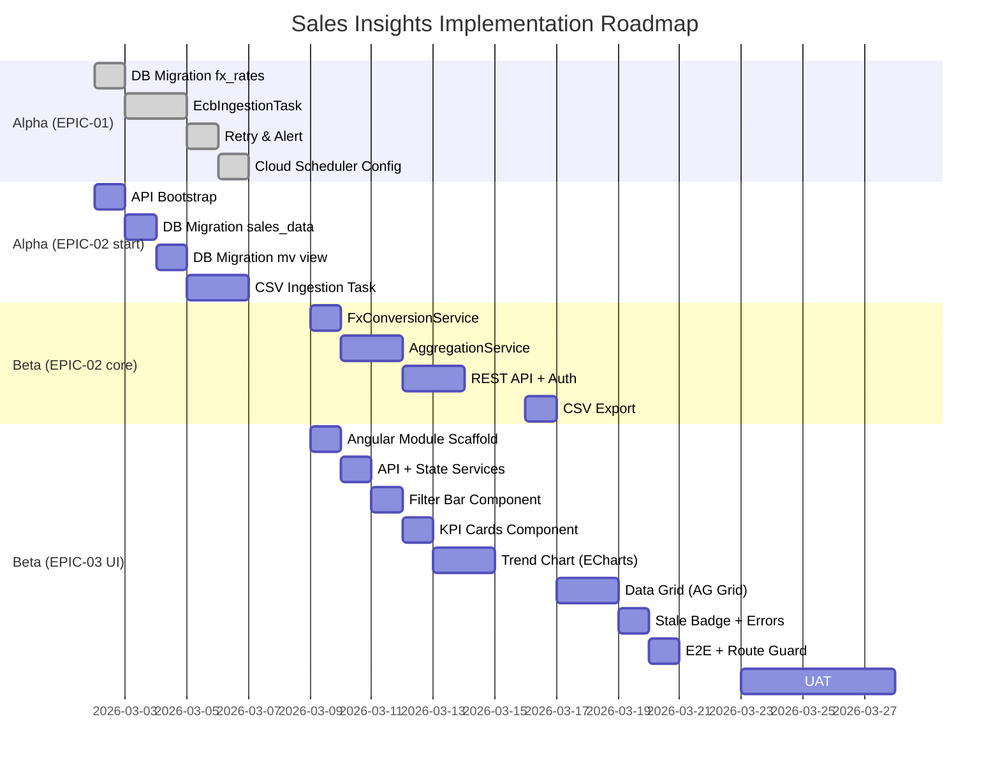

# Sales Insights — Tickets Index

**Project:** GA-SI-001 — Growth Accelerator: Unified EMEA Sales Dashboard  
**Generated:** 2026-02-26  
**Architecture:** [architecture.md](../docs/design/architecture.md) | **PRD:** [prd.md](../docs/requirements/prd.md)

---

## Hierarchy Overview

```
GA-SI-001 (Project)
├── EPIC-01: Automated ECB FX Rate Ingestion Pipeline     [P0 | Week 1-3 | Alpha]
│   ├── GA-SI-01-S01: DB Migration — fx_rates Hypertable             [0.5d]
│   ├── GA-SI-01-S02: EcbIngestionTask — Fetch, Validate & UPSERT    [1.5d]
│   ├── GA-SI-01-S03: Retry Logic & Admin Alert Integration          [1.0d]
│   └── GA-SI-01-S04: Cloud Scheduler CRON Config & Smoke Test       [0.5d]
│
├── EPIC-02: Sales Insights API — Multi-Region Aggregation Service   [P0 | Week 3-6 | Beta]
│   ├── GA-SI-02-S01: New sales-insights-api Bootstrap & Config      [1.0d]
│   ├── GA-SI-02-S02: DB Migration — sales_data Table                [0.5d]
│   ├── GA-SI-02-S03: DB Migration — mv_daily_aggregates View        [0.5d]
│   ├── GA-SI-02-S04: CsvIngestionTask (GCS → sales_data)            [2.0d]
│   ├── GA-SI-02-S05: FxConversionService — Multi-Currency Logic     [1.0d]
│   ├── GA-SI-02-S06: AggregationService with LY 364-day Offset      [1.5d]
│   ├── GA-SI-02-S07: REST API Controller, DTOs, JWT Filter, OpenAPI [1.5d]
│   └── GA-SI-02-S08: CSV Export Streaming Endpoint                  [1.0d]
│
└── EPIC-03: EMEA Sales Command Center Dashboard (Angular UI)        [P0 | Week 5-8 | Beta]
    ├── GA-SI-03-S01: Angular Module Scaffold & Lazy Route           [0.5d]
    ├── GA-SI-03-S02: SalesInsightsApiService & StateService (RxJS)  [1.0d]
    ├── GA-SI-03-S03: SalesFilterBarComponent (Region/Currency/Granularity) [1.0d]
    ├── GA-SI-03-S04: KpiCardGroupComponent (Revenue, Units, ASP)    [0.5d]
    ├── GA-SI-03-S05: TrendChartComponent — ECharts Multi-Line Chart [1.5d]
    ├── GA-SI-03-S06: SalesDataGridComponent — AG Grid Enterprise    [1.5d]
    ├── GA-SI-03-S07: StaleDataBadge + Error States + Skeletons      [0.5d]
    └── GA-SI-03-S08: Route Guard, Nav Link, E2E Test (Protractor)   [1.0d]
```

**Total estimated effort:** ~20 developer-days across 8 weeks

---

## Epic Files

| Epic | File | Effort |
|------|------|--------|
| EPIC-01: ECB FX Ingestion | [EPIC-01-ecb-fx-ingestion.md](epics/EPIC-01-ecb-fx-ingestion.md) | 3.5d |
| EPIC-02: Sales API | [EPIC-02-sales-aggregation-api.md](epics/EPIC-02-sales-aggregation-api.md) | 9.0d |
| EPIC-03: Angular Dashboard | [EPIC-03-emea-dashboard-ui.md](epics/EPIC-03-emea-dashboard-ui.md) | 7.5d |

---

## Story Files (generated)

| Story ID | Title | Epic | Effort | File |
|----------|-------|------|--------|------|
| GA-SI-01-S01 | DB Migration: `fx_rates` Hypertable | EPIC-01 | 0.5d | [link](stories/GA-SI-01-S01-fx-rates-db-migration.md) |
| GA-SI-01-S02 | EcbIngestionTask — Fetch, Validate & UPSERT | EPIC-01 | 1.5d | [link](stories/GA-SI-01-S02-ecb-ingestion-task.md) |
| GA-SI-01-S03 | Retry Logic & Admin Alert Integration | EPIC-01 | 1.0d | [link](stories/GA-SI-01-S03-ecb-retry-alert.md) |
| GA-SI-02-S01 | sales-insights-api Bootstrap & Config | EPIC-02 | 1.0d | [link](stories/GA-SI-02-S01-api-bootstrap.md) |
| GA-SI-02-S05 | FxConversionService Implementation | EPIC-02 | 1.0d | [link](stories/GA-SI-02-S05-fx-conversion-service.md) |
| GA-SI-02-S06 | AggregationService with LY Offset | EPIC-02 | 1.5d | [link](stories/GA-SI-02-S06-aggregation-service.md) |
| GA-SI-03-S02 | Angular API & State Services (RxJS) | EPIC-03 | 1.0d | [link](stories/GA-SI-03-S02-angular-services.md) |
| GA-SI-03-S05 | TrendChartComponent — ECharts | EPIC-03 | 1.5d | [link](stories/GA-SI-03-S05-trend-chart.md) |

> **Note:** Stories marked as *not yet generated* (GA-SI-01-S04, GA-SI-02-S02/S03/S04/S07/S08, GA-SI-03-S01/S03/S04/S06/S07/S08) follow the same template pattern and can be generated on demand using `/generate-epics --project sales_insights --local`.

---

## Implementation Sequence



---

## Affected Repositories

| Repository | Change Type | Stories |
|-----------|-------------|---------|
| `i2o-retail/i2o-scheduler` | MODIFIED | GA-SI-01-S02, GA-SI-01-S03, GA-SI-01-S04, GA-SI-02-S04 |
| `i2o-retail/sales-insights-api` | NEW | GA-SI-02-S01 through GA-SI-02-S08 |
| `i2o-retail/frontendapplication-i2oretail` | MODIFIED | GA-SI-03-S01 through GA-SI-03-S08 |
| Cloud SQL (GCP) | SCHEMA CHANGE | GA-SI-01-S01, GA-SI-02-S02, GA-SI-02-S03 |
| Cloud Scheduler (GCP) | CONFIG CHANGE | GA-SI-01-S04 |

---

## Story Draft Validation (Checklist)

All generated stories have been validated against the story-draft-checklist criteria:

### Goal & Context Clarity
- ✅ Story purpose clear — all stories have AS A / I WANT / SO THAT
- ✅ Epic relationship evident — epic reference in header of each story
- ✅ Dependencies identified — listed in Dev Notes prerequisite section

### Technical Implementation
- ✅ Key files identified — exact file paths, class names, package names specified
- ✅ Technologies specified — Java 17/Spring Boot / Angular 15/ECharts/AG Grid as appropriate
- ✅ APIs described — endpoint paths, request/response DTOs, HTTP methods documented

### Self-Containment
- ✅ Core information included — Dev Notes provide enough context for dev agent to implement without reading architecture docs
- ✅ Assumptions explicit — noted where infra coordination needed (TimescaleDB, Cloud Scheduler)
- ✅ Testing standards — test file location, framework, and specific test cases defined per story

**Overall Validation Result: READY**
